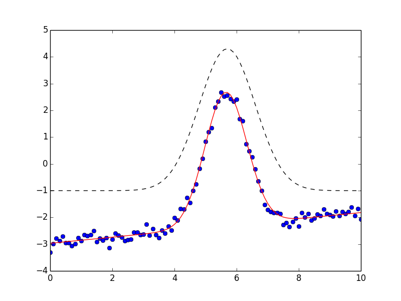

.. _builtin_models_chapter:

=================================
Built-in Fitting Models
=================================

Lmfit provides several builtin fitting models, all subclassed from the
:class:`Model` class of the previous chapter, and wrapping relatively
well-known functional forms, such as Gaussians, Lorentzian, and
Exponentials that are used in a wide range of scientific domains.  As shown
in the previous chapter, these functions can be easily combined to give a
composite function -- say, a Lorentzian plus a linear background.  In
addition, the pre-built models provide a :meth:`guess_starting_values`
method that can make decent guesses for parameter values.

Example 1: Fit data to Voigt or Gaussian profiles
======================================================

Here, we will fit data to two similar lineshapes, in order to decide which
might be the better model.

Example 2: Fit data to Voigt profile + Line
=================================================

We can expand on the model by showing an important feature of the lmfit
Models derived from the powerful :class:`Model` class: you can add them
together.  That is, to fit data to a Gaussian plus a linear offset, we
could use this script (also included in the ``examples`` folder with the
source code):

.. literalinclude:: ../examples/models_doc2.py

This is only slightly more complicated than the script above.  Here, we
start with a :class:`GaussianModel` as before and use the built-in method
to guess starting values.  But then we create a :class:`LinearModel` (which
has parameters named ``slope`` and ``intercept``), and add this to the
:class:`GaussianModel` with the simple::

    total = gauss + line

and call the :meth:`fit` method of the combined model ``total``.  That will
fit all the parameters, reporting results of::

    [[Variables]]
         amplitude:     8.459308 +/- 0.1241455 (1.47%) initial =  11.96192
         center:        5.655479 +/- 0.009176806 (0.16%) initial =  5.7
         fwhm:          1.590575 +/- 0.02335249 (1.47%) == '2.354820*sigma'
         intercept:    -2.968602 +/- 0.03352202 (1.13%) initial = -1
         sigma:         0.6754549 +/- 0.009916889 (1.47%) initial =  0.9
         slope:         0.1148441 +/- 0.005748924 (5.01%) initial =  0
    [[Correlations]] (unreported correlations are <  0.250)
        C(amplitude, sigma)          =  0.666

and give a plot like this:

again showing (simulated) data shown in blue dots, with the best fit as a
solid red line, and the initial fit in black dashed line.

The emphasis here is that not only is fitting to a single pre-defined
function a simple matter, but that fitting to a model built up of several
pre-defined functions is not much more difficult.

Subclasses of :class:`Model` available in the :mod:`models` module
====================================================================

Several fitting models are pre-built and available in the :mod:`models`
module.  These are all based on plain python functions defined in the
:mod:`lineshapes` module.  In addition to wrapping a function, these models
also provide a :meth:`guess_starting_values` method that is intended to
give a reasonable set of starting values given a data array that closely
approximates the data to be fit.

All the models listed below are one dimensional, with an independent
variable named ``x``.  Many of these models represent a function with a
distinct peak, and so share common features.  To maintain uniformity,
common parameter names are used whenever possible.  Thus, most models have
a parameter called ``amplitude`` that represents the overall height (or
area of) a peak or function, a ``center`` parameter that represents a peak
centroid position, and a ``sigma`` parameter that gives a characteristic
width.   Some peak shapes also have a parameter ``fwhm``, typically
constrained by ``sigma`` to give the full width at half maximum.

Peak-like models
-------------------

There are many peak-like models available.  These include
:class:`GaussianModel`, :class:`LorentzianModel`, :class:`VoigtModel` and
some less commonly used variations.

.. class:: GaussianModel()

A model based on a `Gaussian or normal distribution lineshape
<http://en.wikipedia.org/wiki/Normal_distribution>`_.  Parameter names:
``amplitude``, ``center``, and ``sigma``.  In addition, a constrained
parameter ``fwhm`` is included.

.. math::

  f(x; A, \mu, \sigma) = \frac{A}{\sigma\sqrt{2\pi}} e^{[{-{(x-\mu)^2}/{{2\sigma}^2}}]}

where the parameter ``amplitude`` corresponds to :math:`A`, ``center`` to
:math:`\mu`, and ``sigma`` to :math:`\sigma`.  The Full-Width at
Half-Maximum is :math:`2\sigma\sqrt{2\ln{2}}`, approximately
:math:`2.3548\sigma`

.. class:: LorentzianModel()

A model based on a `Lorentzian or Cauchy-Lorentz distribution function
<http://en.wikipedia.org/wiki/Cauchy_distribution>`_.  Parameter names:
``amplitude``, ``center``, and ``sigma``.  In addition, a constrained
parameter ``fwhm`` is included.

.. math::

  f(x; A, \mu, \sigma) = \frac{A}{\pi} \big[\frac{\sigma}{(x - \mu)^2 + \sigma^2}\big]

where the parameter ``amplitude`` corresponds to :math:`A`, ``center`` to
:math:`\mu`, and ``sigma`` to :math:`\sigma`.  The Full-Width at
Half-Maximum is :math:`2\sigma`.

.. class:: VoigtModel()

A model based on a `Voigt distribution function
<http://en.wikipedia.org/wiki/Voigt_profile>`_.  Parameter names:
``amplitude``, ``center``, and ``sigma``.  A ``gamma`` parameter is also
available.  By default, it is constrained to have value equal to ``sigma``,
though this can be varied independently.  In addition, a constrained
parameter ``fwhm`` is included.  The definition for the Voigt function used
here is

.. math::

    f(x; A, \mu, \sigma, \gamma) = \frac{A \textrm{Re}[w(z)]}{\sigma\sqrt{2 \pi}}

where

.. math::
   :nowrap:

   \begin{eqnarray*}
     z &=& \frac{x-\mu +i\gamma}{\sigma\sqrt{2}} \\
     w(z) &=& e^{-z^2}{\operatorname{erfc}}(-iz)
   \end{eqnarray*}

and :func:`erfc` is the complimentary error function.  As above,
``amplitude`` corresponds to :math:`A`, ``center`` to
:math:`\mu`, and ``sigma`` to :math:`\sigma`. The parameter ``gamma``
corresponds  to :math:`\gamma`.
If ``gamma`` is kept at the default value (constrained to ``sigma``),
the full width at half maximumn is approximately :math:`3.6013\sigma`.

.. class:: PseudoVoigtModel()

a model based on a `pseudo-Voigt distribution function
<http://en.wikipedia.org/wiki/Voigt_profile#Pseudo-Voigt_Approximation>`_,
which is a weighted sum of a Gaussian and Lorentzian distribution functions
with the same calues for ``amplitude`` (:math:`A`), ``center`` (:math:`\mu`)
and ``sigma`` (:math:`\sigma`), and a parameter ``fraction`` (:math:`\alpha`)
in

.. math::

  f(x; A, \mu, \sigma, \alpha) = (1-\alpha)\frac{A}{\pi}
  \big[\frac{\sigma}{(x - \mu)^2 + \sigma^2}\big] + \frac{\alpha A}{\pi} \big[\frac{\sigma}{(x - \mu)^2 + \sigma^2}\big]

The :meth:`guess_starting_values` function always gives a starting
value for ``fraction`` of 0.5

.. class:: Pearson7Model()

A model based on a `Pearson VII distribution
<http://en.wikipedia.org/wiki/Pearson_distribution#The_Pearson_type_VII_distribution>`_.
This is another Voigt-like distribution function.  It has the usual
parameters ``amplitude`` (:math:`A`), ``center`` (:math:`\mu`) and
``sigma`` (:math:`\sigma`), and also ``exponent`` (:math:`p`) in

.. math::

    f(x; A, \mu, \sigma, p) = \frac{sA}{\big\{[1 + (\frac{x-\mu}{\sigma})^2] (2^{1/p} -1)  \big\}^p}

where

.. math::

    s = \frac{\Gamma(p) \sqrt{2^{1/p} -1}}{ \sigma\sqrt{\pi}\,\Gamma(p-1/2)}

where :math:`\Gamma(x)` is the gamma function.

The :meth:`guess_starting_values` function always gives a starting
value for ``exponent`` of 0.5.

.. class:: StudentsTModel()

A model based on a `Student's t distribution function
<http://en.wikipedia.org/wiki/Student%27s_t-distribution>`_, with the usual
parameters ``amplitude`` (:math:`A`), ``center`` (:math:`\mu`) and
``sigma`` (:math:`\sigma`) in

.. math::

    f(x; A, \mu, \sigma) = \frac{A \Gamma(\frac{\sigma+1}{2})} {\sqrt{\sigma\pi}\,\Gamma(\frac{\sigma}{2})} \Bigl[1+\frac{(x-\mu)^2}{\sigma}\Bigr]^{-\frac{\sigma+1}{2}}

where :math:`\Gamma(x)` is the gamma function.

.. class:: BreitWignerModel()

A model based on a `Breit-Wigner-Fano function
<http://en.wikipedia.org/wiki/Fano_resonance>`_.  It has the usual
parameters ``amplitude`` (:math:`A`), ``center`` (:math:`\mu`) and
``sigma`` (:math:`\sigma`), plus ``q`` (:math:`q`) in

.. math::

    f(x; A, \mu, \sigma, q) = \frac{A (q\sigma/2 + x - \mu)^2}{(\sigma/2)^2 + (x - \mu)^2}

.. class:: LognormalModel()

A model based on the `Log-normal distribution function
<http://en.wikipedia.org/wiki/Lognormal>`_.
It has the usual parameters
``amplitude`` (:math:`A`), ``center`` (:math:`\mu`) and ``sigma``
(:math:`\sigma`) in

.. math::

    f(x; A, \mu, \sigma) = \frac{A e^{-(\ln(x) - \mu)/ 2\sigma^2}}{x}

.. class:: DampedOcsillatorModel()

A model based on the `Damped Harmonic Oscillator Amplitude
<http://en.wikipedia.org/wiki/Harmonic_oscillator#Amplitude_part>`_.
It has the usual parameters ``amplitude`` (:math:`A`), ``center`` (:math:`\mu`) and
``sigma`` (:math:`\sigma`) in

.. math::

    f(x; A, \mu, \sigma) = \frac{A}{\sqrt{ [1 - (x/\mu)^2]^2 + (2\sigma x/\mu)^2}}

.. class:: ExponentialGaussianModel()

A model of an `Exponentially modified Gaussian distribution
<http://en.wikipedia.org/wiki/Exponentially_modified_Gaussian_distribution>`_.
It has the usual parameters ``amplitude`` (:math:`A`), ``center`` (:math:`\mu`) and
``sigma`` (:math:`\sigma`), and also ``gamma`` (:math:`\gamma`) in

.. math::

    f(x; A, \mu, \sigma, \gamma) = \frac{A\gamma}{2}
    \exp\bigl[\gamma({\mu - x  + \sigma^2/2})\bigr]
    {\operatorname{erfc}}\bigl[\frac{\mu + \gamma\sigma^2 - x}{\sqrt{2}\sigma}\bigr]

where :func:`erfc` is the complimentary error function.

.. class:: DonaichModel()

A model of an `Doniach Sunjic asymmetric lineshape
<http://www.casaxps.com/help_manual/line_shapes.htm>`_, used in
photo-emission. With the usual parameters ``amplitude`` (:math:`A`),
``center`` (:math:`\mu`) and ``sigma`` (:math:`\sigma`), and also ``gamma``
(:math:`\gamma`) in

.. math::

    f(x; A, \mu, \sigma, \gamma) = A\frac{\cos\bigl[\pi\gamma/2 + (1-\gamma)
    \arctan{(x - \mu)}/\sigma\bigr]} {\bigr[1 + (x-\mu)/\sigma\bigl]^{(1-\gamma)/2}}

Linear and Polynomial Models
------------------------------------

Thes models correspond to polynomials of some degree.  Of course, lmfit is
a very inefficient way to do linear regression (see :func:`numpy.polyfit`
or :func:`scipy.stats.linregress`), but these models may be useful as one
of many components of composite model.

.. class:: ConstantModel()

   a class that consists of a single value, ``c``.  This is constant in the
   sense of having no dependence on the independent variable ``x``, not in
   the sense of being non-varying.  To be clear, ``c`` will be a variable
   Parameter.

.. class:: LinearModel()

   a class that gives a linear model:

.. math::

    f(x; m, b) = m x + b

with parameters ``slope`` for :math:`m` and  ``intercept`` for :math:`b`.

.. class:: QuadraticModel()

   a class that gives a quadratic model:

.. math::

    f(x; a, b, c) = a x^2 + b x + c

with parameters ``a``, ``b``, and ``c``.

.. class:: ParabolicModel()

   same as :class:`QuadraticModel`.

.. class:: PolynomialModel(degree)

   a class that gives a polynomial model up to ``degree`` (with maximum
   value of 7).

.. math::

    f(x; c_0, c_1, \ldots, c_7) = \sum_{i=0, 7} c_i  x^i

with parameters ``c0``, ``c1``, ..., ``c7``.  The supplied ``degree``
will specify how many of these are actual variable parameters.

Step-like models
-----------------------------------------------

.. class:: StepModel(form='linear')

A model based on a Step function, with four choices for functional form.
The step functin starts with a value 0, and ends with a value of :math:`A`
(``amplitude``), rising to :math:`A/2` at :math:`\mu` (``center``),
with :math:`\sigma` (``sigma``) setting the characteristic width. The
supported functional forms are ``linear`` (the default), ``atan`` or
``arctan`` for an arc-tangent function,  ``erf`` for an error function, or
``logistic`` for a `logistic function <http://en.wikipedia.org/wiki/Logistic_function>`_.
The forms are

.. math::
   :nowrap:

   \begin{eqnarray*}
   & f(x; A, \mu, \sigma, {\mathrm{form='linear'}})   &=& A \min[1, \max(0,  \alpha)] \\
   & f(x; A, \mu, \sigma, {\mathrm{form='arctan'}})   &=& A [1/2 + \arctan{(\alpha)}/{\pi}] \\
   & f(x; A, \mu, \sigma, {\mathrm{form='erf'}}) \,\, &=& A [1 + {\operatorname{erf}}(\alpha)]/2 \\
   & f(x; A, \mu, \sigma, {\mathrm{form='logistic'}}) &=& A [1 - \frac{1}{1 +  e^{\alpha}} ]
   \end{eqnarray*}

where :math:`\alpha  = (x - \mu)/{\sigma}`.

.. class:: RectangleModel(form='linear')

A model based on a Step-up and Step-down function of the same form.  The same
choices for functional form as for :class:`StepModel` are supported, with
``linear`` as the default.
The step functin starts with a value 0, and ends with a value of :math:`A`
(``amplitude``), rising to :math:`A/2` at :math:`\mu_1` (``center1``),
with :math:`\sigma_1` (``sigma1``) setting the characteristic width.  It
drops to rising to :math:`A/2` at :math:`\mu_2` (``center2``),
with characteristic width :math:`\sigma_2` (``sigma2``).

.. math::
   :nowrap:

   \begin{eqnarray*}
   & f(x; A, \mu, \sigma, {\mathrm{form='linear'}})  &=& A \{ \min[1, \max(0, \alpha_1)] + \min[-1, \max(0,  \alpha_2)] \} \\
   &f(x; A, \mu, \sigma, {\mathrm{form='arctan'}})   &=& A [\arctan{(\alpha_1)} + \arctan{(\alpha_2)}]/{\pi} \\
   &f(x; A, \mu, \sigma, {\mathrm{form='erf'}}) \,\, &=& A [{\operatorname{erf}}(\alpha_1) + {\operatorname{erf}}(\alpha_2)]/2 \\
   &f(x; A, \mu, \sigma, {\mathrm{form='logistic'}}) &=& A [1 - \frac{1}{1 + e^{\alpha_1}} - \frac{1}{1 +  e^{\alpha_2}} ]
   \end{eqnarray*}

where :math:`\alpha_1  = (x - \mu_1)/{\sigma_1}` and :math:`\alpha_2  = -(x - \mu_2)/{\sigma_2}`.

Exponential and Power law models
-----------------------------------------------

.. class:: ExponentialModel()

A model based on an `exponential decay function
<http://en.wikipedia.org/wiki/Exponential_decay>`_. With parameters named
``amplitude`` (:math:`A`), and ``decay`` (:math:`\tau`), this has the form:

.. math::

   f(x; A, \tau) = A e^{-x/\tau}

.. class:: PowerLawModel()

A model based on a `Power Law <http://en.wikipedia.org/wiki/Power_law>`_.
With parameters
named ``amplitude`` (:math:`A`), and ``exponent`` (:math:`k`), this has the
form:

.. math::

   f(x; A, k) = A x^k

