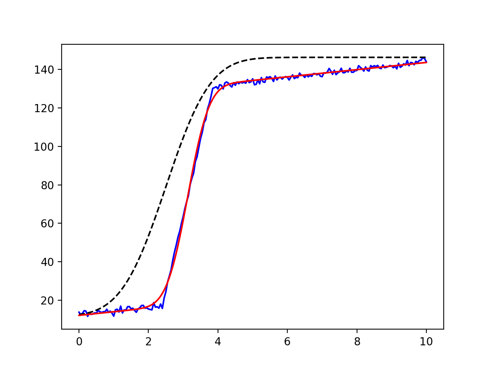

.. _builtin_models_chapter:

=====================================================
Built-in Fitting Models in the :mod:`models` module
=====================================================

.. module:: lmfit.models

Lmfit provides several builtin fitting models in the :mod:`models` module.
These pre-defined models each subclass from the :class:`model.Model` class of the
previous chapter and wrap relatively well-known functional forms, such as
Gaussians, Lorentzian, and Exponentials that are used in a wide range of
scientific domains.  In fact, all the models are all based on simple, plain
python functions defined in the :mod:`lineshapes` module.  In addition to
wrapping a function into a :class:`model.Model`, these models also provide a
:meth:`guess` method that is intended to give a reasonable
set of starting values from a data array that closely approximates the
data to be fit.

As shown in the previous chapter, a key feature of the :class:`mode.Model` class
is that models can easily be combined to give a composite
:class:`model.Model`. Thus while some of the models listed here may seem pretty
trivial (notably, :class:`ConstantModel` and :class:`LinearModel`), the
main point of having these is to be able to used in composite models.  For
example,  a Lorentzian plus a linear background might be represented as::

    >>> from lmfit.models import LinearModel, LorentzianModel
    >>> peak = LorentzianModel()
    >>> background  = LinearModel()
    >>> model = peak + background

All the models listed below are one dimensional, with an independent
variable named ``x``.  Many of these models represent a function with a
distinct peak, and so share common features.  To maintain uniformity,
common parameter names are used whenever possible.  Thus, most models have
a parameter called ``amplitude`` that represents the overall height (or
area of) a peak or function, a ``center`` parameter that represents a peak
centroid position, and a ``sigma`` parameter that gives a characteristic
width.  Many peak shapes also have a parameter ``fwhm`` (constrained by
``sigma``) giving the full width at half maximum and a parameter ``height``
(constrained by ``sigma`` and ``amplitude``) to give the maximum peak
height.

After a list of builtin models, a few examples of their use is given.

Peak-like models
-------------------

There are many peak-like models available.  These include
:class:`GaussianModel`, :class:`LorentzianModel`, :class:`VoigtModel` and
some less commonly used variations.  The :meth:`guess`
methods for all of these make a fairly crude guess for the value of
``amplitude``, but also set a lower bound of 0 on the value of ``sigma``.

:class:`GaussianModel`
~~~~~~~~~~~~~~~~~~~~~~~~~~~

.. class:: GaussianModel(missing=None[, prefix=''[, name=None[, **kws]]])

A model based on a `Gaussian or normal distribution lineshape
<http://en.wikipedia.org/wiki/Normal_distribution>`_.  Parameter names:
``amplitude``, ``center``, and ``sigma``.
In addition, parameters ``fwhm`` and ``height`` are included as constraints
to report full width at half maximum and maximum peak height, respectively.

.. math::

  f(x; A, \mu, \sigma) = \frac{A}{\sigma\sqrt{2\pi}} e^{[{-{(x-\mu)^2}/{{2\sigma}^2}}]}

where the parameter ``amplitude`` corresponds to :math:`A`, ``center`` to
:math:`\mu`, and ``sigma`` to :math:`\sigma`.  The full width at
half maximum is :math:`2\sigma\sqrt{2\ln{2}}`, approximately
:math:`2.3548\sigma`

:class:`LorentzianModel`
~~~~~~~~~~~~~~~~~~~~~~~~~~~

.. class:: LorentzianModel(missing=None[, prefix=''[, name=None[, **kws]]])

A model based on a `Lorentzian or Cauchy-Lorentz distribution function
<http://en.wikipedia.org/wiki/Cauchy_distribution>`_.  Parameter names:
``amplitude``, ``center``, and ``sigma``.
In addition, parameters ``fwhm`` and ``height`` are included as constraints
to report full width at half maximum and maximum peak height, respectively.

.. math::

  f(x; A, \mu, \sigma) = \frac{A}{\pi} \big[\frac{\sigma}{(x - \mu)^2 + \sigma^2}\big]

where the parameter ``amplitude`` corresponds to :math:`A`, ``center`` to
:math:`\mu`, and ``sigma`` to :math:`\sigma`.  The full width at
half maximum is :math:`2\sigma`.

:class:`VoigtModel`
~~~~~~~~~~~~~~~~~~~~~~~~~~~

.. class:: VoigtModel(missing=None[, prefix=''[, name=None[, **kws]]])

A model based on a `Voigt distribution function
<http://en.wikipedia.org/wiki/Voigt_profile>`_.  Parameter names:
``amplitude``, ``center``, and ``sigma``.  A ``gamma`` parameter is also
available.  By default, it is constrained to have value equal to ``sigma``,
though this can be varied independently.  In addition, parameters ``fwhm``
and ``height`` are included as constraints to report full width at half
maximum and maximum peak height, respectively.  The definition for the
Voigt function used here is

.. math::

    f(x; A, \mu, \sigma, \gamma) = \frac{A \textrm{Re}[w(z)]}{\sigma\sqrt{2 \pi}}

where

.. math::
   :nowrap:

   \begin{eqnarray*}
     z &=& \frac{x-\mu +i\gamma}{\sigma\sqrt{2}} \\
     w(z) &=& e^{-z^2}{\operatorname{erfc}}(-iz)
   \end{eqnarray*}

and :func:`erfc` is the complimentary error function.  As above,
``amplitude`` corresponds to :math:`A`, ``center`` to
:math:`\mu`, and ``sigma`` to :math:`\sigma`. The parameter ``gamma``
corresponds  to :math:`\gamma`.
If ``gamma`` is kept at the default value (constrained to ``sigma``),
the full width at half maximum is approximately :math:`3.6013\sigma`.

:class:`PseudoVoigtModel`
~~~~~~~~~~~~~~~~~~~~~~~~~~~

.. class:: PseudoVoigtModel(missing=None[, prefix=''[, name=None[, **kws]]])

a model based on a `pseudo-Voigt distribution function
<http://en.wikipedia.org/wiki/Voigt_profile#Pseudo-Voigt_Approximation>`_,
which is a weighted sum of a Gaussian and Lorentzian distribution functions
with that share values for ``amplitude`` (:math:`A`), ``center`` (:math:`\mu`)
and full width at half maximum (and so have  constrained values of
``sigma`` (:math:`\sigma`).  A parameter ``fraction`` (:math:`\alpha`)
controls the relative weight of the Gaussian and Lorentzian components,
giving the full definition of

.. math::

  f(x; A, \mu, \sigma, \alpha) = \frac{(1-\alpha)A}{\sigma_g\sqrt{2\pi}} e^{[{-{(x-\mu)^2}/{{2\sigma_g}^2}}]}
 + \frac{\alpha A}{\pi} \big[\frac{\sigma}{(x - \mu)^2 + \sigma^2}\big]

where :math:`\sigma_g = {\sigma}/{\sqrt{2\ln{2}}}` so that the full width
at half maximum of each component and of the sum is :math:`2\sigma`. The
:meth:`guess` function always sets the starting value for ``fraction`` at 0.5.

:class:`MoffatModel`
~~~~~~~~~~~~~~~~~~~~~~~~~~~

.. class:: MoffatModel(missing=None[, prefix=''[, name=None[, **kws]]])

a model based on a `Moffat distribution function
<https://en.wikipedia.org/wiki/Moffat_distribution>`_, the parameters are
``amplitude`` (:math:`A`), ``center`` (:math:`\mu`),
a width parameter ``sigma`` (:math:`\sigma`) and an exponent ``beta`` (:math:`\beta`).
For (:math:`\beta=1`) the Moffat has a Lorentzian shape.

.. math::

  f(x; A, \mu, \sigma, \beta) = A \big[(\frac{x-\mu}{\sigma})^2+1\big]^{-\beta}

the full width have maximum is :math:`2\sigma\sqrt{2^{1/\beta}-1}`.
:meth:`guess` function always sets the starting value for ``beta`` to 1.

:class:`Pearson7Model`
~~~~~~~~~~~~~~~~~~~~~~~~~~~

.. class:: Pearson7Model(missing=None[, prefix=''[, name=None[, **kws]]])

A model based on a `Pearson VII distribution
<http://en.wikipedia.org/wiki/Pearson_distribution#The_Pearson_type_VII_distribution>`_.
This is a Lorenztian-like distribution function.  It has the usual
parameters ``amplitude`` (:math:`A`), ``center`` (:math:`\mu`) and
``sigma`` (:math:`\sigma`), and also an ``exponent`` (:math:`m`) in

.. math::

    f(x; A, \mu, \sigma, m) = \frac{A}{\sigma{\beta(m-\frac{1}{2}, \frac{1}{2})}} \bigl[1 + \frac{(x-\mu)^2}{\sigma^2}  \bigr]^{-m}

where :math:`\beta` is the beta function (see :scipydoc:`special.beta` in
:mod:`scipy.special`).  The :meth:`guess` function always
gives a starting value for ``exponent`` of 1.5.

:class:`StudentsTModel`
~~~~~~~~~~~~~~~~~~~~~~~~~~~

.. class:: StudentsTModel(missing=None[, prefix=''[, name=None[, **kws]]])

A model based on a `Student's t distribution function
<http://en.wikipedia.org/wiki/Student%27s_t-distribution>`_, with the usual
parameters ``amplitude`` (:math:`A`), ``center`` (:math:`\mu`) and
``sigma`` (:math:`\sigma`) in

.. math::

    f(x; A, \mu, \sigma) = \frac{A \Gamma(\frac{\sigma+1}{2})} {\sqrt{\sigma\pi}\,\Gamma(\frac{\sigma}{2})} \Bigl[1+\frac{(x-\mu)^2}{\sigma}\Bigr]^{-\frac{\sigma+1}{2}}

where :math:`\Gamma(x)` is the gamma function.

:class:`BreitWignerModel`
~~~~~~~~~~~~~~~~~~~~~~~~~~~

.. class:: BreitWignerModel(missing=None[, prefix=''[, name=None[, **kws]]])

A model based on a `Breit-Wigner-Fano function
<http://en.wikipedia.org/wiki/Fano_resonance>`_.  It has the usual
parameters ``amplitude`` (:math:`A`), ``center`` (:math:`\mu`) and
``sigma`` (:math:`\sigma`), plus ``q`` (:math:`q`) in

.. math::

    f(x; A, \mu, \sigma, q) = \frac{A (q\sigma/2 + x - \mu)^2}{(\sigma/2)^2 + (x - \mu)^2}

:class:`LognormalModel`
~~~~~~~~~~~~~~~~~~~~~~~~~~~

.. class:: LognormalModel(missing=None[, prefix=''[, name=None[, **kws]]])

A model based on the `Log-normal distribution function
<http://en.wikipedia.org/wiki/Lognormal>`_.
It has the usual parameters
``amplitude`` (:math:`A`), ``center`` (:math:`\mu`) and ``sigma``
(:math:`\sigma`) in

.. math::

    f(x; A, \mu, \sigma) = \frac{A e^{-(\ln(x) - \mu)/ 2\sigma^2}}{x}

:class:`DampedOcsillatorModel`
~~~~~~~~~~~~~~~~~~~~~~~~~~~~~~~~~~~~~~~~~

.. class:: DampedOcsillatorModel(missing=None[, prefix=''[, name=None[, **kws]]])

A model based on the `Damped Harmonic Oscillator Amplitude
<http://en.wikipedia.org/wiki/Harmonic_oscillator#Amplitude_part>`_.
It has the usual parameters ``amplitude`` (:math:`A`), ``center`` (:math:`\mu`) and
``sigma`` (:math:`\sigma`) in

.. math::

    f(x; A, \mu, \sigma) = \frac{A}{\sqrt{ [1 - (x/\mu)^2]^2 + (2\sigma x/\mu)^2}}

:class:`ExponentialGaussianModel`
~~~~~~~~~~~~~~~~~~~~~~~~~~~~~~~~~~~~~~~~~

.. class:: ExponentialGaussianModel(missing=None[, prefix=''[, name=None[, **kws]]])

A model of an `Exponentially modified Gaussian distribution
<http://en.wikipedia.org/wiki/Exponentially_modified_Gaussian_distribution>`_.
It has the usual parameters ``amplitude`` (:math:`A`), ``center`` (:math:`\mu`) and
``sigma`` (:math:`\sigma`), and also ``gamma`` (:math:`\gamma`) in

.. math::

    f(x; A, \mu, \sigma, \gamma) = \frac{A\gamma}{2}
    \exp\bigl[\gamma({\mu - x  + \gamma\sigma^2/2})\bigr]
    {\operatorname{erfc}}\Bigl(\frac{\mu + \gamma\sigma^2 - x}{\sqrt{2}\sigma}\Bigr)

where :func:`erfc` is the complimentary error function.

:class:`SkewedGaussianModel`
~~~~~~~~~~~~~~~~~~~~~~~~~~~~~~~~~~~~~~~~~

.. class:: SkewedGaussianModel(missing=None[, prefix=''[, name=None[, **kws]]])

A variation of the above model, this is a `Skewed normal distribution
<http://en.wikipedia.org/wiki/Skew_normal_distribution>`_.
It has the usual parameters ``amplitude`` (:math:`A`), ``center`` (:math:`\mu`) and
``sigma`` (:math:`\sigma`), and also ``gamma`` (:math:`\gamma`) in

.. math::

    f(x; A, \mu, \sigma, \gamma) = \frac{A}{\sigma\sqrt{2\pi}}
  e^{[{-{(x-\mu)^2}/{{2\sigma}^2}}]} \Bigl\{ 1 +
      {\operatorname{erf}}\bigl[
	 \frac{\gamma(x-\mu)}{\sigma\sqrt{2}}
     \bigr] \Bigr\}

where :func:`erf` is the error function.

:class:`DonaichModel`
~~~~~~~~~~~~~~~~~~~~~~~~~~~

.. class:: DonaichModel(missing=None[, prefix=''[, name=None[, **kws]]])

A model of an `Doniach Sunjic asymmetric lineshape
<http://www.casaxps.com/help_manual/line_shapes.htm>`_, used in
photo-emission. With the usual parameters ``amplitude`` (:math:`A`),
``center`` (:math:`\mu`) and ``sigma`` (:math:`\sigma`), and also ``gamma``
(:math:`\gamma`) in

.. math::

    f(x; A, \mu, \sigma, \gamma) = A\frac{\cos\bigl[\pi\gamma/2 + (1-\gamma)
    \arctan{(x - \mu)}/\sigma\bigr]} {\bigr[1 + (x-\mu)/\sigma\bigl]^{(1-\gamma)/2}}

Linear and Polynomial Models
------------------------------------

These models correspond to polynomials of some degree.  Of course, lmfit is
a very inefficient way to do linear regression (see :numpydoc:`polyfit`
or :scipydoc:`stats.linregress`), but these models may be useful as one
of many components of composite model.

:class:`ConstantModel`
~~~~~~~~~~~~~~~~~~~~~~~~~~

.. class:: ConstantModel(missing=None[, prefix=''[, name=None[, **kws]]])

   a class that consists of a single value, ``c``.  This is constant in the
   sense of having no dependence on the independent variable ``x``, not in
   the sense of being non-varying.  To be clear, ``c`` will be a variable
   Parameter.

:class:`LinearModel`
~~~~~~~~~~~~~~~~~~~~~~~~~~~

.. class:: LinearModel(missing=None[, prefix=''[, name=None[, **kws]]])

   a class that gives a linear model:

.. math::

    f(x; m, b) = m x + b

with parameters ``slope`` for :math:`m` and  ``intercept`` for :math:`b`.

:class:`QuadraticModel`
~~~~~~~~~~~~~~~~~~~~~~~~~~~

.. class:: QuadraticModel(missing=None[, prefix=''[, name=None[, **kws]]])

   a class that gives a quadratic model:

.. math::

    f(x; a, b, c) = a x^2 + b x + c

with parameters ``a``, ``b``, and ``c``.

:class:`ParabolicModel`
~~~~~~~~~~~~~~~~~~~~~~~~~~~

.. class:: ParabolicModel(missing=None[, prefix=''[, name=None[, **kws]]])

   same as :class:`QuadraticModel`.

:class:`PolynomialModel`
~~~~~~~~~~~~~~~~~~~~~~~~~~~~~~~~~~~

.. class:: PolynomialModel(degree, missing=None[, prefix=''[, name=None[, **kws]]])

   a class that gives a polynomial model up to ``degree`` (with maximum
   value of 7).

.. math::

    f(x; c_0, c_1, \ldots, c_7) = \sum_{i=0, 7} c_i  x^i

with parameters ``c0``, ``c1``, ..., ``c7``.  The supplied ``degree``
will specify how many of these are actual variable parameters.  This uses
:numpydoc:`polyval` for its calculation of the polynomial.

Step-like models
-----------------------------------------------

Two models represent step-like functions, and share many characteristics.

:class:`StepModel`
~~~~~~~~~~~~~~~~~~~~~~~~~~~

.. class:: StepModel(form='linear'[, missing=None[, prefix=''[, name=None[, **kws]]]])

A model based on a Step function, with four choices for functional form.
The step function starts with a value 0, and ends with a value of :math:`A`
(``amplitude``), rising to :math:`A/2` at :math:`\mu` (``center``),
with :math:`\sigma` (``sigma``) setting the characteristic width. The
supported functional forms are ``linear`` (the default), ``atan`` or
``arctan`` for an arc-tangent function,  ``erf`` for an error function, or
``logistic`` for a `logistic function <http://en.wikipedia.org/wiki/Logistic_function>`_.
The forms are

.. math::
   :nowrap:

   \begin{eqnarray*}
   & f(x; A, \mu, \sigma, {\mathrm{form={}'linear{}'}})  & = A \min{[1, \max{(0,  \alpha)}]} \\
   & f(x; A, \mu, \sigma, {\mathrm{form={}'arctan{}'}})  & = A [1/2 + \arctan{(\alpha)}/{\pi}] \\
   & f(x; A, \mu, \sigma, {\mathrm{form={}'erf{}'}})     & = A [1 + {\operatorname{erf}}(\alpha)]/2 \\
   & f(x; A, \mu, \sigma, {\mathrm{form={}'logistic{}'}})& = A [1 - \frac{1}{1 +  e^{\alpha}} ]
   \end{eqnarray*}

where :math:`\alpha  = (x - \mu)/{\sigma}`.

:class:`RectangleModel`
~~~~~~~~~~~~~~~~~~~~~~~~~~~~~~~~~~~~~~

.. class:: RectangleModel(form='linear'[, missing=None[, prefix=''[, name=None[, **kws]]]])

A model based on a Step-up and Step-down function of the same form.  The
same choices for functional form as for :class:`StepModel` are supported,
with ``linear`` as the default.  The function starts with a value 0, and
ends with a value of :math:`A` (``amplitude``), rising to :math:`A/2` at
:math:`\mu_1` (``center1``), with :math:`\sigma_1` (``sigma1``) setting the
characteristic width.  It drops to rising to :math:`A/2` at :math:`\mu_2`
(``center2``), with characteristic width :math:`\sigma_2` (``sigma2``).

.. math::
   :nowrap:

   \begin{eqnarray*}
   &f(x; A, \mu, \sigma, {\mathrm{form={}'linear{}'}})   &= A \{ \min{[1, \max{(0, \alpha_1)}]} + \min{[-1, \max{(0,  \alpha_2)}]} \} \\
   &f(x; A, \mu, \sigma, {\mathrm{form={}'arctan{}'}})   &= A [\arctan{(\alpha_1)} + \arctan{(\alpha_2)}]/{\pi} \\
   &f(x; A, \mu, \sigma, {\mathrm{form={}'erf{}'}})      &= A [{\operatorname{erf}}(\alpha_1) + {\operatorname{erf}}(\alpha_2)]/2 \\
   &f(x; A, \mu, \sigma, {\mathrm{form={}'logistic{}'}}) &= A [1 - \frac{1}{1 + e^{\alpha_1}} - \frac{1}{1 +  e^{\alpha_2}} ]
   \end{eqnarray*}

where :math:`\alpha_1  = (x - \mu_1)/{\sigma_1}` and :math:`\alpha_2  = -(x - \mu_2)/{\sigma_2}`.

Exponential and Power law models
-----------------------------------------------

:class:`ExponentialModel`
~~~~~~~~~~~~~~~~~~~~~~~~~~~

.. class:: ExponentialModel(missing=None[, prefix=''[, name=None[, **kws]]])

A model based on an `exponential decay function
<http://en.wikipedia.org/wiki/Exponential_decay>`_. With parameters named
``amplitude`` (:math:`A`), and ``decay`` (:math:`\tau`), this has the form:

.. math::

   f(x; A, \tau) = A e^{-x/\tau}

:class:`PowerLawModel`
~~~~~~~~~~~~~~~~~~~~~~~~~~~

.. class:: PowerLawModel(missing=None[, prefix=''[, name=None[, **kws]]])

A model based on a `Power Law <http://en.wikipedia.org/wiki/Power_law>`_.
With parameters
named ``amplitude`` (:math:`A`), and ``exponent`` (:math:`k`), this has the
form:

.. math::

   f(x; A, k) = A x^k

User-defined Models
----------------------------

.. _asteval: http://newville.github.io/asteval/

As shown in the previous chapter (:ref:`model_chapter`), it is fairly
straightforward to build fitting models from parametrized python functions.
The number of model classes listed so far in the present chapter should
make it clear that this process is not too difficult.  Still, it is
sometimes desirable to build models from a user-supplied function.  This
may be especially true if model-building is built-in to some larger library
or application for fitting in which the user may not be able to easily
build and use a new model from python code.

The :class:`ExpressionModel` allows a model to be built from a
user-supplied expression.  This uses the `asteval`_ module also used for
mathematical constraints as discussed in :ref:`constraints_chapter`.

:class:`ExpressionModel`
~~~~~~~~~~~~~~~~~~~~~~~~~~~

.. class:: ExpressionModel(expr, independent_vars=None, init_script=None, **kws)

    A model using the user-supplied mathematical expression, which can be nearly any valid Python expresion.

    :param expr: expression use to build model
    :type expr: string
    :param independent_vars: list of argument names in expression that are independent variables.
    :type independent_vars: ``None`` (default) or list of strings for independent variables.
    :param init_script: python script to run before parsing and evaluating expression.
    :type init_script: ``None`` (default) or string

with other parameters passed to :class:`model.Model`, with the notable
exception that :class:`ExpressionModel` does **not** support the `prefix` argument.

Since the point of this model is that an arbitrary expression will be
supplied, the determination of what are the parameter names for the model
happens when the model is created.  To do this, the expression is parsed,
and all symbol names are found.  Names that are already known (there are
over 500 function and value names in the asteval namespace, including most
python builtins, more than 200 functions inherited from numpy, and more
than 20 common lineshapes defined in the :mod:`lineshapes` module) are not
converted to parameters.  Unrecognized name are expected to be names either
of parameters or independent variables.  If `independent_vars` is the
default value of ``None``, and if the expression contains a variable named
`x`, that will be used as the independent variable.  Otherwise,
`independent_vars` must be given.

For example, if one creates an :class:`ExpressionModel` as::

    >>> mod = ExpressionModel('off + amp * exp(-x/x0) * sin(x*phase)')

The name `exp` will be recognized as the exponent function, so the model
will be interpreted to have parameters named `off`, `amp`, `x0` and
`phase`. In addition, `x` will be assumed to be the sole independent variable.
In general, there is no obvious way to set default parameter values or
parameter hints for bounds, so this will have to be handled explicitly.

To evaluate this model, you might do the following::

    >>> x = numpy.linspace(0, 10, 501)
    >>> params = mod.make_params(off=0.25, amp=1.0, x0=2.0, phase=0.04)
    >>> y = mod.eval(params, x=x)

While many custom models can be built with a single line expression
(especially since the names of the lineshapes like `gaussian`, `lorentzian`
and so on, as well as many numpy functions, are available), more complex
models will inevitably require multiple line functions.  You can include
such Python code with the `init_script` argument.  The text of this script
is evaluated when the model is initialized (and before the actual
expression is parsed), so that you can define functions to be used
in your expression.

As a probably unphysical example, to make a model that is the derivative of
a Gaussian function times the logarithm of a Lorentzian function you may
could to define this in a script::

    >>> script = """
    def mycurve(x, amp, cen, sig):
	loren = lorentzian(x, amplitude=amp, center=cen, sigma=sig)
	gauss = gaussian(x, amplitude=amp, center=cen, sigma=sig)
	return log(loren)*gradient(gauss)/gradient(x)
    """

and then use this with :class:`ExpressionModel` as::

    >>> mod = ExpressionModel('mycurve(x, height, mid, wid)',
			      init_script=script,
			      independent_vars=['x'])

As above, this will interpret the parameter names to be `height`, `mid`,
and `wid`, and build a model that can be used to fit data.

Example 1: Fit Peaked data to Gaussian, Lorentzian, and  Voigt profiles
------------------------------------------------------------------------

Here, we will fit data to three similar line shapes, in order to decide which
might be the better model.  We will start with a Gaussian profile, as in
the previous chapter, but use the built-in :class:`GaussianModel` instead
of writing one ourselves.  This is a slightly different version rom the
one in previous example in that the parameter names are different, and have
built-in default values.  We'll simply use::

     from numpy import loadtxt
     from lmfit.models import GaussianModel

     data = loadtxt('test_peak.dat')
     x = data[:, 0]
     y = data[:, 1]

     mod = GaussianModel()

     pars = mod.guess(y, x=x)
     out  = mod.fit(y, pars, x=x)
     print(out.fit_report(min_correl=0.25))

which prints out the results::

    [[Model]]
	Model(gaussian)
    [[Fit Statistics]]
	# function evals   = 23
	# data points      = 401
	# variables        = 3
	chi-square         = 29.994
	reduced chi-square = 0.075
	Akaike info crit   = -1033.774
	Bayesian info crit = -1021.792
    [[Variables]]
	sigma:       1.23218319 +/- 0.007374 (0.60%) (init= 1.35)
	center:      9.24277049 +/- 0.007374 (0.08%) (init= 9.25)
	amplitude:   30.3135571 +/- 0.157126 (0.52%) (init= 29.08159)
	fwhm:        2.90156963 +/- 0.017366 (0.60%)  == '2.3548200*sigma'
	height:      9.81457973 +/- 0.050872 (0.52%)  == '0.3989423*amplitude/max(1.e-15, sigma)'
    [[Correlations]] (unreported correlations are <  0.250)
	C(sigma, amplitude)          =  0.577

We see a few interesting differences from the results of the previous
chapter. First, the parameter names are longer. Second, there are ``fwhm``
and ``height`` parameters, to give the full width at half maximum and
maximum peak height.  And third, the automated initial guesses are pretty
good. A plot of the fit:

.. _figA1:

  .. image::  _images/models_peak1.png
     :target: _images/models_peak1.png
     :width: 48 %
  .. image::  _images/models_peak2.png
     :target: _images/models_peak2.png
     :width: 48 %

  Fit to peak with Gaussian (left) and Lorentzian (right) models.

shows a decent match to the data -- the fit worked with no explicit setting
of initial parameter values.  Looking more closing, the fit is not perfect,
especially in the tails of the peak, suggesting that a different peak
shape, with longer tails, should be used.  Perhaps a Lorentzian would be
better?  To do this, we simply replace ``GaussianModel`` with
``LorentzianModel`` to get a :class:`LorentzianModel`::

    from lmfit.models import LorentzianModel
    mod = LorentzianModel()

with the rest of the script as above.  Perhaps predictably, the first thing
we try gives results that are worse::

    [[Model]]
	Model(lorentzian)
    [[Fit Statistics]]
	# function evals   = 27
	# data points      = 401
	# variables        = 3
	chi-square         = 53.754
	reduced chi-square = 0.135
	Akaike info crit   = -799.830
	Bayesian info crit = -787.848
    [[Variables]]
	sigma:       1.15484517 +/- 0.013156 (1.14%) (init= 1.35)
	center:      9.24438944 +/- 0.009275 (0.10%) (init= 9.25)
	amplitude:   38.9728645 +/- 0.313857 (0.81%) (init= 36.35199)
	fwhm:        2.30969034 +/- 0.026312 (1.14%)  == '2.0000000*sigma'
	height:      10.7420881 +/- 0.086336 (0.80%)  == '0.3183099*amplitude/max(1.e-15, sigma)'
    [[Correlations]] (unreported correlations are <  0.250)
	C(sigma, amplitude)          =  0.709

with the plot shown on the right in the figure above.  The tails are now
too big, and the value for :math:`\chi^2` almost doubled.  A Voigt model
does a better job.  Using :class:`VoigtModel`, this is as simple as using::

    from lmfit.models import VoigtModel
    mod = VoigtModel()

with all the rest of the script as above.  This gives::

    [[Model]]
	Model(voigt)
    [[Fit Statistics]]
	# function evals   = 19
	# data points      = 401
	# variables        = 3
	chi-square         = 14.545
	reduced chi-square = 0.037
	Akaike info crit   = -1324.006
	Bayesian info crit = -1312.024
    [[Variables]]
	amplitude:   35.7554017 +/- 0.138614 (0.39%) (init= 43.62238)
	sigma:       0.73015574 +/- 0.003684 (0.50%) (init= 0.8775)
	center:      9.24411142 +/- 0.005054 (0.05%) (init= 9.25)
	gamma:       0.73015574 +/- 0.003684 (0.50%)  == 'sigma'
	fwhm:        2.62951718 +/- 0.013269 (0.50%)  == '3.6013100*sigma'
	height:      19.5360268 +/- 0.075691 (0.39%)  == '0.3989423*amplitude/max(1.e-15, sigma)'
    [[Correlations]] (unreported correlations are <  0.250)
	C(sigma, amplitude)          =  0.651

which has a much better value for :math:`\chi^2` and an obviously better
match to the data as seen in the figure below (left).

.. _figA2:

  .. image::  _images/models_peak3.png
     :target: _images/models_peak3.png
     :width: 48 %
  .. image::  _images/models_peak4.png
     :target: _images/models_peak4.png
     :width: 48 %

  Fit to peak with Voigt model (left) and Voigt model with ``gamma``
  varying independently of ``sigma`` (right).

Can we do better? The Voigt function has a :math:`\gamma` parameter
(``gamma``) that can be distinct from ``sigma``.  The default behavior used
above constrains ``gamma`` to have exactly the same value as ``sigma``.  If
we allow these to vary separately, does the fit improve?  To do this, we
have to change the ``gamma`` parameter from a constrained expression and
give it a starting value using something like::

   mod = VoigtModel()
   pars = mod.guess(y, x=x)
   pars['gamma'].set(value=0.7, vary=True, expr='')

which gives::

    [[Model]]
	Model(voigt)
    [[Fit Statistics]]
	# function evals   = 23
	# data points      = 401
	# variables        = 4
	chi-square         = 10.930
	reduced chi-square = 0.028
	Akaike info crit   = -1436.576
	Bayesian info crit = -1420.600
    [[Variables]]
	amplitude:   34.1914716 +/- 0.179468 (0.52%) (init= 43.62238)
	sigma:       0.89518950 +/- 0.014154 (1.58%) (init= 0.8775)
	center:      9.24374845 +/- 0.004419 (0.05%) (init= 9.25)
	gamma:       0.52540156 +/- 0.018579 (3.54%) (init= 0.7)
	fwhm:        3.22385492 +/- 0.050974 (1.58%)  == '3.6013100*sigma'
	height:      15.2374711 +/- 0.299235 (1.96%)  == '0.3989423*amplitude/max(1.e-15, sigma)'
    [[Correlations]] (unreported correlations are <  0.250)
	C(sigma, gamma)              = -0.928
	C(gamma, amplitude)          =  0.821
	C(sigma, amplitude)          = -0.651

and the fit shown on the right above.

Comparing the two fits with the Voigt function, we see that :math:`\chi^2`
is definitely improved with a separately varying ``gamma`` parameter.  In
addition, the two values for ``gamma`` and ``sigma`` differ significantly
-- well outside the estimated uncertainties.  More compelling, reduced
:math:`\chi^2` is improved even though a fourth variable has been added to
the fit.  In the simplest statistical sense, this suggests that ``gamma``
is a significant variable in the model.  In addition, we can use both the
Akaike or Bayesian Information Criteria (see
:ref:`information_criteria_label`) to assess how likely the model with
variable ``gamma`` is to explain the data than the model with ``gamma``
fixed to the value of ``sigma``.  According to theory,
:math:`\exp(-(\rm{AIC1}-\rm{AIC0})/2)` gives the probably that a model with
AIC` is more likely than a model with AIC0.  For the two models here, with
AIC values of -1432 and -1321 (Note: if we had more carefully set the value
for ``weights`` based on the noise in the data, these values might be
positive, but there difference would be roughly the same), this says that
the model with ``gamma`` fixed to ``sigma`` has a probably less than 1.e-25
of being the better model.

Example 2: Fit data to a Composite Model with pre-defined models
------------------------------------------------------------------

Here, we repeat the point made at the end of the last chapter that
instances of :class:`model.Model` class can be added together to make a
*composite model*.  By using the large number of built-in models available,
it is therefore very simple to build models that contain multiple peaks and
various backgrounds.  An example of a simple fit to a noisy step function
plus a constant:

.. literalinclude:: ../examples/doc_stepmodel.py

After constructing step-like data, we first create a :class:`StepModel`
telling it to use the ``erf`` form (see details above), and a
:class:`ConstantModel`.  We set initial values, in one case using the data
and :meth:`guess` method for the initial step function paramaters, and
:meth:`make_params` arguments for the linear component.
After making a composite model, we run :meth:`fit` and report the
results, which gives::

    [[Model]]
	(Model(step, prefix='step_', form='erf') + Model(linear, prefix='line_'))
    [[Fit Statistics]]
	# function evals   = 51
	# data points      = 201
	# variables        = 5
	chi-square         = 584.829
	reduced chi-square = 2.984
	Akaike info crit   = 224.671
	Bayesian info crit = 241.187
    [[Variables]]
	line_slope:       2.03039786 +/- 0.092221 (4.54%) (init= 0)
	line_intercept:   11.7234542 +/- 0.274094 (2.34%) (init= 10.7816)
	step_amplitude:   112.071629 +/- 0.647316 (0.58%) (init= 134.0885)
	step_sigma:       0.67132341 +/- 0.010873 (1.62%) (init= 1.428571)
	step_center:      3.12697699 +/- 0.005151 (0.16%) (init= 2.5)
    [[Correlations]] (unreported correlations are <  0.100)
	C(line_slope, step_amplitude)  = -0.878
	C(step_amplitude, step_sigma)  =  0.563
	C(line_slope, step_sigma)    = -0.455
	C(line_intercept, step_center)  =  0.427
	C(line_slope, line_intercept)  = -0.308
	C(line_slope, step_center)   = -0.234
	C(line_intercept, step_sigma)  = -0.139
	C(line_intercept, step_amplitude)  = -0.121
	C(step_amplitude, step_center)  =  0.109

with a plot of

Example 3: Fitting Multiple Peaks -- and using Prefixes
------------------------------------------------------------------

.. _NIST StRD: http://itl.nist.gov/div898/strd/nls/nls_main.shtml

As shown above, many of the models have similar parameter names.  For
composite models, this could lead to a problem of having parameters for
different parts of the model having the same name.  To overcome this, each
:class:`model.Model` can have a ``prefix`` attribute (normally set to a blank
string) that will be put at the beginning of each parameter name.  To
illustrate, we fit one of the classic datasets from the `NIST StRD`_ suite
involving a decaying exponential and two gaussians.

.. literalinclude:: ../examples/doc_nistgauss.py

where we give a separate prefix to each model (they all have an
``amplitude`` parameter).  The ``prefix`` values are attached transparently
to the models.

Note that the calls to :meth:`make_param` used the bare name, without the
prefix.  We could have used the prefixes, but because we used the
individual model ``gauss1`` and ``gauss2``, there was no need.

Note also in the example here that we explicitly set bounds on many of the
parameter values.

The fit results printed out are::

    [[Model]]
	((Model(gaussian, prefix='g1_') + Model(gaussian, prefix='g2_')) + Model(exponential, prefix='exp_'))
    [[Fit Statistics]]
	# function evals   = 66
	# data points      = 250
	# variables        = 8
	chi-square         = 1247.528
	reduced chi-square = 5.155
	Akaike info crit   = 417.865
	Bayesian info crit = 446.036
    [[Variables]]
	exp_amplitude:   99.0183282 +/- 0.537487 (0.54%) (init= 162.2102)
	exp_decay:       90.9508859 +/- 1.103105 (1.21%) (init= 93.24905)
	g1_sigma:        16.6725753 +/- 0.160481 (0.96%) (init= 15)
	g1_center:       107.030954 +/- 0.150067 (0.14%) (init= 105)
	g1_amplitude:    4257.77319 +/- 42.38336 (1.00%) (init= 2000)
	g1_fwhm:         39.2609139 +/- 0.377905 (0.96%)  == '2.3548200*g1_sigma'
	g1_height:       101.880231 +/- 0.592170 (0.58%)  == '0.3989423*g1_amplitude/max(1.e-15, g1_sigma)'
	g2_sigma:        13.8069484 +/- 0.186794 (1.35%) (init= 15)
	g2_center:       153.270100 +/- 0.194667 (0.13%) (init= 155)
	g2_amplitude:    2493.41770 +/- 36.16947 (1.45%) (init= 2000)
	g2_fwhm:         32.5128782 +/- 0.439866 (1.35%)  == '2.3548200*g2_sigma'
	g2_height:       72.0455934 +/- 0.617220 (0.86%)  == '0.3989423*g2_amplitude/max(1.e-15, g2_sigma)'
    [[Correlations]] (unreported correlations are <  0.500)
	C(g1_sigma, g1_amplitude)    =  0.824
	C(g2_sigma, g2_amplitude)    =  0.815
	C(exp_amplitude, exp_decay)  = -0.695
	C(g1_sigma, g2_center)       =  0.684
	C(g1_center, g2_amplitude)   = -0.669
	C(g1_center, g2_sigma)       = -0.652
	C(g1_amplitude, g2_center)   =  0.648
	C(g1_center, g2_center)      =  0.621
	C(g1_sigma, g1_center)       =  0.507
	C(exp_decay, g1_amplitude)   = -0.507

We get a very good fit to this problem (described at the NIST site as of
average difficulty, but the tests there are generally deliberately challenging) by
applying reasonable initial guesses and putting modest but explicit bounds
on the parameter values.  This fit is shown on the left:

.. _figA3:

  .. image::  _images/models_nistgauss.png
     :target: _images/models_nistgauss.png
     :width: 48 %
  .. image::  _images/models_nistgauss2.png
     :target: _images/models_nistgauss2.png
     :width: 48 %

One final point on setting initial values.  From looking at the data
itself, we can see the two Gaussian peaks are reasonably well separated but
do overlap. Furthermore, we can tell that the initial guess for the
decaying exponential component was poorly estimated because we used the
full data range.  We can simplify the initial parameter values by using
this, and by defining an :func:`index_of` function to limit the data range.
That is, with::

    def index_of(arrval, value):
	"return index of array *at or below* value "
	if value < min(arrval):  return 0
	return max(np.where(arrval<=value)[0])

    ix1 = index_of(x,  75)
    ix2 = index_of(x, 135)
    ix3 = index_of(x, 175)

    exp_mod.guess(y[:ix1], x=x[:ix1])
    gauss1.guess(y[ix1:ix2], x=x[ix1:ix2])
    gauss2.guess(y[ix2:ix3], x=x[ix2:ix3])

we can get a better initial estimate.  The fit converges to the same answer,
giving to identical values (to the precision printed out in the report),
but in few steps, and without any bounds on parameters at all::

    [[Model]]
	((Model(gaussian, prefix='g1_') + Model(gaussian, prefix='g2_')) +  Model(exponential,  prefix='exp_'))
    [[Fit Statistics]]
	# function evals   = 48
	# data points      = 250
	# variables        = 8
	chi-square         = 1247.528
	reduced chi-square = 5.155
	Akaike info crit   = 417.865
	Bayesian info crit = 446.036
    [[Variables]]
	exp_amplitude:   99.0183281 +/- 0.537487 (0.54%) (init= 94.53724)
	exp_decay:       90.9508862 +/- 1.103105 (1.21%) (init= 111.1985)
	g1_sigma:        16.6725754 +/- 0.160481 (0.96%) (init= 14.5)
	g1_center:       107.030954 +/- 0.150067 (0.14%) (init= 106.5)
	g1_amplitude:    4257.77322 +/- 42.38338 (1.00%) (init= 2126.432)
	g1_fwhm:         39.2609141 +/- 0.377905 (0.96%)  == '2.3548200*g1_sigma'
	g1_height:       101.880231 +/- 0.592171 (0.58%)  == '0.3989423*g1_amplitude/max(1.e-15, g1_sigma)'
	g2_sigma:        13.8069481 +/- 0.186794 (1.35%) (init= 15)
	g2_center:       153.270100 +/- 0.194667 (0.13%) (init= 150)
	g2_amplitude:    2493.41766 +/- 36.16948 (1.45%) (init= 1878.892)
	g2_fwhm:         32.5128777 +/- 0.439866 (1.35%)  == '2.3548200*g2_sigma'
	g2_height:       72.0455935 +/- 0.617221 (0.86%)  == '0.3989423*g2_amplitude/max(1.e-15, g2_sigma)'
    [[Correlations]] (unreported correlations are <  0.500)
	C(g1_sigma, g1_amplitude)    =  0.824
	C(g2_sigma, g2_amplitude)    =  0.815
	C(exp_amplitude, exp_decay)  = -0.695
	C(g1_sigma, g2_center)       =  0.684
	C(g1_center, g2_amplitude)   = -0.669
	C(g1_center, g2_sigma)       = -0.652
	C(g1_amplitude, g2_center)   =  0.648
	C(g1_center, g2_center)      =  0.621
	C(g1_sigma, g1_center)       =  0.507
	C(exp_decay, g1_amplitude)   = -0.507

This script is in the file ``doc_nistgauss2.py`` in the examples folder,
and the fit result shown on the right above shows an improved initial
estimate of the data.
