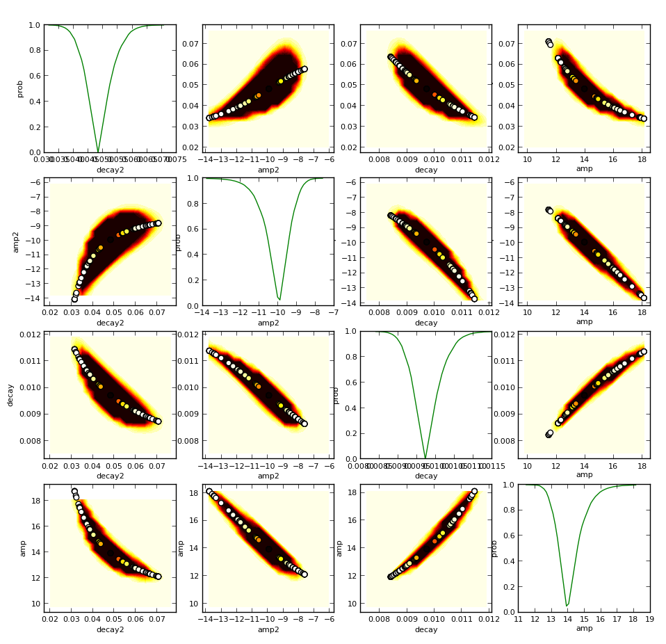

Calculation of coinfidence intervals
====================================

Since version `0.5`, lmfit is also capable of calculating the coinfidence 
intervals directly. For most models, it is not necessery: the estimation
of the standard error from the estimated covariance matrix is normally quite 
good. 

But for some models, e.g. a sum of two exponentials, the approximation begins
to fail. For this case, lmfit has the function `coinf` to calculate coinfidence
inverals directly. 

Method used for calculating coinfidence intervals
-------------------------------------------------
The F-test is used to compare our null model, which is the best fit we found,
with an alternate model, where on of the parameters is fixed to a specific value. 
The value is changed util the differnce between :math:`\chi^2_0` and 
:math:`\chi^2_{f}` can't be explained by the loss of a degree of freedom with
a certain coinfidence. 

.. math::

 F(P_{fix},N-P) = \left(\frac{\chi^2_f}{\chi^2_{0}}-1\right)\frac{N-P}{P_{fix}}

A log-likelihood method will be added soon.

Usage
-----
There a two methods, both are easy use. First you need a minimizer object
which is already fitted. Then you only have to call 

     ci=coinf(min)

and lmfit calculates the coinfidence interval for each parameter. If you set 
trace to true, you can observe the dependency between two parameter. To
calculate the coinfidence in a region, use 
    
     x,y,grid=coinf_2d(min,'para1','para2')

In the test directory is the file `test_ci2.py`, which uses both methods on
a simulated model of a sum of two decays. The result can be seen in the graphic
below. The scatter points are from the traceof `coinf` and the filled contour 
from `coinf_2d`. WARNING: calculating the the coinfidence intervals can be
a very expensive operation for complex models.

Documentation of the methods
----------------------------

.. py:module:: coinfidence
.. autofunction:: coinf
.. autofunction:: coinf_2d
.. autofunction:: cumulative_distribution

    
