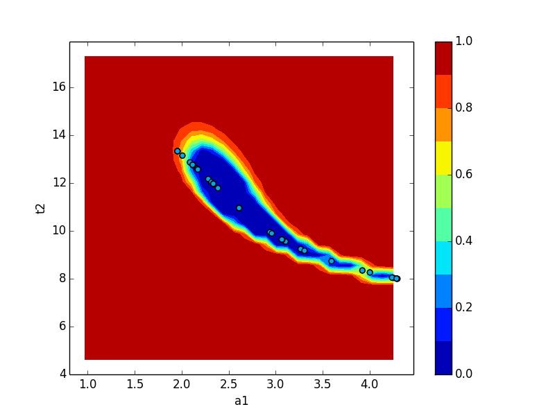

.. _confidence_chapter:

Calculation of confidence intervals
====================================

.. module:: lmfit.confidence

The lmfit :mod:`confidence` module allows you to explicitly calculate
confidence intervals for variable parameters.  For most models, it is not
necessary since the estimation of the standard error from the estimated
covariance matrix is normally quite good.

But for some models, the sum of two exponentials for example, the approximation
begins to fail. For this case, lmfit has the function :func:`conf_interval`
to calculate confidence intervals directly.  This is substantially slower
than using the errors estimated from the covariance matrix, but the results
are more robust.

Method used for calculating confidence intervals
-------------------------------------------------

The F-test is used to compare our null model, which is the best fit we have
found, with an alternate model, where one of the parameters is fixed to a
specific value. The value is changed until the difference between :math:`\chi^2_0`
and :math:`\chi^2_{f}` can't be explained by the loss of a degree of freedom
within a certain confidence.

.. math::

 F(P_{fix},N-P) = \left(\frac{\chi^2_f}{\chi^2_{0}}-1\right)\frac{N-P}{P_{fix}}

`N` is the number of data points and `P` the number of parameters of the null model.
:math:`P_{fix}` is the number of fixed parameters (or to be more clear, the
difference of number of parameters between our null model and the alternate
model).

Adding a log-likelihood method is under consideration.

A basic example
---------------

First we create an example problem::

    >>> import lmfit
    >>> import numpy as np
    >>> x = np.linspace(0.3, 10, 100)
    >>> np.random.seed(0)
    >>> y = 1/(0.1*x) + 2 + 0.1*np.random.randn(x.size)
    >>> pars = lmfit.Parameters()
    >>> pars.add_many(('a', 0.1), ('b', 1))
    >>> def residual(p):
    ...     return 1/(p['a']*x) + p['b'] - y

before we can generate the confidence intervals, we have to run a fit, so
that the automated estimate of the standard errors can be used as a
starting point::

    >>> mini = lmfit.Minimizer(residual, pars)
    >>> result = mini.minimize()
    >>> print(lmfit.fit_report(result.params))
    [[Variables]]
        a:  0.09943896 +/- 1.9322e-04 (0.19%) (init = 0.1)
        b:  1.98476945 +/- 0.01222678 (0.62%) (init = 1)
    [[Correlations]] (unreported correlations are < 0.100)
        C(a, b) =  0.601

Now it is just a simple function call to calculate the confidence
intervals::

    >>> ci = lmfit.conf_interval(mini, result)
    >>> lmfit.printfuncs.report_ci(ci)
          99.73%    95.45%    68.27%    _BEST_    68.27%    95.45%    99.73%
     a:  -0.00059  -0.00039  -0.00019   0.09944  +0.00019  +0.00039  +0.00060
     b:  -0.03766  -0.02478  -0.01230   1.98477  +0.01230  +0.02478  +0.03761

This shows the best-fit values for the parameters in the `_BEST_` column,
and parameter values that are at the varying confidence levels given by
steps in :math:`\sigma`.  As we can see, the estimated error is almost the
same, and the uncertainties are well behaved: Going from 1 :math:`\sigma`
(68% confidence) to 3 :math:`\sigma` (99.7% confidence) uncertainties is
fairly linear.  It can also be seen that the errors are fairy symmetric
around the best fit value.  For this problem, it is not necessary to
calculate confidence intervals, and the estimates of the uncertainties from
the covariance matrix are sufficient.

An advanced example
-------------------

Now we look at a problem where calculating the error from approximated
covariance can lead to misleading result -- two decaying exponentials.  In
fact such a problem is particularly hard for the Levenberg-Marquardt
method, so we first estimate the results using the slower but robust
Nelder-Mead  method, and *then* use Levenberg-Marquardt to estimate the
uncertainties and correlations.

.. literalinclude:: ../examples/doc_confidence_advanced.py

which will report::

    [[Variables]]
        a1:  2.98622120 +/- 0.14867187 (4.98%) (init = 2.986237)
        a2: -4.33526327 +/- 0.11527506 (2.66%) (init = -4.335256)
        t1:  1.30994233 +/- 0.13121177 (10.02%) (init = 1.309932)
        t2:  11.8240351 +/- 0.46316470 (3.92%) (init = 11.82408)
    [[Correlations]] (unreported correlations are < 0.500)
        C(a2, t2) =  0.987
        C(a2, t1) = -0.925
        C(t1, t2) = -0.881
        C(a1, t1) = -0.599
           95.45%    68.27%    _BEST_    68.27%    95.45%
     a1:  -0.27286  -0.14165   2.98622  +0.16353  +0.36343
     a2:  -0.30444  -0.13219  -4.33526  +0.10688  +0.19683
     t1:  -0.23392  -0.12494   1.30994  +0.14660  +0.32369
     t2:  -1.01943  -0.48820  11.82404  +0.46041  +0.90441

Again we called :func:`conf_interval`, this time with tracing and only for
1- and 2-:math:`\sigma`.  Comparing these two different estimates, we see
that the estimate for `a1` is reasonably well approximated from the
covariance matrix, but the estimates for `a2` and especially for `t1`, and
`t2` are very asymmetric and that going from 1 :math:`\sigma` (68%
confidence) to 2 :math:`\sigma` (95% confidence) is not very predictable.

Plots of the confidence region are shown in the figures below for `a1` and `t2` (left), and `a2` and `t2` (right):

.. _figC1:

  .. image:: _images/conf_interval1.png
     :target: _images/conf_interval1.png
     :width: 48%
  .. image:: _images/conf_interval1a.png
     :target: _images/conf_interval1a.png
     :width: 48%

Neither of these plots is very much like an ellipse, which is implicitly
assumed by the approach using the covariance matrix.

The trace returned as the optional second argument from
:func:`conf_interval` contains a dictionary for each variable parameter.
The values are dictionaries with arrays of values for each variable, and an
array of corresponding probabilities for the corresponding cumulative
variables.  This can be used to show the dependence between two
parameters::

    >>> x, y, prob = trace['a1']['a1'], trace['a1']['t2'], trace['a1']['prob']
    >>> x2, y2, prob2 = trace['t2']['t2'], trace['t2']['a1'], trace['t2']['prob']
    >>> plt.scatter(x, y, c=prob ,s=30)
    >>> plt.scatter(x2, y2, c=prob2, s=30)
    >>> plt.gca().set_xlim((2.5, 3.5))
    >>> plt.gca().set_ylim((11.5, 12.5))
    >>> plt.xlabel('a1')
    >>> plt.ylabel('t2')
    >>> plt.show()

which shows the trace of values:

The :meth:`Minimizer.emcee` method uses Markov Chain Monte Carlo to sample
the posterior probability distribution. These distributions demonstrate the
range of solutions that the data supports. The following image was obtained
by using :meth:`Minimizer.emcee` on the same problem.

.. image:: _images/emcee_corner.png

Credible intervals (the Bayesian equivalent of the frequentist confidence
interval) can be obtained with this method. MCMC can be used for model
selection, to determine outliers, to marginalise over nuisance parameters, etcetera.
For example, you may have fractionally underestimated the uncertainties on a
dataset. MCMC can be used to estimate the true level of uncertainty on each
datapoint. A tutorial on the possibilities offered by MCMC can be found at [1]_.

.. [1] https://jakevdp.github.io/blog/2014/03/11/frequentism-and-bayesianism-a-practical-intro/

Confidence Interval Functions
----------------------------------

.. autofunction:: lmfit.conf_interval

.. autofunction:: lmfit.conf_interval2d

.. autofunction:: lmfit.ci_report
