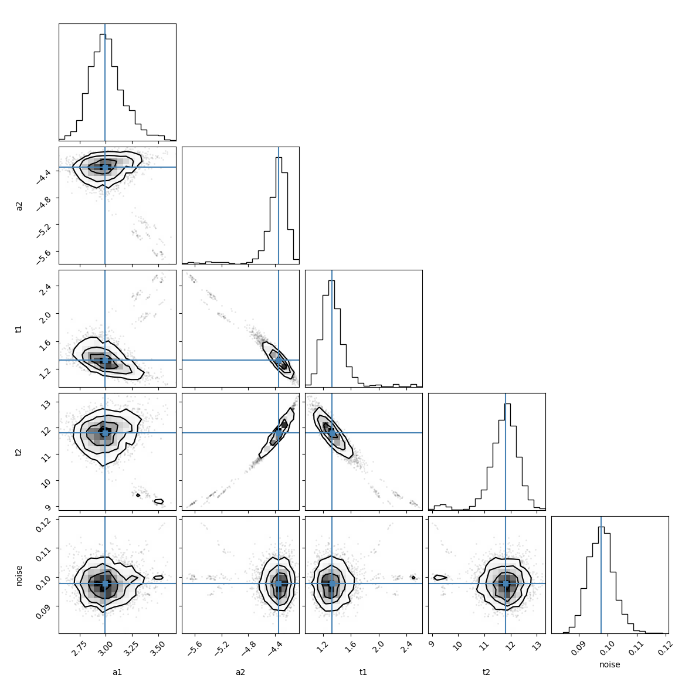

.. _minimize_chapter:

.. module:: lmfit.minimizer

=======================================
Performing Fits and Analyzing Outputs
=======================================

As shown in the previous chapter, a simple fit can be performed with the
:func:`minimize` function.  For more sophisticated modeling, the
:class:`Minimizer` class can be used to gain a bit more control, especially
when using complicated constraints or comparing results from related fits.

The :func:`minimize` function
=============================

The :func:`minimize` function is a wrapper around :class:`Minimizer` for
running an optimization problem.  It takes an objective function (the
function that calculates the array to be minimized), a :class:`Parameters`
object, and several optional arguments.  See :ref:`fit-func-label` for
details on writing the objective function.

.. autofunction:: minimize

..  _fit-func-label:

Writing a Fitting Function
===============================

An important component of a fit is writing a function to be minimized --
the *objective function*.  Since this function will be called by other
routines, there are fairly stringent requirements for its call signature
and return value.  In principle, your function can be any Python callable,
but it must look like this:

.. function:: func(params, *args, **kws):

   Calculate objective residual to be minimized from parameters.

   :param params: Parameters.
   :type  params: :class:`~lmfit.parameter.Parameters`
   :param args:  Positional arguments.  Must match ``args`` argument to :func:`minimize`.
   :param kws:   Keyword arguments.  Must match ``kws`` argument to :func:`minimize`.
   :return: Residual array (generally data-model) to be minimized in the least-squares sense.
   :rtype: numpy.ndarray.  The length of this array cannot change between calls.

A common use for the positional and keyword arguments would be to pass in other
data needed to calculate the residual, including things as the data array,
dependent variable, uncertainties in the data, and other data structures for the
model calculation.

The objective function should return the value to be minimized.  For the
Levenberg-Marquardt algorithm from :meth:`leastsq`, this returned value **must** be an
array, with a length greater than or equal to the number of fitting variables in the
model.  For the other methods, the return value can either be a scalar or an array.  If an
array is returned, the sum of squares of the array will be sent to the underlying fitting
method, effectively doing a least-squares optimization of the return values.

Since the function will be passed in a dictionary of :class:`Parameters`, it is advisable
to unpack these to get numerical values at the top of the function.  A
simple way to do this is with :meth:`Parameters.valuesdict`, as shown below::

    def residual(pars, x, data=None, eps=None):
        from numpy import exp, sign, sin, pi
        # unpack parameters: extract .value attribute for each parameter
        parvals = pars.valuesdict()
        period = parvals['period']
        shift = parvals['shift']
        decay = parvals['decay']

        if abs(shift) > pi/2:
            shift = shift - sign(shift)*pi

        if abs(period) < 1.e-10:
            period = sign(period)*1.e-10

        model = parvals['amp'] * sin(shift + x/period) * exp(-x*x*decay*decay)

        if data is None:
            return model
        if eps is None:
            return model - data
        return (model-data) / eps

In this example, `x` is a positional (required) argument, while the
`data` array is actually optional (so that the function returns the model
calculation if the data is neglected).  Also note that the model
calculation will divide `x` by the value of the ``period`` Parameter.  It
might be wise to ensure this parameter cannot be 0.  It would be possible
to use bounds on the :class:`Parameter` to do this::

    params['period'] = Parameter(value=2, min=1.e-10)

but putting this directly in the function with::

    if abs(period) < 1.e-10:
        period = sign(period)*1.e-10

is also a reasonable approach.   Similarly, one could place bounds on the
``decay`` parameter to take values only between ``-pi/2`` and ``pi/2``.

..  _fit-methods-label:

Choosing Different Fitting Methods
===========================================

By default, the `Levenberg-Marquardt
<https://en.wikipedia.org/wiki/Levenberg-Marquardt_algorithm>`_ algorithm is
used for fitting.  While often criticized, including the fact it finds a
*local* minima, this approach has some distinct advantages.  These include
being fast, and well-behaved for most curve-fitting needs, and making it
easy to estimate uncertainties for and correlations between pairs of fit
variables, as discussed in :ref:`fit-results-label`.

Alternative algorithms can also be used by providing the ``method``
keyword to the :func:`minimize` function or :meth:`Minimizer.minimize`
class as listed in the :ref:`Table of Supported Fitting Methods
<fit-methods-table>`.

.. _fit-methods-table:

 Table of Supported Fitting Methods:

 +--------------------------+------------------------------------------------------------------+
 | Fitting Method           | ``method`` arg to :func:`minimize` or :meth:`Minimizer.minimize` |
 +==========================+==================================================================+
 | Levenberg-Marquardt      |  ``leastsq`` or ``least_squares``                                |
 +--------------------------+------------------------------------------------------------------+
 | Nelder-Mead              |  ``nelder``                                                      |
 +--------------------------+------------------------------------------------------------------+
 | L-BFGS-B                 |  ``lbfgsb``                                                      |
 +--------------------------+------------------------------------------------------------------+
 | Powell                   |  ``powell``                                                      |
 +--------------------------+------------------------------------------------------------------+
 | Conjugate Gradient       |  ``cg``                                                          |
 +--------------------------+------------------------------------------------------------------+
 | Newton-CG                |  ``newton``                                                      |
 +--------------------------+------------------------------------------------------------------+
 | COBYLA                   |  ``cobyla``                                                      |
 +--------------------------+------------------------------------------------------------------+
 | BFGS                     |  ``bfgsb``                                                       |
 +--------------------------+------------------------------------------------------------------+
 | Truncated Newton         |  ``tnc``                                                         |
 +--------------------------+------------------------------------------------------------------+
 | Newton CG trust-region   |  ``trust-ncg``                                                   |
 +--------------------------+------------------------------------------------------------------+
 | Exact trust-region       |  ``trust-exact`` (SciPy >= 1.0)                                  |
 +--------------------------+------------------------------------------------------------------+
 | Newton GLTR trust-region |  ``trust-krylov`` (SciPy >= 1.0)                                 |
 +--------------------------+------------------------------------------------------------------+
 | Constrained trust-region |  ``trust-constr`` (SciPy >= 1.1)                                 |
 +--------------------------+------------------------------------------------------------------+
 | Dogleg                   |  ``dogleg``                                                      |
 +--------------------------+------------------------------------------------------------------+
 | Sequential Linear        |  ``slsqp``                                                       |
 | Squares Programming      |                                                                  |
 +--------------------------+------------------------------------------------------------------+
 | Differential             |  ``differential_evolution``                                      |
 | Evolution                |                                                                  |
 +--------------------------+------------------------------------------------------------------+
 | Brute force method       |  ``brute``                                                       |
 +--------------------------+------------------------------------------------------------------+
 | Basinhopping             |  ``basinhopping``                                                |
 +--------------------------+------------------------------------------------------------------+
 | Adaptive Memory          |  ``ampgo``                                                       |
 | Programming for Global   |                                                                  |
 | Optimization             |                                                                  |
 +--------------------------+------------------------------------------------------------------+

.. note::

   The objective function for the Levenberg-Marquardt method **must**
   return an array, with more elements than variables.  All other methods
   can return either a scalar value or an array.

.. warning::

  Much of this documentation assumes that the Levenberg-Marquardt method is
  used.  Many of the fit statistics and estimates for uncertainties in
  parameters discussed in :ref:`fit-results-label` are done only for this
  method.

..  _fit-results-label:

:class:`MinimizerResult` -- the optimization result
========================================================

.. versionadded:: 0.9.0

An optimization with :func:`minimize` or :meth:`Minimizer.minimize`
will return a :class:`MinimizerResult` object.  This is an otherwise
plain container object (that is, with no methods of its own) that
simply holds the results of the minimization.  These results will
include several pieces of informational data such as status and error
messages, fit statistics, and the updated parameters themselves.

Importantly, the parameters passed in to :meth:`Minimizer.minimize`
will be not be changed.  To find the best-fit values, uncertainties
and so on for each parameter, one must use the
:attr:`MinimizerResult.params` attribute. For example, to print the
fitted values, bounds and other parameter attributes in a
well-formatted text tables you can execute::

    result.params.pretty_print()

with `results` being a `MinimizerResult` object. Note that the method
:meth:`~lmfit.parameter.Parameters.pretty_print` accepts several arguments
for customizing the output (e.g., column width, numeric format, etcetera).

.. autoclass:: MinimizerResult

Goodness-of-Fit Statistics
~~~~~~~~~~~~~~~~~~~~~~~~~~~~~~~~~~~~~~~~~~~~

.. _goodfit-table:

 Table of Fit Results:  These values, including the standard Goodness-of-Fit statistics,
 are all attributes of the :class:`MinimizerResult` object returned by
 :func:`minimize` or :meth:`Minimizer.minimize`.

+----------------------+----------------------------------------------------------------------------+
| Attribute Name       | Description / Formula                                                      |
+======================+============================================================================+
|    nfev              | number of function evaluations                                             |
+----------------------+----------------------------------------------------------------------------+
|    nvarys            | number of variables in fit  :math:`N_{\rm varys}`                          |
+----------------------+----------------------------------------------------------------------------+
|    ndata             | number of data points:  :math:`N`                                          |
+----------------------+----------------------------------------------------------------------------+
|    nfree             | degrees of freedom in fit:  :math:`N - N_{\rm varys}`                      |
+----------------------+----------------------------------------------------------------------------+
|    residual          | residual array, returned by the objective function: :math:`\{\rm Resid_i\}`|
+----------------------+----------------------------------------------------------------------------+
|    chisqr            | chi-square: :math:`\chi^2 = \sum_i^N [{\rm Resid}_i]^2`                    |
+----------------------+----------------------------------------------------------------------------+
|    redchi            | reduced chi-square: :math:`\chi^2_{\nu}= {\chi^2} / {(N - N_{\rm varys})}` |
+----------------------+----------------------------------------------------------------------------+
|    aic               | Akaike Information Criterion statistic (see below)                         |
+----------------------+----------------------------------------------------------------------------+
|    bic               | Bayesian Information Criterion statistic (see below)                       |
+----------------------+----------------------------------------------------------------------------+
|    var_names         | ordered list of variable parameter names used for init_vals and covar      |
+----------------------+----------------------------------------------------------------------------+
|    covar             | covariance matrix (with rows/columns using var_names)                      |
+----------------------+----------------------------------------------------------------------------+
|    init_vals         | list of initial values for variable parameters                             |
+----------------------+----------------------------------------------------------------------------+

Note that the calculation of chi-square and reduced chi-square assume
that the returned residual function is scaled properly to the
uncertainties in the data.  For these statistics to be meaningful, the
person writing the function to be minimized **must** scale them properly.

After a fit using the :meth:`leastsq` method has completed
successfully, standard errors for the fitted variables and correlations
between pairs of fitted variables are automatically calculated from the
covariance matrix.  The standard error (estimated :math:`1\sigma`
error-bar) goes into the :attr:`stderr` attribute of the Parameter.  The
correlations with all other variables will be put into the
:attr:`correl` attribute of the Parameter -- a dictionary with keys for
all other Parameters and values of the corresponding correlation.

In some cases, it may not be possible to estimate the errors and
correlations.  For example, if a variable actually has no practical effect
on the fit, it will likely cause the covariance matrix to be singular,
making standard errors impossible to estimate.  Placing bounds on varied
Parameters makes it more likely that errors cannot be estimated, as being
near the maximum or minimum value makes the covariance matrix singular.  In
these cases, the :attr:`errorbars` attribute of the fit result
(:class:`Minimizer` object) will be ``False``.

.. _information_criteria_label:

Akaike and Bayesian Information Criteria
~~~~~~~~~~~~~~~~~~~~~~~~~~~~~~~~~~~~~~~~~~~~

The :class:`MinimizerResult` includes the traditional chi-square and reduced chi-square statistics:

.. math::
   :nowrap:

   \begin{eqnarray*}
        \chi^2  &=&  \sum_i^N r_i^2 \\
        \chi^2_\nu &=& = \chi^2 / (N-N_{\rm varys})
    \end{eqnarray*}

where :math:`r` is the residual array returned by the objective function
(likely to be ``(data-model)/uncertainty`` for data modeling usages),
:math:`N` is the number of data points (``ndata``), and :math:`N_{\rm
varys}` is number of variable parameters.

Also included are the `Akaike Information Criterion
<https://en.wikipedia.org/wiki/Akaike_information_criterion>`_, and
`Bayesian Information Criterion
<https://en.wikipedia.org/wiki/Bayesian_information_criterion>`_ statistics,
held in the ``aic`` and ``bic`` attributes, respectively.  These give slightly
different measures of the relative quality for a fit, trying to balance
quality of fit with the number of variable parameters used in the fit.
These are calculated as:

.. math::
   :nowrap:

   \begin{eqnarray*}
     {\rm aic} &=&  N \ln(\chi^2/N) + 2 N_{\rm varys} \\
     {\rm bic} &=&  N \ln(\chi^2/N) + \ln(N) N_{\rm varys} \\
    \end{eqnarray*}

When comparing fits with different numbers of varying parameters, one
typically selects the model with lowest reduced chi-square, Akaike
information criterion, and/or Bayesian information criterion.  Generally,
the Bayesian information criterion is considered the most conservative of
these statistics.

..  _fit-itercb-label:

Using a Iteration Callback Function
====================================

An iteration callback function is a function to be called at each
iteration, just after the objective function is called.  The iteration
callback allows user-supplied code to be run at each iteration, and can be
used to abort a fit.

.. function:: iter_cb(params, iter, resid, *args, **kws):

   User-supplied function to be run at each iteration.

   :param params: Parameters.
   :type  params: :class:`~lmfit.parameter.Parameters`
   :param iter:   Iteration number.
   :type  iter:   int
   :param resid:  Residual array.
   :type  resid:  numpy.ndarray
   :param args:  Positional arguments.  Must match ``args`` argument to :func:`minimize`
   :param kws:   Keyword arguments.  Must match ``kws`` argument to :func:`minimize`
   :return:      Residual array (generally data-model) to be minimized in the least-squares sense.
   :rtype:    None for normal behavior, any value like True to abort the fit.

Normally, the iteration callback would have no return value or return
``None``.  To abort a fit, have this function return a value that is
``True`` (including any non-zero integer).  The fit will also abort if any
exception is raised in the iteration callback. When a fit is aborted this
way, the parameters will have the values from the last iteration.  The fit
statistics are not likely to be meaningful, and uncertainties will not be computed.

..  _fit-minimizer-label:

Using the :class:`Minimizer` class
=======================================

For full control of the fitting process, you will want to create a
:class:`Minimizer` object.

.. autoclass :: Minimizer

The Minimizer object has a few public methods:

.. automethod:: Minimizer.minimize

.. automethod:: Minimizer.leastsq

.. automethod:: Minimizer.least_squares

.. automethod:: Minimizer.scalar_minimize

.. automethod:: Minimizer.prepare_fit

.. automethod:: Minimizer.brute

For more information, check the examples in ``examples/lmfit_brute_example.ipynb``.

.. automethod:: Minimizer.basinhopping

.. automethod:: Minimizer.ampgo

.. automethod:: Minimizer.emcee

.. _label-emcee:

:meth:`Minimizer.emcee` - calculating the posterior probability distribution of parameters
==============================================================================================

:meth:`Minimizer.emcee` can be used to obtain the posterior probability distribution of
parameters, given a set of experimental data. An example problem is a double
exponential decay. A small amount of Gaussian noise is also added in::

    >>> import numpy as np
    >>> import lmfit
    >>> import matplotlib.pyplot as plt
    >>> x = np.linspace(1, 10, 250)
    >>> np.random.seed(0)
    >>> y = 3.0 * np.exp(-x / 2) - 5.0 * np.exp(-(x - 0.1) / 10.) + 0.1 * np.random.randn(len(x))
    >>> plt.plot(x, y)
    >>> plt.show()

.. image:: _images/emcee_dbl_exp.png
   :target: _images/emcee_dbl_exp.png
   :width: 50%

Create a Parameter set for the initial guesses::

    >>> p = lmfit.Parameters()
    >>> p.add_many(('a1', 4.), ('a2', 4.), ('t1', 3.), ('t2', 3., True))

    >>> def residual(p):
    ...     v = p.valuesdict()
    ...     return v['a1'] * np.exp(-x / v['t1']) + v['a2'] * np.exp(-(x - 0.1) / v['t2']) - y

Solving with :func:`minimize` gives the Maximum Likelihood solution::

    >>> mi = lmfit.minimize(residual, p, method='Nelder', nan_policy='omit')
    >>> lmfit.printfuncs.report_fit(mi.params, min_correl=0.5)
    [[Variables]]
    a1:  2.98623689 (init = 4)
    a2: -4.33525597 (init = 4)
    t1:  1.30993186 (init = 3)
    t2:  11.8240752 (init = 3)

    >>> plt.plot(x, y)
    >>> plt.plot(x, residual(mi.params) + y, 'r')
    >>> plt.show()

.. image:: _images/emcee_dbl_exp2.png
   :target: _images/emcee_dbl_exp2.png
   :width: 50%

However, this doesn't give a probability distribution for the parameters.
Furthermore, we wish to deal with the data uncertainty. This is called
marginalisation of a nuisance parameter. ``emcee`` requires a function that returns
the log-posterior probability. The log-posterior probability is a sum of the
log-prior probability and log-likelihood functions. The log-prior probability is
assumed to be zero if all the parameters are within their bounds and ``-np.inf``
if any of the parameters are outside their bounds.

    >>> # add a noise parameter
    >>> mi.params.add('noise', value=1, min=0.001, max=2)

    >>> # This is the log-likelihood probability for the sampling. We're going to estimate the
    >>> # size of the uncertainties on the data as well.
    >>> def lnprob(p):
    ...    noise = p['noise']
    ...    return -0.5 * np.sum((residual(p) / noise)**2 + np.log(2 * np.pi * noise**2))

Now we have to set up the minimizer and do the sampling::

    >>> mini = lmfit.Minimizer(lnprob, mi.params)
    >>> res = mini.emcee(burn=300, steps=1000, thin=20, params=mi.params)

Lets have a look at those posterior distributions for the parameters.  This requires
installation of the `corner` package::

    >>> import corner
    >>> corner.corner(res.flatchain, labels=res.var_names, truths=list(res.params.valuesdict().values()))

The values reported in the :class:`MinimizerResult` are the medians of the
probability distributions and a 1 :math:`\sigma` quantile, estimated as half the
difference between the 15.8 and 84.2 percentiles. The median value is not
necessarily the same as the Maximum Likelihood Estimate. We'll get that as well.
You can see that we recovered the right uncertainty level on the data::

    >>> print("median of posterior probability distribution")
    >>> print('--------------------------------------------')
    >>> lmfit.report_fit(res.params)
    median of posterior probability distribution
    --------------------------------------------
    [[Variables]]
        a1:     2.99342394 +/- 0.15851315 (5.30%) (init = 2.986237)
        a2:    -4.34384999 +/- 0.12454831 (2.87%) (init = -4.335256)
        t1:     1.32338403 +/- 0.14120290 (10.67%) (init = 1.309932)
        t2:     11.7962437 +/- 0.48632272 (4.12%) (init = 11.82408)
        noise:  0.09761521 +/- 0.00431795 (4.42%) (init = 1)
    [[Correlations]] (unreported correlations are < 0.100)
        C(a2, t1)    = -0.965
        C(a2, t2)    =  0.959
        C(t1, t2)    = -0.927
        C(a1, a2)    = -0.241
        C(a1, t2)    = -0.168
        C(a2, noise) = -0.116
        C(t1, noise) =  0.107

    >>> # find the maximum likelihood solution
    >>> highest_prob = np.argmax(res.lnprob)
    >>> hp_loc = np.unravel_index(highest_prob, res.lnprob.shape)
    >>> mle_soln = res.chain[hp_loc]
    >>> for i, par in enumerate(p):
    ...     p[par].value = mle_soln[i]

    >>> print("\nMaximum likelihood Estimation")
    >>> print('-----------------------------')
    >>> print(p)
    Maximum likelihood Estimation
    -----------------------------
    Parameters([('a1', <Parameter 'a1', 2.9684811738216754, bounds=[-inf:inf]>),
    ('a2', <Parameter 'a2', -4.355238699173162, bounds=[-inf:inf]>),
    ('t1', <Parameter 't1', 1.3337647386777762, bounds=[-inf:inf]>),
    ('t2', <Parameter 't2', 11.758394302818514, bounds=[-inf:inf]>)])
    >>> # Finally lets work out a 1 and 2-sigma error estimate for 't1'
    >>> quantiles = np.percentile(res.flatchain['t1'], [2.28, 15.9, 50, 84.2, 97.7])
    >>> print("1 sigma spread", 0.5 * (quantiles[3] - quantiles[1]))
    >>> print("2 sigma spread", 0.5 * (quantiles[4] - quantiles[0]))
    1 sigma spread 0.1414604069179637
    2 sigma spread 0.453234685099423

Getting and Printing Fit Reports
===========================================

.. currentmodule:: lmfit.printfuncs

.. autofunction:: fit_report

An example using this to write out a fit report would be:

.. literalinclude:: ../examples/doc_fitting_withreport.py

which would write out::

    [[Fit Statistics]]
        # fitting method   = leastsq
        # function evals   = 83
        # data points      = 1001
        # variables        = 4
        chi-square         = 498.811759
        reduced chi-square = 0.50031270
        Akaike info crit   = -689.222517
        Bayesian info crit = -669.587497
    [[Variables]]
        amp:     13.9121945 +/- 0.14120288 (1.01%) (init = 13)
        period:  5.48507045 +/- 0.02666492 (0.49%) (init = 2)
        shift:   0.16203677 +/- 0.01405661 (8.67%) (init = 0)
        decay:   0.03264538 +/- 3.8014e-04 (1.16%) (init = 0.02)
    [[Correlations]] (unreported correlations are < 0.100)
        C(period, shift) =  0.797
        C(amp, decay)    =  0.582
        C(amp, shift)    = -0.297
        C(amp, period)   = -0.243
        C(shift, decay)  = -0.182
        C(period, decay) = -0.150
