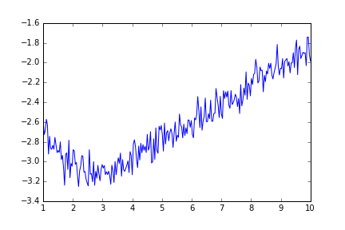
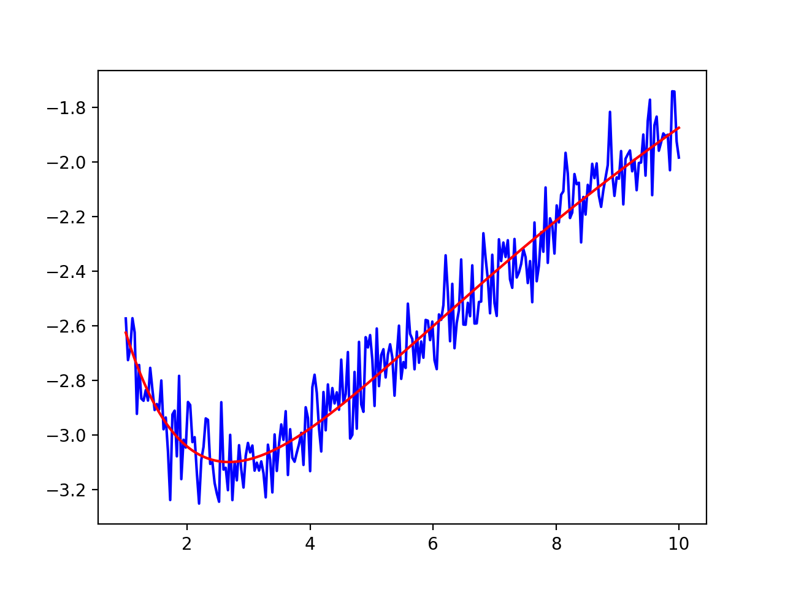

.. _minimize_chapter:

.. module:: lmfit.minimizer

=======================================
Performing Fits, Analyzing Outputs
=======================================

As shown in the previous chapter, a simple fit can be performed with the
:func:`minimize` function.  For more sophisticated modeling, the
:class:`Minimizer` class can be used to gain a bit more control, especially
when using complicated constraints or comparing results from related fits.

.. warning::

  Upgrading scripts from version 0.8.3 to 0.9.0?  See  :ref:`whatsnew_090_label`

The :func:`minimize` function
===============================

The :func:`minimize` function is a wrapper around :class:`Minimizer` for
running an optimization problem.  It takes an objective function (the
function that calculates the array to be minimized), a :class:`Parameters`
object, and several optional arguments.  See :ref:`fit-func-label` for
details on writing the objective.

.. function:: minimize(function, params[, args=None[, kws=None[, method='leastsq'[, scale_covar=True[, iter_cb=None[, **fit_kws]]]]]])

   find values for the ``params`` so that the sum-of-squares of the array returned
   from ``function`` is minimized.

   :param function:  function to return fit residual.  See :ref:`fit-func-label` for details.
   :type  function:  callable.
   :param params:  a :class:`Parameters` dictionary.  Keywords must be strings
		   that match ``[a-z_][a-z0-9_]*`` and cannot be a python
		   reserved word.  Each value must be :class:`Parameter`.
   :type  params:  :class:`Parameters`.
   :param args:  arguments tuple to pass to the residual function as  positional arguments.
   :type  args:  tuple
   :param kws:   dictionary to pass to the residual function as keyword arguments.
   :type  kws:  dict
   :param method:  name of fitting method to use. See  :ref:`fit-methods-label` for details
   :type  method:  string (default ``leastsq``)
   :param scale_covar:  whether to automatically scale covariance matrix (``leastsq`` only)
   :type  scale_covar:  bool (default ``True``)
   :param iter_cb:  function to be called at each fit iteration. See :ref:`fit-itercb-label` for details.
   :type  iter_cb:  callable or ``None``
   :param fit_kws:  dictionary to pass to :scipydoc:`optimize.leastsq` or :scipydoc:`optimize.minimize`.
   :type  fit_kws:  dict

   :return: :class:`MinimizerResult` instance, which will contain the
	    optimized parameter, and several goodness-of-fit statistics.

.. versionchanged:: 0.9.0
   return value changed to :class:`MinimizerResult`

   On output, the params will be unchanged.  The best-fit values, and where
   appropriate, estimated uncertainties and correlations, will all be
   contained in the returned :class:`MinimizerResult`.  See
   :ref:`fit-results-label` for further details.

   For clarity, it should be emphasized that this function is simply a
   wrapper around :class:`Minimizer` that runs a single fit, implemented as::

    fitter = Minimizer(fcn, params, fcn_args=args, fcn_kws=kws,
		       iter_cb=iter_cb, scale_covar=scale_covar, **fit_kws)
    return fitter.minimize(method=method)

..  _fit-func-label:

Writing a Fitting Function
===============================

An important component of a fit is writing a function to be minimized --
the *objective function*.  Since this function will be called by other
routines, there are fairly stringent requirements for its call signature
and return value.  In principle, your function can be any python callable,
but it must look like this:

.. function:: func(params, *args, **kws):

   calculate objective residual to be minimized from parameters.

   :param params: parameters.
   :type  params: :class:`Parameters`.
   :param args:  positional arguments.  Must match ``args`` argument to :func:`minimize`
   :param kws:   keyword arguments.  Must match ``kws`` argument to :func:`minimize`
   :return: residual array (generally data-model) to be minimized in the least-squares sense.
   :rtype: numpy array.  The length of this array cannot change between calls.

A common use for the positional and keyword arguments would be to pass in other
data needed to calculate the residual, including such things as the data array,
dependent variable, uncertainties in the data, and other data structures for the
model calculation.

The objective function should return the value to be minimized.  For the
Levenberg-Marquardt algorithm from :meth:`leastsq`, this returned value **must** be an
array, with a length greater than or equal to the number of fitting variables in the
model.  For the other methods, the return value can either be a scalar or an array.  If an
array is returned, the sum of squares of the array will be sent to the underlying fitting
method, effectively doing a least-squares optimization of the return values.

Since the function will be passed in a dictionary of :class:`Parameters`, it is advisable
to unpack these to get numerical values at the top of the function.  A
simple way to do this is with :meth:`Parameters.valuesdict`, as with::

    def residual(pars, x, data=None, eps=None):
	# unpack parameters:
	#  extract .value attribute for each parameter
	parvals = pars.valuesdict()
	period = parvals['period']
	shift = parvals['shift']
	decay = parvals['decay']

	if abs(shift) > pi/2:
	    shift = shift - sign(shift)*pi

	if abs(period) < 1.e-10:
	    period = sign(period)*1.e-10

	model = parvals['amp'] * sin(shift + x/period) * exp(-x*x*decay*decay)

	if data is None:
	    return model
	if eps is None:
	    return (model - data)
	return (model - data)/eps

In this example, ``x`` is a positional (required) argument, while the
``data`` array is actually optional (so that the function returns the model
calculation if the data is neglected).  Also note that the model
calculation will divide ``x`` by the value of the 'period' Parameter.  It
might be wise to ensure this parameter cannot be 0.  It would be possible
to use the bounds on the :class:`Parameter` to do this::

    params['period'] = Parameter(value=2, min=1.e-10)

but putting this directly in the function with::

	if abs(period) < 1.e-10:
	    period = sign(period)*1.e-10

is also a reasonable approach.   Similarly, one could place bounds on the
``decay`` parameter to take values only between ``-pi/2`` and ``pi/2``.

..  _fit-methods-label:

Choosing Different Fitting Methods
===========================================

By default, the `Levenberg-Marquardt
<http://en.wikipedia.org/wiki/Levenberg-Marquardt_algorithm>`_ algorithm is
used for fitting.  While often criticized, including the fact it finds a
*local* minima, this approach has some distinct advantages.  These include
being fast, and well-behaved for most curve-fitting needs, and making it
easy to estimate uncertainties for and correlations between pairs of fit
variables, as discussed in :ref:`fit-results-label`.

Alternative algorithms can also be used by providing the ``method``
keyword to the :func:`minimize` function or :meth:`Minimizer.minimize`
class as listed in the :ref:`Table of Supported Fitting Methods
<fit-methods-table>`.

.. _fit-methods-table:

 Table of Supported Fitting Methods:

 +-----------------------+------------------------------------------------------------------+
 | Fitting Method        | ``method`` arg to :func:`minimize` or :meth:`Minimizer.minimize` |
 +=======================+==================================================================+
 | Levenberg-Marquardt   |  ``leastsq``                                                     |
 +-----------------------+------------------------------------------------------------------+
 | Nelder-Mead           |  ``nelder``                                                      |
 +-----------------------+------------------------------------------------------------------+
 | L-BFGS-B              |  ``lbfgsb``                                                      |
 +-----------------------+------------------------------------------------------------------+
 | Powell                |  ``powell``                                                      |
 +-----------------------+------------------------------------------------------------------+
 | Conjugate Gradient    |  ``cg``                                                          |
 +-----------------------+------------------------------------------------------------------+
 | Newton-CG             |  ``newton``                                                      |
 +-----------------------+------------------------------------------------------------------+
 | COBYLA                |  ``cobyla``                                                      |
 +-----------------------+------------------------------------------------------------------+
 | Truncated Newton      |  ``tnc``                                                         |
 +-----------------------+------------------------------------------------------------------+
 | Dogleg                |  ``dogleg``                                                      |
 +-----------------------+------------------------------------------------------------------+
 | Sequential Linear     |  ``slsqp``                                                       |
 | Squares Programming   |                                                                  |
 +-----------------------+------------------------------------------------------------------+
 | Differential          |  ``differential_evolution``                                      |
 | Evolution             |                                                                  |
 +-----------------------+------------------------------------------------------------------+

.. note::

   The objective function for the Levenberg-Marquardt method **must**
   return an array, with more elements than variables.  All other methods
   can return either a scalar value or an array.

.. warning::

  Much of this documentation assumes that the Levenberg-Marquardt method is
  the method used.  Many of the fit statistics and estimates for
  uncertainties in parameters discussed in :ref:`fit-results-label` are
  done only for this method.

..  _fit-results-label:

:class:`MinimizerResult` -- the optimization result
========================================================

.. class:: MinimizerResult(**kws)

.. versionadded:: 0.9.0

An optimization with :func:`minimize` or :meth:`Minimizer.minimize`
will return a :class:`MinimizerResult` object.  This is an otherwise
plain container object (that is, with no methods of its own) that
simply holds the results of the minimization.  These results will
include several pieces of informational data such as status and error
messages, fit statistics, and the updated parameters themselves.

Importantly, the parameters passed in to :meth:`Minimizer.minimize`
will be not be changed.  To to find the best-fit values, uncertainties
and so on for each parameter, one must use the
:attr:`MinimizerResult.params` attribute.

.. attribute::   params

  the :class:`Parameters` actually used in the fit, with updated
  values, :attr:`stderr` and :attr:`correl`.

.. attribute::  var_names

  ordered list of variable parameter names used in optimization, and
  useful for understanding the the values in :attr:`init_vals` and
  :attr:`covar`.

.. attribute:: covar

  covariance matrix from minimization (`leastsq` only), with
  rows/columns using :attr:`var_names`.

.. attribute:: init_vals

  list of initial values for variable parameters using :attr:`var_names`.

.. attribute::  nfev

  number of function evaluations

.. attribute::  success

  boolean (``True``/``False``) for whether fit succeeded.

.. attribute::  errorbars

  boolean (``True``/``False``) for whether uncertainties were
  estimated.

.. attribute::  message

  message about fit success.

.. attribute::  ier

  integer error value from :scipydoc:`optimize.leastsq`  (`leastsq`  only).

.. attribute::  lmdif_message

  message from :scipydoc:`optimize.leastsq` (`leastsq` only).

.. attribute::  nvarys

  number of variables in fit  :math:`N_{\rm varys}`

.. attribute::  ndata

  number of data points:  :math:`N`

.. attribute::  nfree `

  degrees of freedom in fit:  :math:`N - N_{\rm varys}`

.. attribute::  residual

  residual array, return value of :func:`func`:  :math:`{\rm Resid}`

.. attribute::  chisqr

  chi-square: :math:`\chi^2 = \sum_i^N [{\rm Resid}_i]^2`

.. attribute::  redchi

  reduced chi-square: :math:`\chi^2_{\nu}= {\chi^2} / {(N - N_{\rm
  varys})}`

.. attribute::  aic

  Akaike Information Criterion statistic (see below)

.. attribute::  bic

  Bayesian Information Criterion statistic (see below).

Goodness-of-Fit Statistics
~~~~~~~~~~~~~~~~~~~~~~~~~~~~~~~~~~~~~~~~~~~~

.. _goodfit-table:

 Table of Fit Results:  These values, including the standard Goodness-of-Fit statistics,
 are all attributes of the :class:`MinimizerResult` object returned by
 :func:`minimize` or :meth:`Minimizer.minimize`.

+----------------------+----------------------------------------------------------------------------+
| Attribute Name       | Description / Formula                                                      |
+======================+============================================================================+
|    nfev              | number of function evaluations                                             |
+----------------------+----------------------------------------------------------------------------+
|    nvarys            | number of variables in fit  :math:`N_{\rm varys}`                          |
+----------------------+----------------------------------------------------------------------------+
|    ndata             | number of data points:  :math:`N`                                          |
+----------------------+----------------------------------------------------------------------------+
|    nfree `           | degrees of freedom in fit:  :math:`N - N_{\rm varys}`                      |
+----------------------+----------------------------------------------------------------------------+
|    residual          | residual array, return value of :func:`func`:  :math:`{\rm Resid}`         |
+----------------------+----------------------------------------------------------------------------+
|    chisqr            | chi-square: :math:`\chi^2 = \sum_i^N [{\rm Resid}_i]^2`                    |
+----------------------+----------------------------------------------------------------------------+
|    redchi            | reduced chi-square: :math:`\chi^2_{\nu}= {\chi^2} / {(N - N_{\rm varys})}` |
+----------------------+----------------------------------------------------------------------------+
|    aic               | Akaike Information Criterion statistic (see below)                         |
+----------------------+----------------------------------------------------------------------------+
|    bic               | Bayesian Information Criterion statistic (see below)                       |
+----------------------+----------------------------------------------------------------------------+
|    var_names         | ordered list of variable parameter names used for init_vals and covar      |
+----------------------+----------------------------------------------------------------------------+
|    covar             | covariance matrix (with rows/columns using var_names                       |
+----------------------+----------------------------------------------------------------------------+
|    init_vals         | list of initial values for variable parameters                             |
+----------------------+----------------------------------------------------------------------------+

Note that the calculation of chi-square and reduced chi-square assume
that the returned residual function is scaled properly to the
uncertainties in the data.  For these statistics to be meaningful, the
person writing the function to be minimized must scale them properly.

After a fit using using the :meth:`leastsq` method has completed
successfully, standard errors for the fitted variables and correlations
between pairs of fitted variables are automatically calculated from the
covariance matrix.  The standard error (estimated :math:`1\sigma`
error-bar) go into the :attr:`stderr` attribute of the Parameter.  The
correlations with all other variables will be put into the
:attr:`correl` attribute of the Parameter -- a dictionary with keys for
all other Parameters and values of the corresponding correlation.

In some cases, it may not be possible to estimate the errors and
correlations.  For example, if a variable actually has no practical effect
on the fit, it will likely cause the covariance matrix to be singular,
making standard errors impossible to estimate.  Placing bounds on varied
Parameters makes it more likely that errors cannot be estimated, as being
near the maximum or minimum value makes the covariance matrix singular.  In
these cases, the :attr:`errorbars` attribute of the fit result
(:class:`Minimizer` object) will be ``False``.

.. _information_criteria_label:

Akaike and Bayesian Information Criteria
~~~~~~~~~~~~~~~~~~~~~~~~~~~~~~~~~~~~~~~~~~~~

The :class:`MinimizerResult` includes the traditional chi-square and reduced chi-square statistics:

.. math::
   :nowrap:

   \begin{eqnarray*}
	\chi^2  &=&  \sum_i^N r_i^2 \\
	\chi^2_\nu &=& = \chi^2 / (N-N_{\rm varys})
    \end{eqnarray*}

where :math:`r` is the residual array returned by the objective function
(likely to be ``(data-model)/uncertainty`` for data modeling usages),
:math:`N` is the number of data points (``ndata``), and :math:`N_{\rm
varys}` is number of variable parameters.

Also included are the `Akaike Information Criterion
<http://en.wikipedia.org/wiki/Akaike_information_criterion>`_, and
`Bayesian Information Criterion
<http://en.wikipedia.org/wiki/Bayesian_information_criterion>`_ statistics,
held in the ``aic`` and ``bic`` attributes, respectively.  These give slightly
different measures of the relative quality for a fit, trying to balance
quality of fit with the number of variable parameters used in the fit.
These are calculated as

.. math::
   :nowrap:

   \begin{eqnarray*}
     {\rm aic} &=&  N \ln(\chi^2/N) + 2 N_{\rm varys} \\
     {\rm bic} &=&  N \ln(\chi^2/N) + \ln(N) *N_{\rm varys} \\
    \end{eqnarray*}

When comparing fits with different numbers of varying parameters, one
typically selects the model with lowest reduced chi-square, Akaike
information criterion, and/or Bayesian information criterion.  Generally,
the Bayesian information criterion is considered the most conservative of
these statistics.

..  _fit-itercb-label:

Using a Iteration Callback Function
====================================

An iteration callback function is a function to be called at each
iteration, just after the objective function is called.  The iteration
callback allows user-supplied code to be run at each iteration, and can be
used to abort a fit.

.. function:: iter_cb(params, iter, resid, *args, **kws):

   user-supplied function to be run at each iteration

   :param params: parameters.
   :type  params: :class:`Parameters`.
   :param iter:   iteration number
   :type  iter:   integer
   :param resid:  residual array.
   :type  resid:  ndarray
   :param args:  positional arguments.  Must match ``args`` argument to :func:`minimize`
   :param kws:   keyword arguments.  Must match ``kws`` argument to :func:`minimize`
   :return:      residual array (generally data-model) to be minimized in the least-squares sense.
   :rtype:    ``None`` for normal behavior, any value like ``True`` to abort fit.

Normally, the iteration callback would have no return value or return
``None``.  To abort a fit, have this function return a value that is
``True`` (including any non-zero integer).  The fit will also abort if any
exception is raised in the iteration callback. When a fit is aborted this
way, the parameters will have the values from the last iteration.  The fit
statistics are not likely to be meaningful, and uncertainties will not be computed.

..  _fit-minimizer-label:

Using the :class:`Minimizer` class
=======================================

For full control of the fitting process, you'll want to create a
:class:`Minimizer` object.

.. class:: Minimizer(function, params, fcn_args=None, fcn_kws=None, iter_cb=None, scale_covar=True, mask_non_finite=False, **kws)

   creates a Minimizer, for more detailed access to fitting methods and attributes.

   :param function:  objective function to return fit residual.  See :ref:`fit-func-label` for details.
   :type  function:  callable.
   :param params:  a dictionary of Parameters.  Keywords must be strings
		   that match ``[a-z_][a-z0-9_]*`` and is not a python
		   reserved word.  Each value must be :class:`Parameter`.
   :type  params:  dict
   :param fcn_args:  arguments tuple to pass to the residual function as  positional arguments.
   :type  fcn_args: tuple
   :param fcn_kws:  dictionary to pass to the residual function as keyword arguments.
   :type  fcn_kws:  dict
   :param iter_cb:  function to be called at each fit iteration.  See :ref:`fit-itercb-label` for details.
   :type  iter_cb:  callable or ``None``
   :param scale_covar:  flag for automatically scaling covariance matrix and uncertainties to reduced chi-square (``leastsq`` only)
   :type  scale_covar:  bool (default ``True``).
   :param nan_policy: Specifies action if `userfcn` (or a Jacobian) returns nan
    values. One of:

		'raise' - a `ValueError` is raised
		'propagate' - the values returned from `userfcn` are un-altered
		'omit' - the non-finite values are filtered.

   :type  nan_policy: str (default 'raise')
   :param kws:      dictionary to pass as keywords to the underlying :mod:`scipy.optimize` method.
   :type  kws:      dict

The Minimizer object has a few public methods:

.. method:: minimize(method='leastsq', params=None, **kws)

   perform fit using either :meth:`leastsq` or :meth:`scalar_minimize`.

   :param method: name of fitting method.  Must be one of the names in
		  :ref:`Table of Supported Fitting Methods <fit-methods-table>`
   :type  method:  str.
   :param params:  a :class:`Parameters` dictionary for starting values
   :type  params:  :class:`Parameters` or `None`

   :return: :class:`MinimizerResult` object, containing updated
	    parameters, fitting statistics, and information.

.. versionchanged:: 0.9.0
   return value changed to :class:`MinimizerResult`

   Additional keywords are passed on to the correspond :meth:`leastsq`
   or :meth:`scalar_minimize` method.

.. method:: leastsq(params=None, scale_covar=True, **kws)

   perform fit with Levenberg-Marquardt algorithm.  Keywords will be
   passed directly to :scipydoc:`optimize.leastsq`.  By default,
   numerical derivatives are used, and the following arguments are set:

    +------------------+----------------+------------------------------------------------------------+
    | :meth:`leastsq`  |  Default Value | Description                                                |
    | arg              |                |                                                            |
    +==================+================+============================================================+
    |   xtol           |  1.e-7         | Relative error in the approximate solution                 |
    +------------------+----------------+------------------------------------------------------------+
    |   ftol           |  1.e-7         | Relative error in the desired sum of squares               |
    +------------------+----------------+------------------------------------------------------------+
    |   maxfev         | 2000*(nvar+1)  | maximum number of function calls (nvar= # of variables)    |
    +------------------+----------------+------------------------------------------------------------+
    |   Dfun           | ``None``       | function to call for Jacobian calculation                  |
    +------------------+----------------+------------------------------------------------------------+

.. versionchanged:: 0.9.0
   return value changed to :class:`MinimizerResult`

.. method:: scalar_minimize(method='Nelder-Mead', params=None, hess=None, tol=None, **kws)

   perform fit with any of the scalar minimization algorithms supported by
   :scipydoc:`optimize.minimize`.

    +-------------------------+-----------------+-----------------------------------------------------+
    | :meth:`scalar_minimize` | Default Value   | Description                                         |
    | arg                     |                 |                                                     |
    +=========================+=================+=====================================================+
    |   method                | ``Nelder-Mead`` | fitting method                                      |
    +-------------------------+-----------------+-----------------------------------------------------+
    |   tol                   | 1.e-7           | fitting and parameter tolerance                     |
    +-------------------------+-----------------+-----------------------------------------------------+
    |   hess                  | None            | Hessian of objective function                       |
    +-------------------------+-----------------+-----------------------------------------------------+

.. versionchanged:: 0.9.0
   return value changed to :class:`MinimizerResult`

.. method:: prepare_fit(**kws)

   prepares and initializes model and Parameters for subsequent
   fitting. This routine prepares the conversion of :class:`Parameters`
   into fit variables, organizes parameter bounds, and parses, "compiles"
   and checks constrain expressions.   The method also creates and returns
   a new instance of a :class:`MinimizerResult` object that contains the
   copy of the Parameters that will actually be varied in the fit.

   This method is called directly by the fitting methods, and it is
   generally not necessary to call this function explicitly.

.. versionchanged:: 0.9.0
   return value changed to :class:`MinimizerResult`

.. method:: emcee(params=None, steps=1000, nwalkers=100, burn=0, thin=1, ntemps=1, pos=None, reuse_sampler=False, workers=1, float_behavior='posterior', is_weighted=True, seed=None)

  Bayesian sampling of the posterior distribution for the parameters using the `emcee`
  Markov Chain Monte Carlo package. The method assumes that the prior is Uniform. You need
  to have `emcee` installed to use this method.

  :param params: a :class:`Parameters` dictionary for starting values
  :type  params: :class:`Parameters` or `None`
  :param steps: How many samples you would like to draw from the posterior
		 distribution for each of the walkers?
  :type  steps: int
  :param nwalkers: Should be set so :math:`nwalkers >> nvarys`, where `nvarys`
		    are the number of parameters being varied during the fit.
		    "Walkers are the members of the ensemble. They are almost
		    like separate Metropolis-Hastings chains but, of course,
		    the proposal distribution for a given walker depends on the
		    positions of all the other walkers in the ensemble." - from
		    [1]_.
  :type  nwalkers: int
  :param burn: Discard this many samples from the start of the sampling regime.
  :type  burn: int
  :param thin: Only accept 1 in every `thin` samples.
  :type  thin: int
  :param ntemps: If `ntemps > 1` perform a Parallel Tempering.
  :type ntemps: int
  :param pos: Specify the initial positions for the sampler.  If `ntemps == 1`
	      then `pos.shape` should be `(nwalkers, nvarys)`. Otherwise,
	      `(ntemps, nwalkers, nvarys)`. You can also initialise using a
	      previous chain that had the same `ntemps`, `nwalkers` and `nvarys`.
  :type pos: np.ndarray
  :param reuse_sampler:  If you have already run :meth:`emcee` on a given
	    :class:`Minimizer` object then it possesses an internal sampler
	    attribute. You can continue to draw from the same sampler (retaining
	    the chain history) if you set this option to `True`. Otherwise a new
	    sampler is created. The `nwalkers`, `ntemps` and `params` keywords
	    are ignored with this option.
	    **Important**: the :class:`Parameters` used to create the sampler
	    must not change in-between calls to :meth:`emcee`. Alteration of
	    :class:`Parameters` would include changed ``min``, ``max``,
	    ``vary`` and ``expr`` attributes. This may happen, for example, if
	    you use an altered :class:`Parameters` object and call the
	    :meth:`minimize` method in-between calls to :meth:`emcee` .
  :type  reuse_sampler:  bool
  :param workers: For parallelization of sampling.  It can be any Pool-like object
	    with a map method that follows the same calling sequence as the
	    built-in map function. If int is given as the argument, then a
	    multiprocessing-based pool is spawned internally with the
	    corresponding number of parallel processes. 'mpi4py'-based
	    parallelization and 'joblib'-based parallelization pools can also
	    be used here. **Note**: because of multiprocessing overhead it may
	    only be worth parallelising if the objective function is expensive
	    to calculate, or if there are a large number of objective
	    evaluations per step (`ntemps * nwalkers * nvarys`).
  :type workers: int or Pool-like
  :type float_behavior: str
  :param float_behavior: Specifies the meaning of the objective function if it
   returns a float. One of:

    'posterior' - the objective function returns a log-posterior probability

    'chi2' - the objective function is returning :math:`\chi^2`.

   See Notes for further details.
  :param is_weighted: Has your objective function been weighted by measurement
	    uncertainties? If `is_weighted is True` then your objective
	    function is assumed to return residuals that have been divided by
	    the true measurement uncertainty `(data - model) / sigma`. If
	    `is_weighted is False` then the objective function is assumed to
	    return unweighted residuals, `data - model`. In this case `emcee`
	    will employ a positive measurement uncertainty during the sampling.
	    This measurement uncertainty will be present in the output params
	    and output chain with the name `__lnsigma`. A side effect of this
	    is that you cannot use this parameter name yourself.
	    **Important** this parameter only has any effect if your objective
	    function returns an array. If your objective function returns a
	    float, then this parameter is ignored. See Notes for more details.
  :type is_weighted: bool
  :param seed: If `seed` is an int, a new `np.random.RandomState` instance is used,
	    seeded with `seed`.
	    If `seed` is already a `np.random.RandomState` instance, then that
	    `np.random.RandomState` instance is used.
	    Specify `seed` for repeatable sampling.
  :type seed: int or np.random.RandomState

  :return: :class:`MinimizerResult` object containing updated params, statistics,
	    etc. The :class:`MinimizerResult` also contains the ``chain``,
	    ``flatchain`` and ``lnprob`` attributes. The ``chain``
	    and ``flatchain`` attributes contain the samples and have the shape
	    `(nwalkers, (steps - burn) // thin, nvarys)` or
	    `(ntemps, nwalkers, (steps - burn) // thin, nvarys)`,
	    depending on whether Parallel tempering was used or not.
	    `nvarys` is the number of parameters that are allowed to vary.
	    The ``flatchain`` attribute is a :class:`pandas.DataFrame` of the
	    flattened chain, `chain.reshape(-1, nvarys)`. To access flattened
	    chain values for a particular parameter use
	    `result.flatchain[parname]`. The ``lnprob`` attribute contains the
	    log probability for each sample in ``chain``. The sample with the
	    highest probability corresponds to the maximum likelihood estimate.

  This method samples the posterior distribution of the parameters using
  Markov Chain Monte Carlo.  To do so it needs to calculate the
  log-posterior probability of the model parameters, `F`, given the data,
  `D`, :math:`\ln p(F_{true} | D)`. This 'posterior probability' is
  calculated as:

  .. math::

    \ln p(F_{true} | D) \propto \ln p(D | F_{true}) + \ln p(F_{true})

  where :math:`\ln p(D | F_{true})` is the 'log-likelihood' and
  :math:`\ln p(F_{true})` is the 'log-prior'. The default log-prior
  encodes prior information already known about the model. This method
  assumes that the log-prior probability is `-np.inf` (impossible) if the
  one of the parameters is outside its limits. The log-prior probability
  term is zero if all the parameters are inside their bounds (known as a
  uniform prior). The log-likelihood function is given by [1]_:

  .. math::

    \ln p(D|F_{true}) = -\frac{1}{2}\sum_n \left[\frac{\left(g_n(F_{true}) - D_n \right)^2}{s_n^2}+\ln (2\pi s_n^2)\right]

  The first summand in the square brackets represents the residual for a
  given datapoint (:math:`g` being the generative model) . This term
  represents :math:`\chi^2` when summed over all datapoints.
  Ideally the objective function used to create :class:`lmfit.Minimizer` should
  return the log-posterior probability, :math:`\ln p(F_{true} | D)`.
  However, since the in-built log-prior term is zero, the objective
  function can also just return the log-likelihood, unless you wish to
  create a non-uniform prior.

  If a float value is returned by the objective function then this value
  is assumed by default to be the log-posterior probability, i.e.
  `float_behavior is 'posterior'`. If your objective function returns
  :math:`\chi^2`, then you should use a value of `'chi2'` for
  `float_behavior`. `emcee` will then multiply your :math:`\chi^2` value
  by -0.5 to obtain the posterior probability.

  However, the default behaviour of many objective functions is to return
  a vector of (possibly weighted) residuals. Therefore, if your objective
  function returns a vector, `res`, then the vector is assumed to contain
  the residuals. If `is_weighted is True` then your residuals are assumed
  to be correctly weighted by the standard deviation of the data points
  (`res = (data - model) / sigma`) and the log-likelihood (and
  log-posterior probability) is calculated as: `-0.5 * np.sum(res **2)`.
  This ignores the second summand in the square brackets. Consequently, in
  order to calculate a fully correct log-posterior probability value your
  objective function should return a single value. If `is_weighted is False`
  then the data uncertainty, :math:`s_n`, will be treated as a nuisance
  parameter and will be marginalised out. This is achieved by employing a
  strictly positive uncertainty (homoscedasticity) for each data point,
  :math:`s_n=exp(\_\_lnsigma)`. `__lnsigma` will be present in
  `MinimizerResult.params`, as well as `Minimizer.chain`, `nvarys` will also be
  increased by one.

  .. [1] http://dan.iel.fm/emcee/current/user/line/

.. _label-emcee:

:meth:`emcee` - calculating the posterior probability distribution of parameters
==============================================================================================

:meth:`emcee` can be used to obtain the posterior probability distribution of
parameters, given a set of experimental data. An example problem is a double
exponential decay. A small amount of Gaussian noise is also added in::

    >>> import numpy as np
    >>> import lmfit
    >>> import matplotlib.pyplot as plt
    >>> x = np.linspace(1, 10, 250)
    >>> np.random.seed(0)
    >>> y = 3.0 * np.exp(-x / 2) - 5.0 * np.exp(-(x - 0.1) / 10.) + 0.1 * np.random.randn(len(x))
    >>> plt.plot(x, y)
    >>> plt.show()

Create a Parameter set for the initial guesses::

    >>> p = lmfit.Parameters()
    >>> p.add_many(('a1', 4.), ('a2', 4.), ('t1', 3.), ('t2', 3., True))

    >>> def residual(p):
    ...     v = p.valuesdict()
    ...     return v['a1'] * np.exp(-x / v['t1']) + v['a2'] * np.exp(-(x - 0.1) / v['t2']) - y

Solving with :func:`minimize` gives the Maximum Likelihood solution.::

    >>> mi = lmfit.minimize(residual, p, method='Nelder')
    >>> lmfit.printfuncs.report_fit(mi.params, min_correl=0.5)
    [[Variables]]
	a1:   2.98623688 (init= 4)
	a2:  -4.33525596 (init= 4)
	t1:   1.30993185 (init= 3)
	t2:   11.8240752 (init= 3)
    [[Correlations]] (unreported correlations are <  0.500)
    >>> plt.plot(x, y)
    >>> plt.plot(x, residual(mi.params) + y, 'r')
    >>> plt.show()

However, this doesn't give a probability distribution for the parameters.
Furthermore, we wish to deal with the data uncertainty. This is called
marginalisation of a nuisance parameter. emcee requires a function that returns
the log-posterior probability. The log-posterior probability is a sum of the
log-prior probability and log-likelihood functions. The log-prior probability is
assumed to be zero if all the parameters are within their bounds and `-np.inf`
if any of the parameters are outside their bounds.::

    >>> # add a noise parameter
    >>> mi.params.add('f', value=1, min=0.001, max=2)

    >>> # This is the log-likelihood probability for the sampling. We're going to estimate the
    >>> # size of the uncertainties on the data as well.
    >>> def lnprob(p):
    ...    resid = residual(p)
    ...    s = p['f']
    ...    resid *= 1 / s
    ...    resid *= resid
    ...    resid += np.log(2 * np.pi * s**2)
    ...    return -0.5 * np.sum(resid)

Now we have to set up the minimizer and do the sampling.::

    >>> mini = lmfit.Minimizer(lnprob, mi.params)
    >>> res = mini.emcee(burn=300, steps=600, thin=10, params=mi.params)

Lets have a look at those posterior distributions for the parameters.  This requires
installation of the `corner` package.::

    >>> import corner
    >>> corner.corner(res.flatchain, labels=res.var_names, truths=list(res.params.valuesdict().values()))

.. image:: _images/emcee_triangle.png

The values reported in the :class:`MinimizerResult` are the medians of the
probability distributions and a 1 sigma quantile, estimated as half the
difference between the 15.8 and 84.2 percentiles. The median value is not
necessarily the same as the Maximum Likelihood Estimate. We'll get that as well.
You can see that we recovered the right uncertainty level on the data.::

    >>> print("median of posterior probability distribution")
    >>> print('------------------------------------------')
    >>> lmfit.report_fit(res.params)
    median of posterior probability distribution
    ------------------------------------------
    [[Variables]]
	a1:   3.00975345 +/- 0.151034 (5.02%) (init= 2.986237)
	a2:  -4.35419204 +/- 0.127505 (2.93%) (init=-4.335256)
	t1:   1.32726415 +/- 0.142995 (10.77%) (init= 1.309932)
	t2:   11.7911935 +/- 0.495583 (4.20%) (init= 11.82408)
	f:    0.09805494 +/- 0.004256 (4.34%) (init= 1)
    [[Correlations]] (unreported correlations are <  0.100)
	C(a2, t2)                    =  0.981
	C(a2, t1)                    = -0.927
	C(t1, t2)                    = -0.880
	C(a1, t1)                    = -0.519
	C(a1, a2)                    =  0.195
	C(a1, t2)                    =  0.146

    >>> # find the maximum likelihood solution
    >>> highest_prob = np.argmax(res.lnprob)
    >>> hp_loc = np.unravel_index(highest_prob, res.lnprob.shape)
    >>> mle_soln = res.chain[hp_loc]
    >>> for i, par in enumerate(p):
    ...     p[par].value = mle_soln[i]

    >>> print("\nMaximum likelihood Estimation")
    >>> print('-----------------------------')
    >>> print(p)
    Maximum likelihood Estimation
    -----------------------------
    Parameters([('a1', <Parameter 'a1', 2.9943337359308981, bounds=[-inf:inf]>),
    ('a2', <Parameter 'a2', -4.3364489105166593, bounds=[-inf:inf]>),
    ('t1', <Parameter 't1', 1.3124544105342462, bounds=[-inf:inf]>),
    ('t2', <Parameter 't2', 11.80612160586597, bounds=[-inf:inf]>)])

    >>> # Finally lets work out a 1 and 2-sigma error estimate for 't1'
    >>> quantiles = np.percentile(res.flatchain['t1'], [2.28, 15.9, 50, 84.2, 97.7])
    >>> print("2 sigma spread", 0.5 * (quantiles[-1] - quantiles[0]))
    2 sigma spread 0.298878202908

Getting and Printing Fit Reports
===========================================

.. currentmodule:: lmfit.printfuncs

.. function:: fit_report(result, modelpars=None, show_correl=True, min_correl=0.1)

   generate and return text of report of best-fit values, uncertainties,
   and correlations from fit.

   :param result:       :class:`MinimizerResult` object as returned by :func:`minimize`.
   :param modelpars:    Parameters with "Known Values" (optional, default None)
   :param show_correl:  whether to show list of sorted correlations [``True``]
   :param min_correl:   smallest correlation absolute value to show [0.1]

   If the first argument is a :class:`Parameters` object,
   goodness-of-fit statistics will not be included.

.. function:: report_fit(result, modelpars=None, show_correl=True, min_correl=0.1)

   print text of report from :func:`fit_report`.

An example fit with report would be

.. literalinclude:: ../examples/doc_withreport.py

which would write out::

    [[Fit Statistics]]
	# function evals   = 85
	# data points      = 1001
	# variables        = 4
	chi-square         = 498.812
	reduced chi-square = 0.500
	Akaike info crit   = -689.223
	Bayesian info crit = -669.587
    [[Variables]]
	amp:      13.9121944 +/- 0.141202 (1.01%) (init= 13)
	period:   5.48507044 +/- 0.026664 (0.49%) (init= 2)
	shift:    0.16203676 +/- 0.014056 (8.67%) (init= 0)
	decay:    0.03264538 +/- 0.000380 (1.16%) (init= 0.02)
    [[Correlations]] (unreported correlations are <  0.100)
	C(period, shift)             =  0.797
	C(amp, decay)                =  0.582
	C(amp, shift)                = -0.297
	C(amp, period)               = -0.243
	C(shift, decay)              = -0.182
	C(period, decay)             = -0.150
