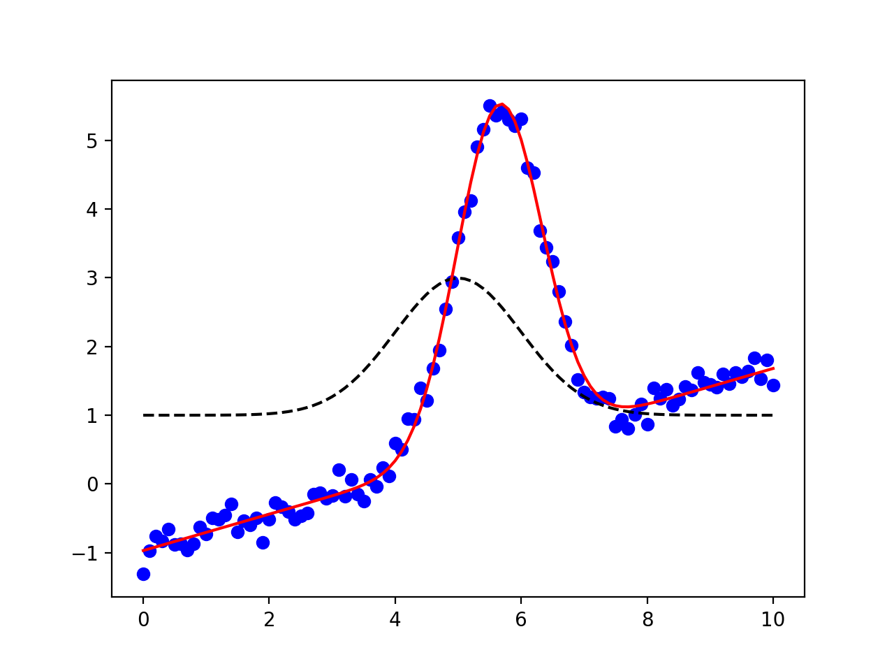

.. _model_chapter:

=================================================
Modeling Data and Curve Fitting
=================================================

A very common application of least-squares minimization is *curve fitting*,
where one has a parametrized model function meant to explain some
phenomena, and wants to adjust the numerical values for the model to
most closely match some particular data.  Within the :mod:`scipy` world,
such curve fitting problems are commonly solved with
:func:`scipy.optimize.curve_fit`, which simply calls
:func:`scipy.optimize.leastsq`.  As lmfit is a high-level wrapper around
:func:`scipy.optimize.leastsq`, it can be used for curve-fitting problems,
but here we discuss an even easier way to do it that is closer in spirit to
:func:`scipy.optimize.curve_fit`, but better.

The :class:`Model` class makes it easy to turn a model function that
calculates a model for your data into a fitting model.  In an effort to
make simple things truly simple, lmfit also provides canonical definitions
for many known lineshapes such as Gaussian or Lorentzian peaks and
Exponential decays that are widely used in many scientific domains.  These
are available in the :mod:`models` module that will be discussed in more
detail in the next chapter (:ref:`builtin_models_chapter`).  We mention it
here as you may want to consult that list before writing your own model.
For now, we focus on turning python function into high-level fitting models
with the :class:`Model` class, and using these to fit data.

Example: Fit data to Gaussian profile
================================================

Let's start with a simple and common example of fitting data to a Gaussian
peak.  As we will see, there is a buit-in :class:`GaussianModel` class that
provides a model function for a Gaussian profile, but here we'll build our
own.  We start with a definition the model function that we might want to
use to fit to some data::

    >>> from numpy import sqrt, pi, exp, linspace
    >>>
    >>> def gaussian(x, amp, cen, wid):
    ...    "1-d gaussian: gaussian(x, amp, cen, wid)"
    ...    return (amp/(sqrt(2*pi)*wid)) * exp(-(x-cen)**2 /(2*wid**2))
    ...

To some data :math:`y(x)` represented by the arrays ``y`` and ``x`` with we
would do something like::

    >>> from scipy.optimize import curve_fit
    >>>
    >>> x, y = read_data_from_somewhere(....)
    >>>
    >>> init_vals = [5, 5, 1]     # for [amp, cen, wid]
    >>> best_vals, covar = curve_fit(gaussian, x, y, p0=init_vals)
    >>> print best_vals

That is, we read in data from somewhere, make an initial guess of the model
values, and run ``curve_fit`` with the model function, data arrays, and
initial guesses.  The results returned are the optimal values for the
parameters and the covariance matrix.   It's pretty simple to do, but
misses many of the key benefits of lmfit.

To solve this with lmit we could write a residual function but such a
residual function would be fairly simple (essentially, ``data - model``,
possibly with some weighting), and we would need to define and use
appropriately named parameters.  Though convenient, it also becomes
somewhat of a burden to keep all the parameter names straight.  After doing
this a few times it appears as a recurring pattern, and we can imagine
automating this process.  That's where the :class:`Model` class comes in.
We can pass this class the ``gaussian`` function, and it will automatically
generate the appropriate residual function and the corresponding parameters
from the function signature itself::

    >>> from lmfit import Model
    >>> gmod = Model(gaussian)
    >>> for name, par in gmod.params.items():
    ...     print(name, par)
    ...
    'amp', <Parameter 'amp', None, bounds=[None:None]>
    'wid', <Parameter 'wid', None, bounds=[None:None]>
    'cen', <Parameter 'cen', None, bounds=[None:None]>
    >>> print("Independent Variables: ", gmod.independent_vars)
    'Independent Variables: ', ['x']

The Model ``gmod`` is constructed to have a ``params`` member that holds the
:class:`Parameters` for the model, and an ``independent_vars`` that holds
the name of the independent variables.  By default, the first argument of
the function is taken as the independent variable, and the rest of the
parameters are used for variable Parameters.  Thus, for the ``gaussian``
function above, the parameters are named ``amp``, ``cen``, and ``wid``, and
``x`` is the independent variable -- taken directly from the signature of
the model function.

On creation of the model, the parameters are not initialized (the values
are all ``None``), and will need to be given initial values before the
model can be used.  This can be done in one of two ways, or a mixture of
the two.  First, the initial values for the models parameters can be set
explicity, as with:

    >>> gmod.params['amp'].value = 10.0

and so on.  This is also useful to setting parameter bounds and so forth.
Alternatively, one can use the :meth:`eval` method (to evaluate the model)
or the :meth:`fit` method (to fit data to this model) with explicit keyword
arguments for the parameter values.  For example, one could use
:meth:`eval` to calculate the predicted function::

    >>> x = linspace(0, 10, 201)
    >>> y = gmod.eval(x=x, amp=10, cen=6.2, wid=0.75)

So far, this is a slightly long-winded way to calculate a Gaussian
function.   But now that the model is set up, we can also use its
:meth:`fit` method to fit this model to data, as with::

    result = gmod.fit(y, x=x, amp=5, cen=5, wid=1)

Putting everything together, the script to do such a fit (included in the
``examples`` folder with the source code) is:

.. literalinclude:: ../examples/doc_model1.py

which is pretty compact and to the point.  Of course, the parameter in the
returned ``result`` have pulled apart the covariance matrix, so that the
results printed out are::

    [[Variables]]
         amp:     8.880218 +/- 0.1135949 (1.28%) initial =  5
         cen:     5.658661 +/- 0.01030495 (0.18%) initial =  5
         wid:     0.6976547 +/- 0.01030495 (1.48%) initial =  1
    [[Correlations]] (unreported correlations are <  0.250)
         C(amp, wid)                  =  0.577

and the plot generated gives:

.. image:: _images/model_fit1.png
   :target: _images/model_fit1.png
   :width: 85%

which shows the data in blue dots, the best fit as a solid red line, and
the initial fit in black dashed line.

We emphasize here that the fit to this model function was really performed
with 2 lines of code.  These lines clearly express that we want to turn the
``gaussian`` function into a fitting model, and then fit the :math:`y(x)`
data to this model, starting with values of 5 for ``amp``, 5 for ``cen``
and 1 for ``wid``::

    gmod = Model(gaussian)
    result = gmod.fit(y, x=x, amp=5, cen=5, wid=1)

which compares well to :func:`scipy.optimize.curve_fit`::

    best_vals, covar = curve_fit(gaussian, x, y, p0=[5, 5, 1])

except that all the other features of lmfit are included.

Some model functions may be more complicated than the Gaussian function
here.  We'll discuss these below, but for now we've shown that at least the
wrapping of a simple model function for curve fitting is easy.

The :class:`Model` class
=======================================

The :class:`Model` class provides a general way to wrap a pre-defined
function as a fitting model.

.. class:: Model(func[, independent_vars=None[, param_names=None[, missing=None[, prefix='' [, components=None]]]]])

    Create a model based on the user-supplied function.  This uses
    introspection to automatically converting argument names of the
    function to Parameter names.

    :param func: function to be wrapped
    :type func: callable
    :param independent_vars: list of argument names to ``func`` that are independent variables.
    :type independent_vars: ``None`` (default) or list of strings.
    :param param_names: list of argument names to ``func`` that should be made into Parameters.
    :type param_names: ``None`` (default) or list of strings
    :param missing: how to handle missing values.
    :type missing: one of ``None`` (default), 'drop', or 'raise'
    :param prefix: prefix to add to all parameter names to distinguish components.
    :type prefix: string
    :param components: list of model components for a composite fit (usually handled internally).
    :type components: ``None`` or default.

Methods and Attributes of the :class:`Model` class
----------------------------------------------------

.. method:: guess_starting_values(data, **kws)

   by default this is left to raise a ``NotImplementedError``, but may be
   overwritten by subclasses.  Generally, this method should take some
   values for ``data`` and use it to construct reasonable starting values for
   the parameters.

.. method:: set_paramval(parname, value[, min=None[, max=None[, vary=True]]])

   set the value for a named parameter.  This is convenient for setting
   initial values.  The ``parname`` can include the models ``prefix`` or
   not.

   :param parname: parameter name.
   :type parname: string
   :param value: value for parameter
   :type value: float
   :param min:  lower bound for parameter value
   :type min: ``None`` or float
   :param max:  upper bound for parameter value
   :type max: ``None`` or float
   :param vary:  whether to vay parameter in fit.
   :type vary: boolean

.. method:: eval(params=None[, **kws])

   evaluate the model function for a set of parameters and inputs.

   :param params: parameters to use for fit.
   :type params: ``None`` (default) or Parameters

   :return:       ndarray for model given the parameters and other arguments.

   If ``params`` is ``None``, the internal ``params`` will be used.

   Note that all other arguments for the model function (including all the
   independent vairables!) will need to be passed in using keyword
   arguments.

.. method:: fit(data[, params=None[, weights=None[, method='leastsq'[, scale_covar=True[, iter_cb=None[, **kws]]]]]])

   perform a fit of the model to the ``data`` array.

   :param data: array of data to be fitted.
   :type data: ndarray-like
   :param params: parameters to use for fit.
   :type params: ``None`` (default) or Parameters
   :param weights: weights to use fit.
   :type weights: ``None`` (default) or ndarray-like.
   :param method:  name of fitting method to use. See  :ref:`fit-methods-label` for details
   :type  method:  string (default ``leastsq``)
   :param scale_covar:  whether to automatically scale covariance matrix (``leastsq`` only)
   :type  scale_covar:  bool (default ``True``)
   :param iter_cb:  function to be called at each fit iteration
   :type  iter_cb:  callable or ``None``

   :return:       fit result object.

   If ``params`` is ``None``, the internal ``params`` will be used. If it
   is supplied, these will replace the internal ones.  If supplied,
   ``weights`` must is an ndarray-like object of same size and shape as
   ``data``.

   Note that other arguments for the model function (including all the
   independent vairables!) will need to be passed in using keyword
   arguments.

   The result returned from :meth:`fit` will contains all of the items
   returned from :func:`minimize` (see  :ref:`Table of Fit Results
   <goodfit-table>` plus those listed in the :ref:`Table of Model Fit results <modelfit-table>`

.. method:: fit_report(modelpars=None[, show_correl=True[, min_correl=0.1]])

   return result of :func:`fit_report` after completing :meth:`fit`.

.. _modelfit-table:

Table of Model Fit Results: These values are included in the return value
from :meth:`Model.fit`, in addition to the standard Goodness-of-Fit
statistics and fit results given in :ref:`Table of Fit Results
<goodfit-table>`.

   +----------------------------+------------------------------------------------------+
   | result attribute           |  Description / Formula                               |
   +============================+======================================================+
   | ``init_params``            | initial set of parameters                            |
   +----------------------------+------------------------------------------------------+
   | ``init_fit``               | initial estimate of fit to data                      |
   +----------------------------+------------------------------------------------------+
   | ``best_fit``               | final estimate of fit to data                        |
   +----------------------------+------------------------------------------------------+

.. attribute:: independent_vars

   list of strings for independent variables.

.. attribute:: param_names

   list of strings of parameter names.

.. attribute:: params

   :class:`Parameters` object for the model

.. attribute:: prefix

   prefix used for name-mangling of parameter names.  The default is ''.
   If a particular :class:`Model` has arguments ``amplitude``,
   ``center``, and ``sigma``, these would become the parameter names.
   Using a prefix of ``g1_`` would convert these parameter names to
   ``g1_amplitude``, ``g1_center``, and ``g1_sigma``.   This can be
   essential to avoid name collision in composite models.

.. attribute:: missing

   what to do for missing values.  The choices are

    * ``None``: Do not check for null or missing values (default)
    * ``'none'``: Do not check for null or missing values.
    * ``'drop'``: Drop null or missing observations in data.  If pandas is
                installed, ``pandas.isnull`` is used, otherwise :attr:`numpy.isnan` is used.
    * ``'raise'``: Raise a (more helpful) exception when data contains null
                  or missing values.

.. attribute:: components

   a list of instances of :class:`Model` that make up a composite model.
   Normally, you will not need to use this, but is used my :class:`Model`
   itself when constructing a composite model (that is adding models together).

Determining parameter names and independent variables for a function
-----------------------------------------------------------------------

The :class:`Model` created from the supplied function ``func`` will create
a :class:`Parameters` object, and names are inferred from the function
arguments, and a residual function is automatically constructed.

By default, the independent variable is take as the first argument to the
function.  You can explicitly set this, of course, and will need to if the
independent variable is not first in the list, or if there are actually more
than one independent variables.

If not specified, Parameters are constructed from all positional arguments
and all keyword arguments that have a default value that is numerical, except
the independent variable, of course.   Importantly, the Parameters can be
modified after creation.  In fact, you'll have to do this because none of the
parameters have valid initial values.  You can place bounds and constraints
on Parameters, or fix their values.

More Details on building models from functions
============================================================

Here we explore some of the variations of building a :class:`Model` from a
user-defined function that didn't get mentioned in the example above for
the Gaussian model.

Explicitly specifying ``independent_vars``
-------------------------------------------------

As for the example above of the Gaussian model, creating a :class:`Model`
from a function is fairly easy::

    >>> def decay(t, tau, N):
    ...    return N*np.exp(-t/tau)
    ...
    >>> decay_model = Model(decay)
    >>> print decay_model.independent_vars
    ['t']
    >>> for pname, par in decay_model.params.items():
    ...     print pname, par
    ...
    tau <Parameter 'tau', None, bounds=[None:None]>
    N <Parameter 'N', None, bounds=[None:None]>

Here, ``t`` is assumed to be the independent variable because it comes
first, and that the other function arguments are used to create the
remaining parameters are created from the other parameters.

If you wanted ``tau`` to be the independent variable in the above example,
you would just do this::

    >>> decay_model = Model(decay, independent_vars=['tau'])
    >>> print decay_model.independent_vars
    ['tau']
    >>> for pname, par in decay_model.params.items():
    ...     print pname, par
    ...
    t <Parameter 't', None, bounds=[None:None]>
    N <Parameter 'N', None, bounds=[None:None]>

Functions with keyword arguments
-----------------------------------------

If the model function had keyword parameters, these would be turned into
Parameters if the supplied default value was a valid number (but not
``None``).

    >>> def decay2(t, tau, N=10, check_positive=False):
    ...    if check_small:
    ...        arg = abs(t)/max(1.e-9, abs(tau))
    ...    else:
    ...        arg = t/tau
    ...    return N*np.exp(arg)
    ...
    >>> mod = Model(decay2)
    >>> for pname, par in mod.params.items():
    ...     print pname, par
    ...
    t <Parameter 't', None, bounds=[None:None]>
    N <Parameter 'N', 10, bounds=[None:None]>

Here, even though ``N`` is a keyword argument to the function, it is turned
into a parameter, with the default numerical value as its initial value.
By default, it is permitted to be varied in the fit -- the 10 is taken as
an initial value, not a fixed value.  On the other hand, the
``check_positive`` keyword argument, was not converted to a parameter
because it has a boolean default value.

Defining a ``prefix`` for the Parameters
--------------------------------------------

As we will see in the next chapter when combining models, it is sometimes
necessary to decorate the parameter names in the model, but still have them
be correctly used in the underlying model function.  This would be
necessary, for example, if two parameters in a composite model (see
:ref:`composite_models_section` or examples in the next chapter) would have
the same name.  To avoid this, we can add a ``prefix`` to the
:class:`Model` which will automatically do this mapping for us.

    >>> def myfunc(x, amplitude=1, center=0, sigma=1):
    ...

    >>> mod = Model(myfunc, prefix='f1_')
    >>> for pname, par in mod.params.items():
    ...     print pname, par
    ...
    f1_amplitude <Parameter 'f1_amplitude', None, bounds=[None:None]>
    f1_center <Parameter 'f1_center', None, bounds=[None:None]>
    f1_sigma <Parameter 'f1_sigma', None, bounds=[None:None]>

You would refer to these parameters as ``f1_amplitude`` and so forth, and
the model will know to map these to the ``amplitude`` argument of ``myfunc``.

More on initialing model parameters
-----------------------------------------

As mentioned above, the parameters created by :class:`Model` are generally
created with invalid initial values of ``None``.  These values must be
initialized in order for the model to be evaluated or used in a fit.  There
are three ways to do this initialization that can be used in any
combination:

  1. You can supply initial values in the definition of the model function.
  2. You can initialize the parameters after the model has been created.
  3. You can supply initial values for the parameters to the :meth:`eval`
     or :meth:`fit` methods.

For option 1, consider doing::

    >>> def myfunc(x, a=1, b=0):
    >>>     ...

instead of::

    >>> def myfunc(x, a, b):
    >>>     ...

For option 2, you can do::

    >>> mod = Model(myfunc)
    >>> mod.params['a'].value = 1.0
    >>> mod.params['b'].value = 0.1

An advantage of this approach is that you can set other parameter
attributes such as bounds and constraints.

For option 3, give explicit initial values for the parameters:

   >>> y1 = mod.eval(x=x, a=1, b=3)

Again, these methods can be combined.  For example, you can set parameter
values and bounds as with option 2, but then change the initial value with
option 3.

.. _composite_models_section:

Creating composite models
=============================

One of the most interesting features of the :class:`Model` class is that
models can be added together to give a composite model, with parameters
from the component models all being available to influence the total sum of
the separat component models.  This will become even more useful in the
next chapter, when pre-built subclasses of :class:`Model` are discussed.

For now, we'll consider a simple example will build a model of a Gaussian
plus a line.  Obviously, we could build a model that included both
components::

    def gaussian_plus_line(x, amp, cen, wid, slope, intercept):
        "line + 1-d gaussian"

        gauss = (amp/(sqrt(2*pi)*wid)) * exp(-(x-cen)**2 /(2*wid**2))
        line = slope * x + intercept
        return gauss + line

and use that with::

    mod = Model(gaussian_plus_line)

but, of course, we already had a function for a gaussian function, and
maybe we'll discover that a linear background isn't sufficient and we'd
have to alter the model again.  As an alternative we could just define a
linear function::

    def line(x, slope, intercept):
        "a line"
        return slope * x + intercept

and build a composite model with::

    mod = Model(gaussian) + Model(line)

This model has parameters for both component models, and can be used as:

.. literalinclude:: ../examples/doc_model2.py

which prints out the results::

    [[Fit Statistics]]
        # function evals   = 44
        # data points      = 101
        # variables        = 5
        chi-square         = 2.579
        reduced chi-square = 0.027
    [[Variables]]
         amp:           8.459311 +/- 0.1241451 (1.47%) initial =  5
         cen:           5.655479 +/- 0.009176784 (0.16%) initial =  5
         intercept:    -0.968602 +/- 0.03352202 (3.46%) initial =  1
         slope:         0.264844 +/- 0.005748921 (2.17%) initial =  0
         wid:           0.6754552 +/- 0.009916862 (1.47%) initial =  1
    [[Correlations]] (unreported correlations are <  0.100)
        C(amp, wid)                  =  0.666
        C(cen, intercept)            =  0.129

and shows the plot:

which shows the data in blue dots, the best fit as a solid red line, and
the initial fit in black dashed line.

In this example, the argumnet names for the model functions do not overlap.
If they had, the ``prefix`` argument to :class:`Model` would have allowed
us to identify which parameter went with which component model.  As we will
see in the next chapter, using composite models with the built-in models
provides a simple way to build up complex models.

