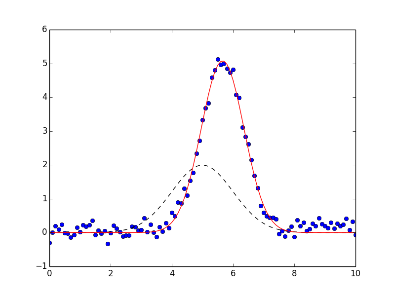

.. _model_chapter:

=================================================
Modeling Data and Curve Fitting
=================================================

.. module:: lmfit.model

A common use of least-squares minimization is *curve fitting*, where one
has a parametrized model function meant to explain some phenomena and wants
to adjust the numerical values for the model to most closely match some
data.  With :mod:`scipy`, such problems are commonly solved with
:scipydoc:`scipy.optimize.curve_fit`, which is a wrapper around
:scipydoc:`scipy.optimize.leastsq`.  Since Lmfit's :func:`minimize` is also
a high-level wrapper around :scipydoc:`scipy.optimize.leastsq` it can be used
for curve-fitting problems, but requires more effort than using
:scipydoc:`scipy.optimize.curve_fit`.

Here we discuss lmfit's :class:`Model` class.  This takes a model function
-- a function that calculates a model for some data -- and provides methods
to create parameters for that model and to fit data using that model
function.  This is closer in spirit to :scipydoc:`scipy.optimize.curve_fit`,
but with the advantages of using :class:`Parameters` and lmfit.

In addition to allowing you turn any model function into a curve-fitting
method, Lmfit also provides canonical definitions for many known line shapes
such as Gaussian or Lorentzian peaks and Exponential decays that are widely
used in many scientific domains.  These are available in the :mod:`models`
module that will be discussed in more detail in the next chapter
(:ref:`builtin_models_chapter`).  We mention it here as you may want to
consult that list before writing your own model.  For now, we focus on
turning python function into high-level fitting models with the
:class:`Model` class, and using these to fit data.

Example: Fit data to Gaussian profile
================================================

Let's start with a simple and common example of fitting data to a Gaussian
peak.  As we will see, there is a buit-in :class:`GaussianModel` class that
provides a model function for a Gaussian profile, but here we'll build our
own.  We start with a simple definition of the model function:

    >>> from numpy import sqrt, pi, exp, linspace
    >>>
    >>> def gaussian(x, amp, cen, wid):
    ...    return amp * exp(-(x-cen)**2 /wid)
    ...

We want to fit this objective function to data :math:`y(x)` represented by the
arrays ``y`` and ``x``.  This can be done easily with :scipydoc:`optimize.curve_fit`::

    >>> from scipy.optimize import curve_fit
    >>>
    >>> x = linspace(-10,10)
    >>> y = y = gaussian(x, 2.33, 0.21, 1.51) + np.random.normal(0, 0.2, len(x))
    >>>
    >>> init_vals = [1, 0, 1]     # for [amp, cen, wid]
    >>> best_vals, covar = curve_fit(gaussian, x, y, p0=init_vals)
    >>> print best_vals

We sample random data point, make an initial guess of the model
values, and run :scipydoc:`optimize.curve_fit` with the model function,
data arrays, and initial guesses.  The results returned are the optimal
values for the parameters and the covariance matrix.  It's simple and very
useful.  But it misses the benefits of lmfit.

To solve this with lmfit we would have to write an objective function. But
such a function would be fairly simple (essentially, ``data - model``,
possibly with some weighting), and we would need to define and use
appropriately named parameters.  Though convenient, it is somewhat of a
burden to keep the named parameter straight (on the other hand, with
:scipydoc:`optimize.curve_fit` you are required to remember the parameter
order).  After doing this a few times it appears as a recurring pattern,
and we can imagine automating this process.  That's where the
:class:`Model` class comes in.

:class:`Model` allows us to easily wrap a model function such as the
``gaussian`` function.  This automatically generate the appropriate
residual function, and determines the corresponding parameter names from
the function signature itself::

    >>> from lmfit import Model
    >>> gmod = Model(gaussian)
    >>> gmod.param_names
    set(['amp', 'wid', 'cen'])
    >>> gmod.independent_vars)
    ['x']

The Model ``gmod`` knows the names of the parameters and the independent
variables.  By default, the first argument of the function is taken as the
independent variable, held in :attr:`independent_vars`, and the rest of the
functions positional arguments (and, in certain cases, keyword arguments --
see below) are used for Parameter names.  Thus, for the ``gaussian``
function above, the parameters are named ``amp``, ``cen``, and ``wid``, and
``x`` is the independent variable -- all taken directly from the signature
of the model function. As we will see below, you can specify what the
independent variable is, and you can add or alter parameters, too.

The parameters are *not* created when the model is created. The model knows
what the parameters should be named, but not anything about the scale and
range of your data.  You will normally have to make these parameters and
assign initial values and other attributes.  To help you do this, each
model has a :meth:`make_params` method that will generate parameters with
the expected names:

    >>> params = gmod.make_params()

This creates the :class:`Parameters` but doesn't necessarily give them
initial values -- again, the model has no idea what the scale should be.
You can set initial values for parameters with keyword arguments to
:meth:`make_params`:

    >>> params = gmod.make_params(cen=5, amp=200, wid=1)

or assign them (and other parameter properties) after the
:class:`Parameters` has been created.

A :class:`Model` has several methods associated with it.  For example, one
can use the :meth:`eval` method to evaluate the model or the :meth:`fit`
method to fit data to this model with a :class:`Parameter` object.  Both of
these methods can take explicit keyword arguments for the parameter values.
For example, one could use :meth:`eval` to calculate the predicted
function::

    >>> x = linspace(0, 10, 201)
    >>> y = gmod.eval(x=x, amp=10, cen=6.2, wid=0.75)

Admittedly, this a slightly long-winded way to calculate a Gaussian
function.   But now that the model is set up, we can also use its
:meth:`fit` method to fit this model to data, as with::

    >>> result = gmod.fit(y, x=x, amp=5, cen=5, wid=1)

Putting everything together, the script to do such a fit (included in the
``examples`` folder with the source code) is:

.. literalinclude:: ../examples/doc_model1.py

which is pretty compact and to the point.  The returned ``result`` will be
a :class:`ModelResult` object.  As we will see below, this has many
components, including a :meth:`fit_report` method, which will show::

    [[Model]]
	gaussian
    [[Fit Statistics]]
	# function evals   = 33
	# data points      = 101
	# variables        = 3
	chi-square         = 3.409
	reduced chi-square = 0.035
	Akaike info crit   = -336.264
	Bayesian info crit = -328.418
    [[Variables]]
	amp:   8.88021829 +/- 0.113594 (1.28%) (init= 5)
	cen:   5.65866102 +/- 0.010304 (0.18%) (init= 5)
	wid:   0.69765468 +/- 0.010304 (1.48%) (init= 1)
    [[Correlations]] (unreported correlations are <  0.100)
	C(amp, wid)                  =  0.577

The result will also have :attr:`init_fit` for the fit with the initial
parameter values and a :attr:`best_fit` for the fit with the best fit
parameter values.  These can be used to generate the following plot:

which shows the data in blue dots, the best fit as a solid red line, and
the initial fit as a dashed black line.

Note that the model fitting was really performed with 2 lines of code::

    gmod = Model(gaussian)
    result = gmod.fit(y, x=x, amp=5, cen=5, wid=1)

These lines clearly express that we want to turn the ``gaussian`` function
into a fitting model, and then fit the :math:`y(x)` data to this model,
starting with values of 5 for ``amp``, 5 for ``cen`` and 1 for ``wid``.
This is much more expressive than :scipydoc:`optimize.curve_fit`::

    best_vals, covar = curve_fit(gaussian, x, y, p0=[5, 5, 1])

In addition, all the other features of lmfit are included:
:class:`Parameters` can have bounds and constraints and the result is a
rich object that can be reused to explore the model fit in detail.

The :class:`Model` class
=======================================

The :class:`Model` class provides a general way to wrap a pre-defined
function as a fitting model.

.. class::  Model(func[, independent_vars=None[, param_names=None[, missing=None[, prefix=''[, name=None[, **kws]]]]]])

    Create a model based on the user-supplied function.  This uses
    introspection to automatically converting argument names of the
    function to Parameter names.

    :param func: model function to be wrapped
    :type func: callable
    :param independent_vars: list of argument names to ``func`` that are independent variables.
    :type independent_vars: ``None`` (default) or list of strings.
    :param param_names: list of argument names to ``func`` that should be made into Parameters.
    :type param_names: ``None`` (default) or list of strings
    :param missing: how to handle missing values.
    :type missing: one of ``None`` (default), 'none', 'drop', or 'raise'.
    :param prefix: prefix to add to all parameter names to distinguish components in a :class:`CompositeModel`.
    :type prefix: string
    :param name: name for the model. When ``None`` (default) the name is the same  as the model function (``func``).
    :type name: ``None`` or string.
    :param kws:   additional keyword arguments to pass to model function.

Of course, the model function will have to return an array that will be the
same size as the data being modeled.  Generally this is handled by also
specifying one or more independent variables.

:class:`Model` class Methods
---------------------------------

.. method:: Model.eval(params=None[, **kws])

   evaluate the model function for a set of parameters and inputs.

   :param params: parameters to use for fit.
   :type params: ``None`` (default) or Parameters
   :param kws:    additional keyword arguments to pass to model function.
   :return:       ndarray for model given the parameters and other arguments.

   If ``params`` is ``None``, the values for all parameters are expected to
   be provided as keyword arguments.  If ``params`` is given, and a keyword
   argument for a parameter value is also given, the keyword argument will
   be used.

   Note that all non-parameter arguments for the model function --
   **including all the independent variables!** -- will need to be passed
   in using keyword arguments.

.. method:: Model.fit(data[, params=None[, weights=None[, method='leastsq'[, scale_covar=True[, iter_cb=None[, **kws]]]]]])

   perform a fit of the model to the ``data`` array with a set of
   parameters.

   :param data: array of data to be fitted.
   :type data: ndarray-like
   :param params: parameters to use for fit.
   :type params: ``None`` (default) or Parameters
   :param weights: weights to use for residual calculation in fit.
   :type weights: ``None`` (default) or ndarray-like.
   :param method:  name of fitting method to use. See  :ref:`fit-methods-label` for details
   :type  method:  string (default ``leastsq``)
   :param scale_covar:  whether to automatically scale covariance matrix (``leastsq`` only)
   :type  scale_covar:  bool (default ``True``)
   :param iter_cb:  function to be called at each fit iteration. See :ref:`fit-itercb-label` for details.
   :type  iter_cb:  callable or ``None``
   :param verbose:  print a message when a new parameter is created due to a *hint*
   :type  verbose:  bool (default ``True``)
   :param kws:      additional keyword arguments to pass to model function.
   :return:         :class:`ModelResult` object.

   If ``params`` is ``None``, the internal ``params`` will be used. If it
   is supplied, these will replace the internal ones.   If supplied,
   ``weights`` will be used to weight the calculated residual so that the
   quantity minimized in the least-squares sense is ``weights*(data -
   fit)``.  ``weights`` must be an ndarray-like object of same size and
   shape as ``data``.

   Note that other arguments for the model function (including all the
   independent variables!) will need to be passed in using keyword
   arguments.

.. method:: Model.guess(data, **kws)

   Guess starting values for model parameters.

    :param data: data array used to guess parameter values
    :type func:  ndarray
    :param kws:  additional options to pass to model function.
    :return: :class:`Parameters` with guessed initial values for each parameter.

   by default this is left to raise a ``NotImplementedError``, but may be
   overwritten by subclasses.  Generally, this method should take some
   values for ``data`` and use it to construct reasonable starting values for
   the parameters.

.. method:: Model.make_params(**kws)

   Create a set of parameters for model.

    :param kws:  optional keyword/value pairs to set initial values for parameters.
    :return: :class:`Parameters`.

    The parameters may or may not have decent initial values for each
    parameter.

.. method:: Model.set_param_hint(name, value=None[, min=None[, max=None[, vary=True[, expr=None]]]])

   set *hints* to use when creating parameters with :meth:`Model.make_param` for
   the named parameter.  This is especially convenient for setting initial
   values.  The ``name`` can include the models ``prefix`` or not.

   :param name: parameter name.
   :type name: string
   :param value: value for parameter
   :type value: float
   :param min:  lower bound for parameter value
   :type min: ``None`` or float
   :param max:  upper bound for parameter value
   :type max: ``None`` or float
   :param vary:  whether to vary parameter in fit.
   :type vary: boolean
   :param expr:  mathematical expression for constraint
   :type expr: string

   See :ref:`model_param_hints_section`.

.. automethod:: lmfit.model.Model.print_param_hints

:class:`Model` class Attributes
---------------------------------

.. attribute:: func

   The model function used to calculate the model.

.. attribute:: independent_vars

   list of strings for names of the independent variables.

.. attribute:: missing

   describes what to do for missing values.  The choices are

    * ``None``: Do not check for null or missing values (default)
    * ``'none'``: Do not check for null or missing values.
    * ``'drop'``: Drop null or missing observations in data.  If pandas is
		installed, ``pandas.isnull`` is used, otherwise :attr:`numpy.isnan` is used.
    * ``'raise'``: Raise a (more helpful) exception when data contains null
		  or missing values.

.. attribute:: name

   name of the model, used only in the string representation of the
   model. By default this will be taken from the model function.

.. attribute:: opts

   extra keyword arguments to pass to model function.  Normally this will
   be determined internally and should not be changed.

.. attribute:: param_hints

   Dictionary of parameter hints.  See :ref:`model_param_hints_section`.

.. attribute:: param_names

   list of strings of parameter names.

.. attribute:: prefix

   prefix used for name-mangling of parameter names.  The default is ''.
   If a particular :class:`Model` has arguments ``amplitude``,
   ``center``, and ``sigma``, these would become the parameter names.
   Using a prefix of ``g1_`` would convert these parameter names to
   ``g1_amplitude``, ``g1_center``, and ``g1_sigma``.   This can be
   essential to avoid name collision in composite models.

Determining parameter names and independent variables for a function
-----------------------------------------------------------------------

The :class:`Model` created from the supplied function ``func`` will create
a :class:`Parameters` object, and names are inferred from the function
arguments, and a residual function is automatically constructed.

By default, the independent variable is take as the first argument to the
function.  You can explicitly set this, of course, and will need to if the
independent variable is not first in the list, or if there are actually more
than one independent variables.

If not specified, Parameters are constructed from all positional arguments
and all keyword arguments that have a default value that is numerical, except
the independent variable, of course.   Importantly, the Parameters can be
modified after creation.  In fact, you'll have to do this because none of the
parameters have valid initial values.  You can place bounds and constraints
on Parameters, or fix their values.

Explicitly specifying ``independent_vars``
-------------------------------------------------

As we saw for the Gaussian example above, creating a :class:`Model` from a
function is fairly easy. Let's try another::

    >>> def decay(t, tau, N):
    ...    return N*np.exp(-t/tau)
    ...
    >>> decay_model = Model(decay)
    >>> print decay_model.independent_vars
    ['t']
    >>> for pname, par in decay_model.params.items():
    ...     print pname, par
    ...
    tau <Parameter 'tau', None, bounds=[None:None]>
    N <Parameter 'N', None, bounds=[None:None]>

Here, ``t`` is assumed to be the independent variable because it is the
first argument to the function.  The other function arguments are used to
create parameters for the model.

If you want ``tau`` to be the independent variable in the above example,
you can say so::

    >>> decay_model = Model(decay, independent_vars=['tau'])
    >>> print decay_model.independent_vars
    ['tau']
    >>> for pname, par in decay_model.params.items():
    ...     print pname, par
    ...
    t <Parameter 't', None, bounds=[None:None]>
    N <Parameter 'N', None, bounds=[None:None]>

You can also supply multiple values for multi-dimensional functions with
multiple independent variables.  In fact, the meaning of *independent
variable* here is simple, and based on how it treats arguments of the
function you are modeling:

independent variable
    a function argument that is not a parameter or otherwise part of the
    model, and that will be required to be explicitly provided as a
    keyword argument for each fit with :meth:`Model.fit` or evaluation
    with :meth:`Model.eval`.

Note that independent variables are not required to be arrays, or even
floating point numbers.

Functions with keyword arguments
-----------------------------------------

If the model function had keyword parameters, these would be turned into
Parameters if the supplied default value was a valid number (but not
``None``, ``True``, or ``False``).

    >>> def decay2(t, tau, N=10, check_positive=False):
    ...    if check_small:
    ...        arg = abs(t)/max(1.e-9, abs(tau))
    ...    else:
    ...        arg = t/tau
    ...    return N*np.exp(arg)
    ...
    >>> mod = Model(decay2)
    >>> for pname, par in mod.params.items():
    ...     print pname, par
    ...
    t <Parameter 't', None, bounds=[None:None]>
    N <Parameter 'N', 10, bounds=[None:None]>

Here, even though ``N`` is a keyword argument to the function, it is turned
into a parameter, with the default numerical value as its initial value.
By default, it is permitted to be varied in the fit -- the 10 is taken as
an initial value, not a fixed value.  On the other hand, the
``check_positive`` keyword argument, was not converted to a parameter
because it has a boolean default value.    In some sense,
``check_positive`` becomes like an independent variable to the model.
However, because it has a default value it is not required to be given for
each model evaluation or fit, as independent variables are.

Defining a ``prefix`` for the Parameters
--------------------------------------------

As we will see in the next chapter when combining models, it is sometimes
necessary to decorate the parameter names in the model, but still have them
be correctly used in the underlying model function.  This would be
necessary, for example, if two parameters in a composite model (see
:ref:`composite_models_section` or examples in the next chapter) would have
the same name.  To avoid this, we can add a ``prefix`` to the
:class:`Model` which will automatically do this mapping for us.

    >>> def myfunc(x, amplitude=1, center=0, sigma=1):
    ...

    >>> mod = Model(myfunc, prefix='f1_')
    >>> for pname, par in mod.params.items():
    ...     print pname, par
    ...
    f1_amplitude <Parameter 'f1_amplitude', None, bounds=[None:None]>
    f1_center <Parameter 'f1_center', None, bounds=[None:None]>
    f1_sigma <Parameter 'f1_sigma', None, bounds=[None:None]>

You would refer to these parameters as ``f1_amplitude`` and so forth, and
the model will know to map these to the ``amplitude`` argument of ``myfunc``.

Initializing model parameters
-----------------------------------------

As mentioned above, the parameters created by :meth:`Model.make_params` are
generally created with invalid initial values of ``None``.  These values
**must** be initialized in order for the model to be evaluated or used in a
fit.  There are four different ways to do this initialization that can be
used in any combination:

  1. You can supply initial values in the definition of the model function.
  2. You can initialize the parameters when creating parameters with :meth:`Model.make_params`.
  3. You can give parameter hints with :meth:`Model.set_param_hint`.
  4. You can supply initial values for the parameters when you use the
     :meth:`Model.eval` or :meth:`Model.fit` methods.

Of course these methods can be mixed, allowing you to overwrite initial
values at any point in the process of defining and using the model.

Initializing values in the function definition
~~~~~~~~~~~~~~~~~~~~~~~~~~~~~~~~~~~~~~~~~~~~~~~~~~~~~~~

To supply initial values for parameters in the definition of the model
function, you can simply supply a default value::

    >>> def myfunc(x, a=1, b=0):
    >>>     ...

instead of using::

    >>> def myfunc(x, a, b):
    >>>     ...

This has the advantage of working at the function level -- all parameters
with keywords can be treated as options.  It also means that some default
initial value will always be available for the parameter.

Initializing values with :meth:`Model.make_params`
~~~~~~~~~~~~~~~~~~~~~~~~~~~~~~~~~~~~~~~~~~~~~~~~~~~~~~~

When creating parameters with :meth:`Model.make_params` you can specify initial
values.  To do this, use keyword arguments for the parameter names and
initial values::

    >>> mod = Model(myfunc)
    >>> pars = mod.make_params(a=3, b=0.5)

Initializing values by setting parameter hints
~~~~~~~~~~~~~~~~~~~~~~~~~~~~~~~~~~~~~~~~~~~~~~~~~~

After a model has been created, but prior to creating parameters with
:meth:`Model.make_params`, you can set parameter hints.  These allows you to set
not only a default initial value but also to set other parameter attributes
controlling bounds, whether it is varied in the fit, or a constraint
expression.  To set a parameter hint, you can use :meth:`Model.set_param_hint`,
as with::

    >>> mod = Model(myfunc)
    >>> mod.set_param_hint('a', value = 1.0)
    >>> mod.set_param_hint('b', value = 0.3, min=0, max=1.0)
    >>> pars = mod.make_params()

Parameter hints are discussed in more detail in section
:ref:`model_param_hints_section`.

Initializing values when using a model
~~~~~~~~~~~~~~~~~~~~~~~~~~~~~~~~~~~~~~~~~~~~~~~~~~~~~~~

Finally, you can explicitly supply initial values when using a model.  That
is, as with :meth:`Model.make_params`, you can include values
as keyword arguments to either the :meth:`Model.eval` or :meth:`Model.fit` methods::

   >>> y1 = mod.eval(x=x, a=7.0, b=-2.0)

   >>> out = mod.fit(x=x, pars, a=3.0, b=-0.0)

These approaches to initialization provide many opportunities for setting
initial values for parameters.  The methods can be combined, so that you
can set parameter hints but then change the initial value explicitly with
:meth:`Model.fit`.

.. _model_param_hints_section:

Using parameter hints
--------------------------------

After a model has been created, you can give it hints for how to create
parameters with :meth:`Model.make_params`.  This allows you to set not only a
default initial value but also to set other parameter attributes
controlling bounds, whether it is varied in the fit, or a constraint
expression.   To set a parameter hint, you can use :meth:`Model.set_param_hint`,
as with::

    >>> mod = Model(myfunc)
    >>> mod.set_param_hint('a', value = 1.0)
    >>> mod.set_param_hint('b', value = 0.3, min=0, max=1.0)

Parameter hints are stored in a model's :attr:`param_hints` attribute,
which is simply a nested dictionary::

    >>> print mod.param_hints
    {'a': {'value': 1}, 'b': {'max': 1.0, 'value': 0.3, 'min': 0}}

You can change this dictionary directly, or with the :meth:`Model.set_param_hint`
method.  Either way, these parameter hints are used by :meth:`Model.make_params`
when making parameters.

An important feature of parameter hints is that you can force the creation
of new parameters with parameter hints.  This can be useful to make derived
parameters with constraint expressions.  For example to get the full-width
at half maximum of a Gaussian model, one could use a parameter hint of::

    >>> mod = Model(gaussian)
    >>> mod.set_param_hint('fwhm', expr='2.3548*sigma')

The :class:`ModelResult` class
=======================================

A :class:`ModelResult` (which had been called `ModelFit` prior to version
0.9) is the object returned by :meth:`Model.fit`.  It is a subclass of
:class:`Minimizer`, and so contains many of the fit results.  Of course, it
knows the :class:`Model` and the set of :class:`Parameters` used in the
fit, and it has methods to evaluate the model, to fit the data (or re-fit
the data with changes to the parameters, or fit with different or modified
data) and to print out a report for that fit.

While a :class:`Model` encapsulates your model function, it is fairly
abstract and does not contain the parameters or data used in a particular
fit.  A :class:`ModelResult` *does* contain parameters and data as well as
methods to alter and re-do fits.  Thus the :class:`Model` is the idealized
model while the :class:`ModelResult` is the messier, more complex (but perhaps
more useful) object that represents a fit with a set of parameters to data
with a model.

A :class:`ModelResult` has several attributes holding values for fit results,
and several methods for working with fits.  These include statistics
inherited from :class:`Minimizer` useful for comparing different models,
including `chisqr`, `redchi`, `aic`, and `bic`.

.. class:: ModelResult()

    Model fit is intended to be created and returned by :meth:`Model.fit`.

:class:`ModelResult` methods
---------------------------------

These methods are all inherited from :class:`Minimize` or from
:class:`Model`.

.. method:: ModelResult.eval(params=None, **kwargs)

   evaluate the model using parameters supplied (or the best-fit parameters
   if not specified) and supplied independent variables.  The ``**kwargs``
   arguments can be used to update parameter values and/or independent
   variables.

.. method:: ModelResult.eval_components(**kwargs)

   evaluate each component of a :class:`CompositeModel`, returning an
   ordered dictionary of with the values for each component model.  The
   returned dictionary will have keys of the model prefix or (if no prefix
   is given), the model name.  The ``**kwargs`` arguments can be used to
   update parameter values and/or independent variables.

.. method:: ModelResult.fit(data=None[, params=None[, weights=None[, method=None[, **kwargs]]]])

   fit (or re-fit), optionally changing ``data``, ``params``, ``weights``,
   or ``method``, or changing the independent variable(s) with the
   ``**kwargs`` argument.  See :meth:`Model.fit` for argument
   descriptions, and note that any value of ``None`` defaults to the last
   used value.

.. method:: ModelResult.fit_report(modelpars=None[, show_correl=True[,`< min_correl=0.1]])

   return a printable fit report for the fit with fit statistics, best-fit
   values with uncertainties and correlations.  As with :func:`fit_report`.

   :param modelpars:    Parameters with "Known Values" (optional, default None)
   :param show_correl:  whether to show list of sorted correlations [``True``]
   :param min_correl:   smallest correlation absolute value to show [0.1]

.. method:: ModelResult.conf_interval(**kwargs)

   calculate the confidence intervals for the variable parameters using
   :func:`confidence.conf_interval() <lmfit.conf_interval>`.  All keyword
   arguments are passed to that function.  The result is stored in
   :attr:`ci_out`, and so can be accessed without recalculating them.

.. method:: ModelResult.ci_report(with_offset=True)

   return a nicely formatted text report of the confidence intervals, as
   from :func:`ci_report() <lmfit.ci_report>`.

.. method:: ModelResult.plot(datafmt='o', fitfmt='-', initfmt='--', yerr=None, numpoints=None, fig=None, data_kws=None, fit_kws=None, init_kws=None, ax_res_kws=None, ax_fit_kws=None, fig_kws=None)

   Plot the fit results and residuals using matplotlib, if available.  The
   plot will include two panels, one showing the fit residual, and the
   other with the data points, the initial fit curve, and the best-fit
   curve. If the fit model included weights or if ``yerr`` is specified,
   errorbars will also be plotted.

   :param datafmt: matplotlib format string for data curve.
   :type  datafmt: ``None`` or string.
   :param fitfmt:  matplotlib format string for best-fit curve.
   :type fitfmt: ``None`` or string.
   :param initfmt:  matplotlib format string for initial curve.
   :type intfmt: ``None`` or string.
   :param yerr:  array of uncertainties for data array.
   :type  yerr: ``None`` or ndarray.
   :param numpoints:  number of points to display
   :type numpoints: ``None`` or integer
   :param fig: matplotlib Figure to plot on.
   :type fig:  ``None`` or matplotlib.figure.Figure
   :param data_kws:  keyword arguments passed to plot for data curve.
   :type data_kws: ``None`` or dictionary
   :param fit_kws:  keyword arguments passed to plot for best-fit curve.
   :type fit_kws: ``None`` or dictionary
   :param init_kws:  keyword arguments passed to plot for initial curve.
   :type init_kws: ``None`` or dictionary
   :param ax_res_kws:  keyword arguments passed to creation of matplotlib axes for the residual plot.
   :type ax_res_kws: ``None`` or dictionary
   :param ax_fit_kws:  keyword arguments passed to creation of matplotlib axes for the fit plot.
   :type ax_fit_kws: ``None`` or dictionary
   :param fig_kws:  keyword arguments passed to creation of matplotlib figure.
   :type fig_kws: ``None`` or dictionary
   :returns:     matplotlib.figure.Figure

   This combines :meth:`ModelResult.plot_fit` and :meth:`ModelResult.plot_residual`.

   If ``yerr`` is specified or if the fit model included weights, then
   matplotlib.axes.Axes.errorbar is used to plot the data.  If ``yerr`` is
   not specified and the fit includes weights, ``yerr`` set to ``1/self.weights``

   If ``fig`` is None then ``matplotlib.pyplot.figure(**fig_kws)`` is called.

.. method:: ModelResult.plot_fit(ax=None, datafmt='o', fitfmt='-', initfmt='--', yerr=None, numpoints=None,  data_kws=None, fit_kws=None, init_kws=None, ax_kws=None)

   Plot the fit results using matplotlib, if available.  The plot will include
   the data points, the initial fit curve, and the best-fit curve. If the fit
   model included weights or if ``yerr`` is specified, errorbars will also
   be plotted.

   :param ax: matplotlib axes to plot on.
   :type ax:  ``None`` or matplotlib.axes.Axes.
   :param datafmt: matplotlib format string for data curve.
   :type  datafmt: ``None`` or string.
   :param fitfmt:  matplotlib format string for best-fit curve.
   :type fitfmt: ``None`` or string.
   :param initfmt:  matplotlib format string for initial curve.
   :type intfmt: ``None`` or string.
   :param yerr:  array of uncertainties for data array.
   :type  yerr: ``None`` or ndarray.
   :param numpoints:  number of points to display
   :type numpoints: ``None`` or integer
   :param data_kws:  keyword arguments passed to plot for data curve.
   :type data_kws: ``None`` or dictionary
   :param fit_kws:  keyword arguments passed to plot for best-fit curve.
   :type fit_kws: ``None`` or dictionary
   :param init_kws:  keyword arguments passed to plot for initial curve.
   :type init_kws: ``None`` or dictionary
   :param ax_kws:  keyword arguments passed to creation of matplotlib axes.
   :type ax_kws: ``None`` or dictionary
   :returns:     matplotlib.axes.Axes

   For details about plot format strings and keyword arguments see
   documentation of :func:`matplotlib.axes.Axes.plot`.

   If ``yerr`` is specified or if the fit model included weights, then
   matplotlib.axes.Axes.errorbar is used to plot the data.  If ``yerr`` is
   not specified and the fit includes weights, ``yerr`` set to ``1/self.weights``

   If ``ax`` is None then ``matplotlib.pyplot.gca(**ax_kws)`` is called.

.. method:: ModelResult.plot_residuals(ax=None, datafmt='o', yerr=None, data_kws=None, fit_kws=None, ax_kws=None)

  Plot the fit residuals (data - fit) using matplotlib.  If ``yerr`` is
  supplied or if the model included weights, errorbars will also be plotted.

   :param ax: matplotlib axes to plot on.
   :type ax:  ``None`` or matplotlib.axes.Axes.
   :param datafmt: matplotlib format string for data curve.
   :type  datafmt: ``None`` or string.
   :param yerr:  array of uncertainties for data array.
   :type  yerr: ``None`` or ndarray.
   :param numpoints:  number of points to display
   :type numpoints: ``None`` or integer
   :param data_kws:  keyword arguments passed to plot for data curve.
   :type data_kws: ``None`` or dictionary
   :param fit_kws:  keyword arguments passed to plot for best-fit curve.
   :type fit_kws: ``None`` or dictionary
   :param ax_kws:  keyword arguments passed to creation of matplotlib axes.
   :type ax_kws: ``None`` or dictionary
   :returns:     matplotlib.axes.Axes

   For details about plot format strings and keyword arguments see
   documentation of :func:`matplotlib.axes.Axes.plot`.

   If ``yerr`` is specified or if the fit model included weights, then
   matplotlib.axes.Axes.errorbar is used to plot the data.  If ``yerr`` is
   not specified and the fit includes weights, ``yerr`` set to ``1/self.weights``

   If ``ax`` is None then ``matplotlib.pyplot.gca(**ax_kws)`` is called.

:class:`ModelResult` attributes
---------------------------------

.. attribute:: aic

   floating point best-fit Akaike Information Criterion statistic (see :ref:`fit-results-label`).

.. attribute:: best_fit

   ndarray result of model function, evaluated at provided
   independent variables and with best-fit parameters.

.. attribute:: best_values

   dictionary with  parameter names as keys, and best-fit values as values.

.. attribute:: bic

   floating point best-fit Bayesian Information Criterion statistic (see :ref:`fit-results-label`).

.. attribute:: chisqr

   floating point best-fit chi-square statistic (see :ref:`fit-results-label`).

.. attribute:: ci_out

   confidence interval data (see :ref:`confidence_chapter`) or `None`  if
   the confidence intervals have not been calculated.

.. attribute:: covar

   ndarray (square) covariance matrix returned from fit.

.. attribute:: data

   ndarray of data to compare to model.

.. attribute:: errorbars

   boolean for whether error bars were estimated by fit.

.. attribute::  ier

   integer returned code from :scipydoc:`optimize.leastsq`.

.. attribute:: init_fit

   ndarray result of model function, evaluated at provided
   independent variables and with initial parameters.

.. attribute:: init_params

   initial parameters.

.. attribute:: init_values

   dictionary with  parameter names as keys, and initial values as values.

.. attribute:: iter_cb

   optional callable function, to be called at each fit iteration.  This
   must take take arguments of ``params, iter, resid, *args, **kws``, where
   ``params`` will have the current parameter values, ``iter`` the
   iteration, ``resid`` the current residual array, and ``*args`` and
   ``**kws`` as passed to the objective function.  See :ref:`fit-itercb-label`.

.. attribute:: jacfcn

   optional callable function, to be called to calculate jacobian array.

.. attribute::  lmdif_message

   string message returned from :scipydoc:`optimize.leastsq`.

.. attribute::  message

   string message returned from :func:`minimize`.

.. attribute::  method

   string naming fitting method for :func:`minimize`.

.. attribute::  model

   instance of :class:`Model` used for model.

.. attribute::  ndata

    integer number of data points.

.. attribute::  nfev

    integer number of function evaluations used for fit.

.. attribute::  nfree

    integer number of free parameters in fit.

.. attribute::  nvarys

    integer number of independent, freely varying variables in fit.

.. attribute::  params

    Parameters used in fit.  Will have best-fit values.

.. attribute::  redchi

    floating point reduced chi-square statistic (see :ref:`fit-results-label`).

.. attribute::  residual

   ndarray for residual.

.. attribute::  scale_covar

   boolean flag for whether to automatically scale covariance matrix.

.. attribute:: success

   boolean value of whether fit succeeded.

.. attribute:: weights

   ndarray (or ``None``) of weighting values to be used in fit.  If not
   ``None``, it will be used as a multiplicative factor of the residual
   array, so that ``weights*(data - fit)`` is minimized in the
   least-squares sense.

.. index:: Composite models

.. _composite_models_section:

Composite Models : adding (or multiplying) Models
==============================================================

One of the more interesting features of the :class:`Model` class is that
Models can be added together or combined with basic algebraic operations
(add, subtract, multiply, and divide) to give a composite model.  The
composite model will have parameters from each of the component models,
with all parameters being available to influence the whole model.  This
ability to combine models will become even more useful in the next chapter,
when pre-built subclasses of :class:`Model` are discussed.  For now, we'll
consider a simple example, and build a model of a Gaussian plus a line, as
to model a peak with a background. For such a simple problem, we could just
build a model that included both components::

    def gaussian_plus_line(x, amp, cen, wid, slope, intercept):
	"line + 1-d gaussian"

	gauss = (amp/(sqrt(2*pi)*wid)) * exp(-(x-cen)**2 /(2*wid**2))
	line = slope * x + intercept
	return gauss + line

and use that with::

    mod = Model(gaussian_plus_line)

But we already had a function for a gaussian function, and maybe we'll
discover that a linear background isn't sufficient which would mean the
model function would have to be changed.  As an alternative we could define
a linear function::

    def line(x, slope, intercept):
	"a line"
	return slope * x + intercept

and build a composite model with just::

    mod = Model(gaussian) + Model(line)

This model has parameters for both component models, and can be used as:

.. literalinclude:: ../examples/doc_model2.py

which prints out the results::

    [[Model]]
	(Model(gaussian) + Model(line))
    [[Fit Statistics]]
	# function evals   = 44
	# data points      = 101
	# variables        = 5
	chi-square         = 2.579
	reduced chi-square = 0.027
	Akaike info crit   = -360.457
	Bayesian info crit = -347.381
    [[Variables]]
	amp:         8.45931061 +/- 0.124145 (1.47%) (init= 5)
	cen:         5.65547872 +/- 0.009176 (0.16%) (init= 5)
	intercept:  -0.96860201 +/- 0.033522 (3.46%) (init= 1)
	slope:       0.26484403 +/- 0.005748 (2.17%) (init= 0)
	wid:         0.67545523 +/- 0.009916 (1.47%) (init= 1)
    [[Correlations]] (unreported correlations are <  0.100)
	C(amp, wid)                  =  0.666
	C(cen, intercept)            =  0.129

and shows the plot on the left.

.. _figModel2:

  .. image:: _images/model_fit2.png
     :target: _images/model_fit2.png
     :width: 48%
  .. image:: _images/model_fit2a.png
     :target: _images/model_fit2a.png
     :width: 48%

On the left, data is shown in blue dots, the total fit is shown in solid
red line, and the initial fit is shown as a black dashed line.  In the
figure on the right, the data is again shown in blue dots, and the Gaussian
component shown as a black dashed line, and the linear component shown as a
red dashed line.  These components were generated after the fit using the
Models :meth:`ModelResult.eval_components` method of the `result`::

    comps = result.eval_components()

which returns a dictionary of the components, using keys of the model name
(or `prefix` if that is set).  This will use the parameter values in
``result.params`` and the independent variables (``x``) used during the
fit.  Note that while the :class:`ModelResult` held in `result` does store the
best parameters and the best estimate of the model in ``result.best_fit``,
the original model and parameters in ``pars`` are left unaltered.

You can apply this composite model to other data sets, or evaluate the
model at other values of ``x``.  You may want to do this to give a finer or
coarser spacing of data point, or to extrapolate the model outside the
fitting range.  This can be done with::

    xwide = np.linspace(-5, 25, 3001)
    predicted = mod.eval(x=xwide)

In this example, the argument names for the model functions do not overlap.
If they had, the ``prefix`` argument to :class:`Model` would have allowed
us to identify which parameter went with which component model.  As we will
see in the next chapter, using composite models with the built-in models
provides a simple way to build up complex models.

.. class::  CompositeModel(left, right, op[, **kws])

    Create a composite model from two models (`left` and `right` and an
    binary operator (`op`).  Additional keywords are passed to
    :class:`Model`.

    :param left: left-hand side Model
    :type left: :class:`Model`
    :param right: right-hand side Model
    :type right: :class:`Model`
    :param op: binary operator
    :type op: callable, and taking 2 arguments (`left` and `right`).

Normally, one does not have to explicitly create a :class:`CompositeModel`,
as doing::

     mod = Model(fcn1) + Model(fcn2) * Model(fcn3)

will automatically create a :class:`CompositeModel`.  In this example,
`mod.left` will be `Model(fcn1)`, `mod.op` will be :meth:`operator.add`,
and `mod.right` will be another CompositeModel that has a `left` attribute
of `Model(fcn2)`, an `op` of :meth:`operator.mul`, and a `right` of
`Model(fcn3)`.

If you want to use a binary operator other than add, subtract, multiply, or
divide that are supported through normal Python syntax, you'll need to
explicitly create a :class:`CompositeModel` with the appropriate binary
operator.  For example, to convolve two models, you could define a simple
convolution function, perhaps as::

    import numpy as np
    def convolve(dat, kernel):
	# simple convolution
	npts = min(len(dat), len(kernel))
	pad  = np.ones(npts)
	tmp  = np.concatenate((pad*dat[0], dat, pad*dat[-1]))
	out  = np.convolve(tmp, kernel, mode='valid')
	noff = int((len(out) - npts)/2)
	return (out[noff:])[:npts]

which extends the data in both directions so that the convolving kernel
function gives a valid result over the data range.  Because this function
takes two array arguments and returns an array, it can be used as the
binary operator.  A full script using this technique is here:

.. literalinclude:: ../examples/doc_model3.py

which prints out the results::

    [[Model]]
	(Model(jump) <function convolve at 0x109ee4488> Model(gaussian))
    [[Fit Statistics]]
	# function evals   = 27
	# data points      = 201
	# variables        = 3
	chi-square         = 22.091
	reduced chi-square = 0.112
	Akaike info crit   = -437.837
	Bayesian info crit = -427.927
    [[Variables]]
	mid:         5 (fixed)
	sigma:       0.64118585 +/- 0.013233 (2.06%) (init= 1.5)
	center:      4.51633608 +/- 0.009567 (0.21%) (init= 3.5)
	amplitude:   0.62654849 +/- 0.001813 (0.29%) (init= 1)
    [[Correlations]] (unreported correlations are <  0.100)
	C(center, amplitude)         =  0.344
	C(sigma, amplitude)          =  0.280

and shows the plots:

.. _figModel3:

  .. image:: _images/model_fit3a.png
     :target: _images/model_fit3a.png
     :width: 48%
  .. image:: _images/model_fit3b.png
     :target: _images/model_fit3b.png
     :width: 48%

Using composite models with built-in or custom operators allows you to
build complex models from testable sub-components.
