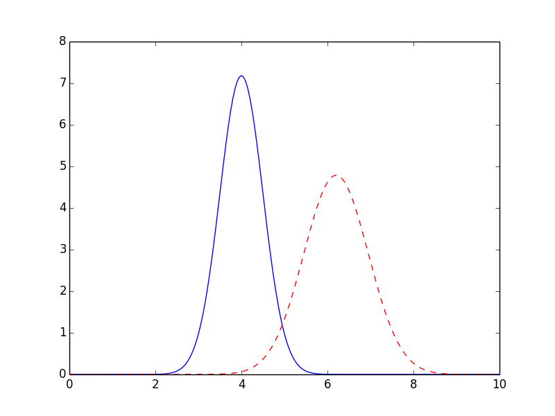

.. _model_label:

=================================================
Creating Fitting Models from model functions
=================================================

It is very common to want to fit some data to a model function, as is
commonly done with :func:`scipy.optimize.curve_fit`).  Indeed, it is common
to want to fit data to well-known functional form such as Gaussian or
Lorentzian peaks, Exponential decays, and so on, that are widely used in
many scientific domains.

The lmfit package provides a :class:`Model` class that makes it easy to
turn a model function that calculates a model for your data into a fitting
model.  In an effort to make simple things truly simple, the lmfit package
also provides canonical definitions for many known lineshapes and
pre-defined high-level fitting models in the :mod:`models` module.  These
are listed in more detail in the next section
(:ref:`builtin_models_label`), and you may want to consult that list before
writing your own model.

Here, we focus on turning python function into high-level fittingmodels
with the :class:`Model` class, and using these to fit data.

Example 1: Fit data to Gaussian profile
================================================

Let's start with a simple and common example of fitting data to a Gaussian
peak.  As we will see, there is a buit-in :class:`GaussianModel` class that
provides a model function for a Gaussian profile, but here we'll build our
own.  We start with a definition the model function that we might want to
use to fit to some data::

    >>> from numpy import sqrt, pi, exp, linspace
    >>>
    >>> def gaussian(x, amp, cen, wid):
    ...    "1-d gaussian: gaussian(x, amp, cen, wid)"
    ...    return (amp/(sqrt(2*pi)*wid)) * exp(-(x-cen)**2 /(2*wid**2))
    ...

We could write a residual function for this, but such a residual function
would be fairly simple (essentially, ``data - model``, possibly with some
weighting), and we would have to define and use appropriately named
parameters.  After doing this a few times it appears as a recurring
pattern, and we can imagine automating this process.  That's where the
:class:`Model` class comes in.  We can pass it the ``gaussian`` function,
and it will generate the appropriate residual function and the
corresponding parameters::

    >>> from lmfit import Model
    >>> mod = Model(gaussian)
    >>> for name, par in mod.params.items():
    ...     print(name, par)
    ...
    'amp', <Parameter 'amp', None, bounds=[None:None]>
    'wid', <Parameter 'wid', None, bounds=[None:None]>
    'cen', <Parameter 'cen', None, bounds=[None:None]>
    >>> print("Independent Variables: ", mod.independent_vars)
    'Independent Variables: ', ['x']

The Model ``mod`` is constructed containing a ``params`` member that holds
the :class:`Parameters` for the model, and an ``independent_vars`` that
holds the name of the independent variables.  By default, the first
argument of the function is taken as the independent variable, and the rest
of the parameters are used for variable Parameters.  Thus, for the
``gaussian`` function above, the parameters are named ``amp``, ``cen``, and
``wid``.  and ``x`` is the independent variable.

On creation of the model, the parameters are not initialized (the values
are all ``None``), and will need to be given initial values before the
model can be used.  This can be done in one of two ways, or a mixture of
the two.  First, the initial values for the models parameters can be set
explicity.  In fact, the parameters can altered in other ways too, as
described in previous sections, as with::

    >>> mod.params['amp'].value = 9.0
    >>> mod.params['amp'].min   = 0.0
    >>> mod.params['cen'].value = 4.0
    >>> mod.params['wid'].value = 0.5
    >>> mod.params['wid'].min   = 0.0

or one can use the :meth:`eval` method (to evaluate the model) or the
:meth:`fit` method (to fit data to this model) with explicit keyword
arguments for the parameter values.

To use this model, one can use :meth:`eval` to calculate the predicted
function::

    >>> x0 = linspace(0, 10, 201)
    >>> y1 = mod.eval(x=x0)
    >>> y2 = mod.eval(x=x0, cen=6.2, wid=0.75)
    >>> import pylab
    >>> pylab.plot(x0, y1)
    >>> pylab.plot(x0, y2)
    >>> pylab.show()

The resulting plot shows that both approaches (explicity setting parameter
values or passing values as keyword arguments to :meth:`eval`) work, with
the resulting plot shown below.

So far, this is a slightly long-winded way to plot a Gaussian function.  Of
course, we can also use the :meth:`fit` method to fit this model to data.
Putting everything together, the script to do such a fit (included in the
``examples`` folder with the source code) is:

.. literalinclude:: ../examples/model_gaussian.py

which is pretty compact and to the point.   The results printed out are::

    [[Variables]]
         amp:     8.880218 +/- 0.1135949 (1.28%) initial =  5
         cen:     5.658661 +/- 0.01030495 (0.18%) initial =  5
         wid:     0.6976547 +/- 0.01030495 (1.48%) initial =  1
    [[Correlations]] (unreported correlations are <  0.250)
         C(amp, wid)                  =  0.577

and the plot generated gives:

.. image:: _images/model_fit1.png
   :target: _images/model_fit1.png
   :width: 85%

which shows the data in blue dots, the best fit as a solid red line, and
the initial fit in black dashed line.

We emphasize here that the fit to this function really took 2 lines of code::

    model = Model(gaussian)
    result = model.fit(data, x=x amp=5, cen=5, wid=1)

Of course, some models are necessarily more complicated, and you may want
to place bounds or constraints on parameter values, but at least it is easy
to model and fit to simple functions.

The :class:`Model` class
=======================================

The :class:`Model` class is the most general way to wrap a pre-defined
function as a fitting model.  All the models described in this chapter are
derived from it.

.. class:: Model(func[, independent_vars=None[, param_names=None[, missing=None[, prefix=''[, components=None]]]]])

    Create a model based on the user-supplied function.  This uses a
    introspection to automatically converting argument names to Parameter names.

    :param func: function to be wrapped
    :type func: callable
    :param independent_vars: list of argument names to ``func`` that are independent variables.
    :type independent_vars: ``None`` (default) or list of strings.
    :param param_names: list of argument names to ``func`` that should be made into Parameters.
    :type param_names: ``None`` (default) or list of strings
    :param missing: how to handle missing values.
    :type missing: one of ``None`` (default), 'drop', or 'raise'
    :param prefix: prefix to add to all parameter names to distinguish components.
    :type prefix: string
    :param components: list of model components for a composite fit (usually handled internally).
    :type components: ``None`` or default.

Methods and Attributes of the :class:`Model` class
----------------------------------------------------

.. method:: guess_starting_values(data, **kws)

   by default this is left to raise a ``NotImplementedError``, but may be
   overwritten by subclasses.  Generally, this method should take some
   values for ``data`` and use it to construct reasonable starting values for
   the parameters.

.. method:: eval(params=None[, **kws])

    evalueate the model function for a set of parameters and inputs.

    :param params: parameters to use for fit.
    :type params: ``None`` (default) or Parameters
    :return:       ndarray for model given the parameters and other arguments.

   If ``params`` is ``None``, the internal ``params`` will be used.

   Note that all other arguments for the model function (including all the
   independent vairables!) will need to be passed in using keyword
   arguments.

.. method:: fit(data[, params=None[, weights=None[, **kws]]])

    perform a fit of the model to the ``data`` array.

    :param data: array of data to be fitted.
    :type data: ndarray-like
    :param params: parameters to use for fit.
    :type params: ``None`` (default) or Parameters
    :param weights: weights to use fit.
    :type params: ``None`` (default) or ndarray-like.
    :return:       fit result object.

   If ``params`` is ``None``, the internal ``params`` will be used. If it
   is supplied, these will replace the internal ones.  If supplied,
   ``weights`` must is an ndarray-like object of same size and shape as
   ``data``.

   Note that other arguments for the model function (including all the
   independent vairables!) will need to be passed in using keyword
   arguments.

   The result returned from :meth:`fit` will contains all of the items
   returned from :func:`minimize` (see  :ref:`Table of Fit Results
   <goodfit-table>` plus those listed in the :ref:`Table of Model Fit results <modelfit-table>`

.. _modelfit-table:

 Table of Model Fit Results: These values are included in the return value
 from :meth:`Model.fit`, in addition to the standard Goodness-of-Fit
 statistics and fit results given in :ref:`Table of Fit Results
 <goodfit-table>`.

+----------------------------+------------------------------------------------------+
| result attribute           |  Description / Formula                               |
+============================+======================================================+
| ``init_params``            | initial set of parameters                            |
+----------------------------+------------------------------------------------------+
| ``init_fit``               | initial estimate of fit to data                      |
+----------------------------+------------------------------------------------------+
| ``best_fit``               | final estimate of fit to data                        |
+----------------------------+------------------------------------------------------+

.. attribute:: independent_vars

   list of strings for independent variables.

.. attribute:: param_names

   list of strings of parameter names.

.. attribute:: params

   :class:`Parameters` object for the model

.. attribute:: prefix

   prefix used for name-mangling of parameter names.  That is, for a
   :class:`GaussianModel`, the default parameter names would be
   ``amplitude``, ``center``, and ``sigma``.  These parameters are used for
   many pre-defined models, and would cause a name collision for a
   composite model.  Using a prefix of ``g1_`` would convert these
   parameter names to ``g1_amplitude``, ``g1_center``, and ``g1_sigma``.

.. attribute:: missing

   what to do for missing values.  The choices are

    * ``None``: Do not check for null or missing values (default)
    * ``'drop'``: Drop null or missing observations in data.  If pandas is
                installed, ``pandas.isnull`` is used, otherwise :attr:`numpy.isnan` is used.
    * ``'raise'``: Raise a (more helpful) exception when data contains null
                  or missing values.

.. attribute:: components

   a list of instances of :class:`Model` that make up a composite model.
   Normally, you will not need to use this, but is used my :class:`Model`
   itself when constructing a composite model (that is adding models together).

Determining parameter names and independent variables for a function
-----------------------------------------------------------------------

The :class:`Model` created from the supplied function ``func`` will create
a :class:`Parameters` object, and names are inferred from the function
arguments, and a residual function is automatically constructed.

By default, the independent variable is take as the first argument to the
function.  You can explicitly set this, of course, and will need to if the
independent variable is not first in the list, or if there are actually more
than one independent variables.

If not specified, Parameters are constructed from all positional arguments
and all keyword arguments that have a default value that is numerical, except
the independent variable, of course.   Importantly, the Parameters can be
modified after creation.  In fact, you'll have to do this because none of the
parameters have valid initial values.  You can place bounds and constraints
on Parameters, or fix their values.

More Details on building models from functions
============================================================

Here we explore some of the variations of building a :class:`Model` from a
user-defined function that didn't get mentioned in the example above for
the Gaussian model.

Explicitly specifying ``independent_vars``
-------------------------------------------------

As for the example above of the Gaussian model, creating a :class:`Model`
from a function is fairly easy::

    >>> def decay(t, tau, N):
    ...    return N*np.exp(-t/tau)
    ...
    >>> decay_model = Model(decay)
    >>> print decay_model.independent_vars
    ['t']
    >>> for pname, par in decay_model.params.items():
    ...     print pname, par
    ...
    tau <Parameter 'tau', None, bounds=[None:None]>
    N <Parameter 'N', None, bounds=[None:None]>

Note that ``t`` is assumed to be the independent variable, and that
parameters are created from the other parameters.   Note also that the
parameters are left uninitialized.

If you wanted ``tau`` to be the independent variable in the above example,
you would just do this::

    >>> decay_model = Model(decay, independent_vars=['tau'])
    >>> print decay_model.independent_vars
    ['tau']
    >>> for pname, par in decay_model.params.items():
    ...     print pname, par
    ...
    t <Parameter 't', None, bounds=[None:None]>
    N <Parameter 'N', None, bounds=[None:None]>

Functions with keyword arguments
-----------------------------------------

If the model had keyword parameters, these would be turned into Parameters if
the supplied default value was a valid number (but not ``None``).

    >>> def decay2(t, tau, N=10, check_positive=False):
    ...    if check_small:
    ...        arg = abs(t)/max(1.e-9, abs(tau))
    ...    else:
    ...        arg = t/tau
    ...    return N*np.exp(arg)
    ...
    >>> decay_model = Model(decay2)
    >>> for pname, par in decay_model.params.items():
    ...     print pname, par
    ...
    tau <Parameter 'tau', None, bounds=[None:None]>
    N <Parameter 'N', 10, bounds=[None:None]>

Here, even though ``N`` is a keyword argument to the function, it is turned
into a parameter, with the default numerical value as its initial value.
By default, it is still permitted to be varied in the fit.  On the other
hand, the ``check_positive`` keyword argument, was not converted to a
parameter because it has a boolean default value.

Defining a ``prefix`` for the Parameters
--------------------------------------------

Initializing a :class:`Model`, evaluating model functions
====================================================================

To use any model, one needs to initialize the variables (so that no values
are left as ``None``). The pre-built models provide
a :meth:`guess_starting_values` method that can make decent guesses for
parameter values, but if you're writing your own model, you may not have such
a function.  In any event, you need to set non-``None`` values for all
parameters.

After that, one can either evaluate the model given parameters and
independent variables.   Thus, to calculate and display a series of Voigt
functions, we might do this:

.. literalinclude:: ../examples/models_doc2.py

