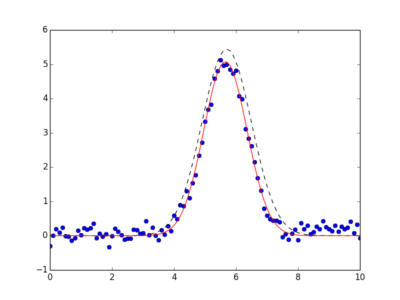

.. _models1d-label:

=================================
Simple Builtin Fitting Models
=================================

It is common to want to fit some data to one of a well-known functional
form such as Gaussians, Lorentzian, and Voigt peaks, Exponential decays,
and so on.  These are used in a wide range of scientific domains and
spectroscopic techniques as well as in basic mathematical analysis.  In an
effort to make make simple things truly simple, the lmfit package provides
canonical definitions for many known lineshapes.  and a few pre-defined
high-level fitting models in the :mod:`models` module. In addition, there
is a :class:`model` class for building high-level fitting models from other
functions.  Here, we outline the existing models, and describe how to build
your own.

Example 1: Fit data to Gaussian profile
===========================================

Let's start with a simple and common example of fitting data to a Gaussian
peak.  Of course, we could define a model Gaussian function, define the
Parameters that go into and build a residual function.  But since many
people are likely to want to do such fits, it's useful xto set up such a
model once, especially if done in such away as to be easy to extend.

The :class:`GaussianModel` class provides a model function for a Gaussian
profile, the set of Parameters needed for this model.  It also has built-in
functions for guessing starting values for the Parameters based on some
data, and fitting the model to a set of data.  This will give a very simple
interface to fitting data to this well-known function.  Here's a script to
do this (included in the ``examples`` folder with the source code):

.. literalinclude:: ../examples/models_doc1.py

After some imports, we read in the data for ``x`` and ``y`` from a text
file. We then create a Gaussian model.  This will automatically contains
all the Parameters for a Gaussian line shape -- it has parameters named
``amplitude``, ``center``, and ``sigma``.  We then tell this model to guess
initial starting values for these parameters based on the data arrays.  We
then run the :meth:`fit` method of the model, and print out the results,
which will look like this::

    [[Variables]]
         amplitude:     8.880221 +/- 0.1135958 (1.28%) initial =  10.90974
         center:        5.658661 +/- 0.01030511 (0.18%) initial =  5.7
         fwhm:          1.642852 +/- 0.02426668 (1.48%) == '2.354820*sigma'
         sigma:         0.6976551 +/- 0.01030511 (1.48%) initial =  0.8
    [[Correlations]] (unreported correlations are <  0.250)
        C(amplitude, sigma)          =  0.577

You can see here that the model created Parameters named ``amplitude``,
``center``, and ``sigma`` for the Gaussian model, and a parameter named
``fwhm``, constrained with ``sigma`` to report Full Width at Half Maximum.
Finally, we display the data, best fit and initial guess graphically --
note that both the initial and best fit are preserved in the ``result``
returned by :meth:`fit` method.

which shows the data in blue dots, the best fit as a solid red line, and
the initial fit in black dashed line.  You can also see from the results
that the starting guess were a pretty good estimate for this simple data
set.

We emphasize here that the fit to this pre-built model really took 3
lines of code::

    model = GaussianModel()
    model.guess_starting_values(y, x=x)
    result = model.fit(y, x=x)

Of course, some models are necessarily mode complicated.

Example 2: Fit data to Gaussian profile + Line
=================================================

We can expand on the model by showing an important feature of the lmfit
Models derived from the powerful :class:`Model` class: you can add them
together.  That is, to fit data to a Gaussian plus a linear offset, we
could use this script (also included in the ``examples`` folder with the
source code):

.. literalinclude:: ../examples/models_doc2.py

This is only slightly more complicated than the script above.  Here, we
start with a :class:`GaussianModel` as before and use the built-in method
to guess starting values.  But then we create a :class:`LinearModel` (which
has parameters named ``slope`` and ``intercept``), and add this to the
:class:`GaussianModel` with the simple::

    total = gauss + line

and call the :meth:`fit` method of the combined model ``total``.  That will
fit all the parameters, reporting results of::

    [[Variables]]
         amplitude:     8.459308 +/- 0.1241455 (1.47%) initial =  11.96192
         center:        5.655479 +/- 0.009176806 (0.16%) initial =  5.7
         fwhm:          1.590575 +/- 0.02335249 (1.47%) == '2.354820*sigma'
         intercept:    -2.968602 +/- 0.03352202 (1.13%) initial = -1
         sigma:         0.6754549 +/- 0.009916889 (1.47%) initial =  0.9
         slope:         0.1148441 +/- 0.005748924 (5.01%) initial =  0
    [[Correlations]] (unreported correlations are <  0.250)
        C(amplitude, sigma)          =  0.666

and give a plot like this:

.. image:: _images/models_doc2.png
   :target: _images/models_doc2.png
   :width: 85%

again showing (simulated) data shown in blue dots, with the best fit as a
solid red line, and the initial fit in black dashed line.

The emphasis here is that not only is fitting to a single pre-defined
function a simple matter, but that fitting to a model built up of several
pre-defined functions is not much more difficult.

The :class:`Model` class
=======================================

The :class:`Model` class is the most general way to wrap a pre-defined
function as a fitting model.  All the models described in this chapter are
derived from it.

.. class:: Model(func[, independent_vars=None[, param_names=None[, missing=None[, prefix=''[, components=None]]]]])

    Create a model based on the user-supplied function.  This uses a
    introspection to automatically converting argument names to Parameter names.

    :param func: function to be wrapped
    :type func: callable
    :param independent_vars: list of argument names to ``func`` that are independent variables.
    :type independent_vars: ``None`` (default) or list of strings.
    :param param_names: list of argument names to ``func`` that should be made into Parameters.
    :type param_names: ``None`` (default) or list of strings
    :param missing: how to handle missing values.
    :type missing: one of ``None`` (default), 'drop', or 'raise'
    :param prefix: prefix to add to all parameter names to distinguish components.
    :type prefix: string
    :param components: list of model components for a composite fit (usually handled internally).
    :type components: ``None`` or default.

Methods and Attributes of the :class:`Model` class
----------------------------------------------------

.. attribute:: independent_vars

   list of strings for independent variables.

.. attribute:: param_names

   list of strings of parameter names.

.. attribute:: params

   :class:`Parameters` object for the model

.. attribute:: prefix

   prefix used for name-mangling of parameter names.  That is, for a
   :class:`GaussianModel`, the default parameter names would be
   ``amplitude``, ``center``, and ``sigma``.  These parameters are used for
   many pre-defined models, and would cause a name collision for a
   composite model.  Using a prefix of ``g1_`` would convert these
   parameter names to ``g1_amplitude``, ``g1_center``, and ``g1_sigma``.

.. attribute:: missing

   what to do for missing values.  The choices are

    * ``None``: Do not check for null or missing values (default)
    * ``'drop'``: Drop null or missing observations in data.  If pandas is
                installed, ``pandas.isnull`` is used, otherwise :attr:`numpy.isnan` is used.
    * ``'raise'``: Raise a (more helpful) exception when data contains null
                  or missing values.

.. attribute:: components

   a list of instances of :class:`Model` that make up a composite model.

.. method:: guess_starting_values(data, **kws)

   by default this is left to raise a ``NotImplementedError``, but may be
   overwritten by subclasses.  Generally, this method should take some
   values for ``data`` and use it to construct initial guesses for
   parameter values.

.. method:: fit(data[, params=None[, weights=None[, **kws]]])

    perform a fit of the model to the ``data`` array.

    :param data: array of data to be fitted.
    :type data: ndarray-like
    :param params: parameters to use for fit.
    :type params: ``None`` (default) or Parameters
    :param weights: weights to use fit.
    :type params: ``None`` (default) or ndarray-like.
    :return:       fit result object.

   If ``params`` is ``None``, the internal ``params`` will be used. If it
   is supplied, these will replace the internal ones.  If supplied,
   ``weights`` must is an ndarray-like object of same size and shape as
   ``data``.

   Note that other parameters for the model function (including all the
   independent vairables!) will need to be passed in using keyword
   arguments.

   The result returned from :meth:`fit` will contains all of the items
   returned from :func:`minimize` (see  :ref:`Table of Fit Results
   <goodfit-table>` plus those listed in the :ref:`Table of Model Fit results <modelfit-table>`

.. _modelfit-table:

 Table of Model Fit Results: These values are included in the return value
 from :meth:`Model.fit`, in addition to the standard Goodness-of-Fit
 statistics and fit results given in :ref:`Table of Fit Results
 <goodfit-table>`.

+----------------------------+------------------------------------------------------+
| result attribute           |  Description / Formula                               |
+============================+======================================================+
| ``init_params``            | initial set of parameters                            |
+----------------------------+------------------------------------------------------+
| ``init_fit``               | initial estimate of fit to data                      |
+----------------------------+------------------------------------------------------+
| ``best_fit``               | final estimate of fit to data                        |
+----------------------------+------------------------------------------------------+

Determining parameter names and independent variables for a function
-----------------------------------------------------------------------

The :class:`Model` created from the supplied function ``func`` will create
a :class:`Parameters` object, and names are inferred from the function
arguments, and a residual function is automatically constructed.

By default, the independent variable is take as the first argument to the
function.  You can explicitly set this, of course, and will need to if the
independent variable is not first in the list, or if there are actually more
than one independent variables.

If not specified, Parameters are constructed from all positional arguments
and all keyword arguments that have a default value that is numerical, except
the independent variable, of course.   Importantly, the Parameters can be
modified after creation.  In fact, you'll have to do this because none of the
parameters have valid initial values.  You can place bounds and constraints
on Parameters, or fix their values.

Simple Examples:  Building a  :class:`Model` from a function
-----------------------------------------------------------------

A simple exmple of creating a :class:`Model` from a function::

    >>> def decay(t, tau, N):
    ...    return N*np.exp(-t/tau)
    ...
    >>> decay_model = Model(decay)
    >>> print decay_model.independent_vars
    ['t']
    >>> for pname, par in decay_model.params.items():
    ...     print pname, par
    ...
    tau <Parameter 'tau', None, bounds=[None:None]>
    N <Parameter 'N', None, bounds=[None:None]>

Note that ``t`` is assumed to be the independent variable, and that
parameters are created from the other parameters.   Note also that the
parameters are left uninitialized.

If you wanted ``tau`` to be the independent variable in the above example,
you would just do this::

    >>> decay_model = Model(decay, independent_vars=['tau'])
    >>> print decay_model.independent_vars
    ['tau']
    >>> for pname, par in decay_model.params.items():
    ...     print pname, par
    ...
    t <Parameter 't', None, bounds=[None:None]>
    N <Parameter 'N', None, bounds=[None:None]>

If the model had keyword parameters, these would be turned into Parameters if
the supplied default value was a valid number (but not ``None``).

    >>> def decay2(t, tau, N=10, check_positive=False):
    ...    if check_small:
    ...        arg = abs(t)/max(1.e-9, abs(tau))
    ...    else:
    ...        arg = t/tau
    ...    return N*np.exp(arg)
    ...
    >>> decay_model = Model(decay2)
    >>> for pname, par in decay_model.params.items():
    ...     print pname, par
    ...
    tau <Parameter 'tau', None, bounds=[None:None]>
    N <Parameter 'N', 10, bounds=[None:None]>

Here, even though ``N`` is a keyword argument to the function, it is turned
into a parameter, with the default numerical value as its initial value.
By default, it is still permitted to be varied in the fit.  On the other
hand, the ``check_positive`` keyword argument, was not converted to a
parameter beause it has a boolean default value.

Available :class:`Model` subclasses in the :mod:`models` module
====================================================================

Several fitting models are pre-built and available in the :mod:`models`
module.  These are all based on plain python functions defined in the
:mod:`lineshapes` module.  In addition to wrapping a function, these models
also provide a :meth:`guess_starting_values` method that is intended to
give a reasonable set of starting values given a data array that closely
approximates the data to be fit.

All the models listed below are one dimensional, with an independent
variable named ``x``.  Many of these models represent a function with a
distinct peak, and so share common features.  To maintain uniformity,
common parameter names are used whenever possible.  Thus, most models have
a parameter called ``amplitude`` that represents the overall height (or
area of) a peak or function, a ``center`` parameter that represents a peak
centroid position, and a ``sigma`` parameter that gives a characteristic
width.   Some peak shapes also have a parameter ``fwhm``, typically
constrained by ``sigma`` to give the full width at half maximum.

.. class:: GaussianModel()

   A model based on a Gaussian or normal distribution lineshape.  Parameter
   names: ``amplitude``, ``center``, and ``sigma``.  In addition, a
   constrained parameter ``fwhm`` is included.

.. math::

  f(x, \mu, \sigma) = \frac{A}{\sigma\sqrt{2\pi}} e^{[{-{(x-\mu)^2}/{{2\sigma}^2}}]}

where the parameter ``amplitude`` corresponds to :math:`A`, ``center`` to
:math:`\mu`, and ``sigma`` to :math:`\sigma`.  The Full-Width at
Half-Maximum is :math:`2\sigma\sqrt{2\ln{2}}`, approximately
:math:`2.3548\sigma`

.. class:: LorentzianModel()

   a model based on a Lorentzian or Cauchy-Lorentz distribution function.
   Parameter names: ``amplitude``, ``center``, and ``sigma``.  In addition,
   a constrained parameter ``fwhm`` is included.

.. math::

  f(x, \mu, \sigma) = \frac{A}{\pi} \big[\frac{\sigma}{(x - \mu)^2 + \sigma^2}\big]

where the parameter
``amplitude`` corresponds to :math:`A`, ``center`` to
:math:`\mu`, and ``sigma`` to :math:`\sigma`.  The Full-Width at
Half-Maximum is :math:`2\sigma`.

.. class:: VoigtModel()

   a model based on a Voigt distribution function.

   Parameter names: ``amplitude``, ``center``, and ``sigma``.  A ``gamma``
   parameter is also available.  By default, it is constrained to have
   value equal to ``sigma``, though this can be varied independently.  In
   addition, a constrained parameter ``fwhm`` is included.  The definition
   for the Voigt function used here is

.. math::

    f(x, \mu, \sigma, \gamma) = \frac{A \textrm{Re}[w(z)]}{\sigma\sqrt{2 \pi}}

where

.. math::
   :nowrap:

   \begin{eqnarray*}
     z &=& \frac{x-\mu +i\gamma}{\sigma\sqrt{2}} \\
     w(z) &=& e^{-z^2}{\operatorname{erfc}}(-iz)
   \end{eqnarray*}

and :func:`erfc` is the complimentary error function.  As above,
``amplitude`` corresponds to :math:`A`, ``center`` to
:math:`\mu`, and ``sigma`` to :math:`\sigma`. The parameter ``gamma``
corresponds  to :math:`\gamma`.
If ``gamma`` is kept at the default value (constrained to ``sigma``),
the full width at half maximumn is approximately :math:`3.6013\sigma`.

.. class:: ExponentialModel()

.. class:: PowerLawModel()

.. class:: ConstantModel()

   a class that consists of a single value, ``c``.  This is constant in the
   sense of having no dependence on the independent variable ``x``, not in
   the sense of being non-varying.  To be clear, ``c`` will be a variable
   Parameter.

.. class:: LinearModel()

   a class that gives a linear model:

.. math::

    f(x, m, b) = m x + b

with parameters ``slope`` for :math:`m` and  ``intercept`` for :math:`b`.

Of course,  lmfit is a very inefficient way to do linear regression (see
:func:`numpy.polyfit` or :func:`scipy.stats.linregress`), but this may be
useful as one of many components of composite model.

.. class:: QuadraticModel()

   a class that gives a quadratic model:

.. math::

    f(x, a, b, c) = a x^2 + b x + c

with parameters ``a``, ``b``, and ``c``.

See note for :class:`LinearModel` about better approaches for fitting to
*only* a quadratic model.

.. class:: ParabolicModel()

   same as :class:`QuadraticModel`.

.. class:: PolynomialModel(degree)

   a class that gives a polynomial model up to ``degree`` (with maximum
   value of 7).

.. math::

    f(x, c_0, c_1, \ldots, c_7) = \sum_{i=0, 7} c_i  x^i

with parameters ``c0``, ``c1``, \ldots ``c7``.  The supplied ``degree``
will specify how many of these are actual variable parameters.

See note for :class:`LinearModel` about better approaches for fitting to
*only* a polynomial model.

.. class:: StepModel()

.. class:: RectangleModel()

Other modeles
-----------------------------------------------

.. function:: pvoigt(x, cen=0, sigma=1, frac=0.5)

   a pseudo-Voigt distribution function, which is a weighted sum of a
   Gaussian and Lorentzian distribution functions with the same values for
   *cen* (:math:`\mu`) and *sigma* (:math:`\sigma`), and *frac* setting the
   Lorentzian fraction::

    pvoigt(x, cen, sigma, frac) = (1-frac)*gaussian(x, cen, sigma) + frac*lorentzian(x, cen, sigma)

.. function:: pearson7(x, cen=0, sigma=1, expon=0.5)

   a Pearson-7 lineshape.  This is another Voigt-like distribution
   function, defined as

.. math::

    f(x, \mu, \sigma, p) = \frac{s}{\big\{[1 + (\frac{x-\mu}{\sigma})^2] (2^{1/p} -1)  \big\}^p}

where for *cen* (:math:`\mu`) and *sigma* (:math:`\sigma`) are as for the
above lineshapes, and *expon* is :math:`p`, and

.. math::

    s = \frac{\Gamma(p) \sqrt{2^{1/p} -1}}{ \sigma\sqrt{\pi}\,\Gamma(p-1/2)}

where :math:`\Gamma(x)` is the gamma function.

.. function:: students_t(x, cen=0, sigma=1)

   Student's t distribution function.

.. math::

    f(x, \mu, \sigma) = \frac{\Gamma(\frac{\sigma+1}{2})} {\sqrt{\sigma\pi}\,\Gamma(\frac{\sigma}{2})} \Bigl[1+\frac{(x-\mu)^2}{\sigma}\Bigr]^{-\frac{\sigma+1}{2}}

where :math:`\Gamma(x)` is the gamma function.

.. function:: breit_wigner(x, cen=0, sigma=1, q=1)

    Breit-Wigner-Fano distribution function.

.. math::

    f(x, \mu, \sigma, q) = \frac{(q\sigma/2 + x - \mu)^2}{(\sigma/2)^2 + (x - \mu)^2}

.. function:: logistic(x, cen=0, sigma=1)

   Logistic lineshape, a sigmoidal curve

.. math::

   f(x, \mu, \sigma) = 1  - \frac{1}{1 + e^{(x-\mu)/\sigma}}

.. function:: lognormal(x, cen=0, sigma=1)

   log-normal function

.. math::

    f(x, \mu, \sigma) = \frac{e^{-(\ln(x) - \mu)/ 2\sigma^2}}{x}

