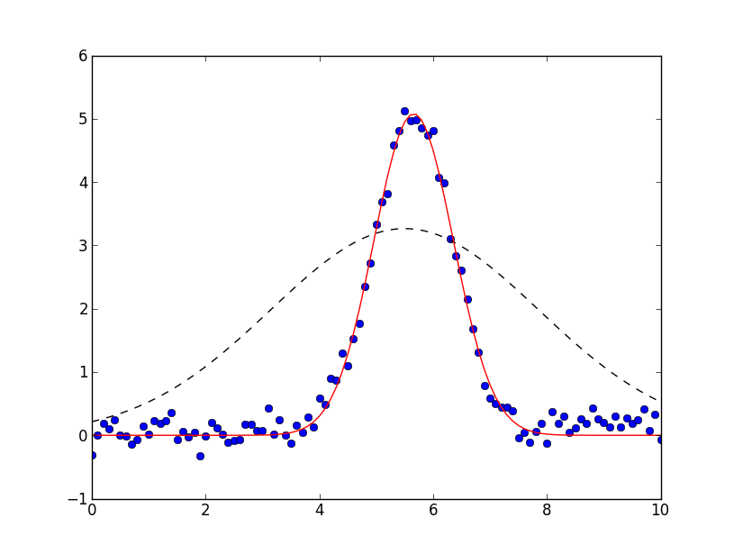

.. _models1d-label:

=================================
Simple Builtin Fitting Models
=================================

It is common to want to fit some 1-dimensional data set to a simple
peak or line shape, such as Gaussians, Lorentzian, and Voigt peaks,
Exponential decays, and so on.  These are used in a wide range of
spectroscopic techniques as well as in basic mathematical analysis.
In an effort to make make simple things truly simple, the lmfit
provides a few simple wrappers for doing such fits in its `models1d`
module.

Example
===========

Let's start with a very simple example.  We'll read data from a simple
datafile, and fit it to a Gaussian peak.  A script to do this could be:

.. literalinclude:: ../examples/model1d_doc1.py

First, we read in the data for 'x' and 'y', then build a Gaussian model.
This 'model' contains all the Parameters for a Gaussian line shape.  We
then expliticly tell the model to make initial guesses for the Parameters
based on the data arrays, and save the model predicted with these initial
Parameter values.  We then perform the actual fit, and print out and
display the results.  The printed output will be (approximately)::

  [[Variables]]
       amplitude:     8.880222 +/- 0.113597 (1.28%) initial =  8.182302
       center:        5.65866 +/- 0.01030533 (0.18%) initial =  5.5
       fwhm:          1.642853 +/- 0.02426699 (1.48%) == '2.35482*sigma'
       sigma:         0.6976553 +/- 0.01030524 (1.48%) initial =  0.6794575
  [[Correlations]] (unreported correlations are <  0.250)
      C(amplitude, sigma)          =  0.577

and the resulting plot will look like:

which shows a good fit (the data were simulated).

You can see here that the model created Parameters named 'amplitude',
'center', 'fwhm', and 'sigma' for the Gaussian model.

You can also see from the results that the starting guess were a pretty
good estimate for this simple data set.  In fact, it's generally possible
to not bother running :meth:`guess_starting_values` explicitly.  If this
method has not been run already, :meth:`fit` will run it for you. Good
reasons to run this method yourself are if want to save the initial
estimate of the data, or to alter the starting values by hand.

classes in the :mod:`models1d` module
=======================================

Several fitting models are available

.. class:: GaussianModel()

.. class:: LorentzianModel()

.. class:: VoigtModel()

.. class:: PeakModel()

.. class:: ExponentialModel()

.. class:: ExponentialModel()

.. class:: StepModel()

.. class:: RectangleModel()

